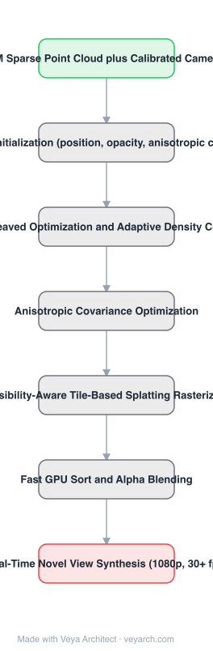

# Architecture: 3D Gaussian Splatting

## Motivation

Radiance-field novel-view synthesis was stuck on a speed/quality trade. Meshes and points rasterize fast but represent scenes poorly; continuous NeRF-style representations optimize well but require costly stochastic sampling during rendering, and can produce noise. Concretely: Mip-NeRF360 reaches top quality but needs up to 48 hours of training, faster methods reach only 10–15 fps at reduced quality, and **no method achieved real-time display rates for unbounded complete scenes at 1080p**.

## Core Idea

Three elements. Represent the scene with **3D Gaussians** initialized from the sparse SfM point cloud that camera calibration already produces for free — a representation that is differentiable and volumetric like continuous methods, yet rasterizable by projection and α-blending. **Interleave optimization with adaptive density control**, notably optimizing **anisotropic covariance**. And render with a **fast visibility-aware, tile-based splatting** algorithm.

## Architecture

### Overview

<b>Layer-by-layer (7 nodes)</b>

| # | Layer | Type | Params |
|---|---|---|---|
| 1 | SfM Sparse Point Cloud plus Calibrated Cameras | `input` |  |
| 2 | 3D Gaussian Initialization (position, opacity, anisotropic covariance, SH) | `custom` |  |
| 3 | Interleaved Optimization and Adaptive Density Control | `custom` |  |
| 4 | Anisotropic Covariance Optimization | `custom` |  |
| 5 | Visibility-Aware Tile-Based Splatting Rasterizer | `custom` |  |
| 6 | Fast GPU Sort and Alpha Blending | `custom` |  |
| 7 | Real-Time Novel View Synthesis (1080p, 30+ fps) | `output` |  |

### Components

1. **3D Gaussian representation** — each Gaussian carries 3D position, opacity α, **anisotropic covariance** and spherical-harmonic coefficients; initialized from SfM points, so no Multi-View Stereo data is required.
2. **Interleaved optimization and adaptive density control** — Gaussians are added and occasionally removed during optimization, while position, opacity, covariance and SH coefficients are optimized; produces 1–5 million Gaussians for the tested scenes.
3. **Anisotropic covariance optimization** — lets Gaussians adapt to scene structure accurately rather than being forced isotropic.
4. **Visibility-aware tile-based renderer** — fast GPU sorting plus α-blending, inspired by tile-based rasterization; supports anisotropic splatting that respects visibility ordering.
5. **Fast backward pass** — tracks traversal of as many sorted splats as required, keeping training fast as well as rendering.

### Data Flow

Calibrated images → SfM sparse point cloud → initialize 3D Gaussians → interleaved optimization with density control (add/remove, optimize covariance/α/SH) → optimized Gaussian set → tile-based sort and α-blended splatting → novel-view image at 1080p, ≥30 fps.

### State / Memory

No recurrent state. The scene *is* the state: an explicit, unstructured set of 1–5M Gaussians held in GPU memory. That explicitness is the contrast with NeRF, where the scene is implicit in MLP weights.

## Design Decisions

- **Explicit primitives, differentiable representation** — the stated goal is combining the best of both worlds: the optimization behaviour of continuous radiance fields with the rasterization speed of explicit primitives.
- **Initialize from SfM points** — free input; also the reason MVS data is not needed.
- **Anisotropic covariance** — needed for accurate scene representation; isotropic Gaussians would need far more of them.
- **Tile-based rasterization with sorting** — the route to real-time rendering; α-blending gives the correct image formation, matching NeRF's model.
- **No empty-space computation** — unlike volumetric ray marching, splatting costs nothing where there is no geometry.

## Evolution

- **Meshes and point clouds** (predecessors): explicit, fast to rasterize, limited quality.
- **NeRF, Mip-NeRF360** (predecessors/contrast): continuous MLP representations, high quality, slow.
- **Voxel / hash / point radiance fields** (contrast): faster but lower quality.
- **3D Gaussian Splatting (2023)**: explicit Gaussians + splatting rasterizer, real-time at 1080p.
- **Siblings**: Mono-splat (monocular), NeRF variants.
- **Contrast**: MLP ray-marching methods requiring 48-hour training.

## Characteristics

| Property | Value |
|---|---|
| Task | novel-view synthesis / scene representation |
| Representation | explicit 3D Gaussians (position, α, anisotropic covariance, SH) |
| Initialization | sparse SfM point cloud (no MVS needed) |
| Optimization | interleaved with adaptive density control |
| Renderer | visibility-aware tile-based splatting, GPU sort + α-blending |
| Result | SOTA quality, competitive training time, ≥30 fps at 1080p |

## Limitations

- Requires calibrated cameras from SfM; uncalibrated or poorly captured input degrades results badly.
- Memory scales with Gaussian count (1–5M for tested scenes); very large scenes get expensive.
- Explicit representation has no implicit completion — unseen regions are simply absent rather than hallucinated plausibly.
- Quality depends on density-control behaviour; popping artifacts are a known practical issue.

## Implementation Notes

Essentials: (1) initialize from the SfM point cloud rather than randomly (random works on synthetic datasets but not typical real scenes), (2) optimize anisotropic covariance — forcing isotropic Gaussians loses the accuracy the representation exists for, (3) run density control interleaved with optimization; adding/removing Gaussians during optimization is what yields a compact representation, (4) render with tile-based sorting and α-blending, and keep the backward pass tracking sorted splats, since training speed depends on it too, (5) report both training time and achieved fps at 1080p — real-time rendering is the claim, and quality-only comparison misses it.
