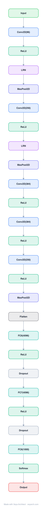

# Architecture: AlexNet

## Motivation

Current approaches to object recognition make essential use of machine learning methods. Until recently, datasets of labeled images were relatively small (tens of thousands). Simple recognition tasks can be solved with datasets of this size, but objects in realistic settings exhibit considerable variability, so to learn to recognize them it is necessary to use much larger training sets. ImageNet (15+ million labeled high-resolution images) made large-scale training possible, but existing models could not effectively leverage this data. The challenge was to build a deep CNN large enough to learn from millions of high-resolution images, fast enough to train in reasonable time.

## Core Idea

A large, deep convolutional neural network with 60 million parameters and 650,000 neurons, using ReLU activations, dropout regularization, and GPU training, that achieved breakthrough performance on ImageNet LSVRC-2010 (top-5 error 17.0%) and won ILSVRC-2012 (top-5 error 15.3%), launching the deep learning era.

## Architecture

### Overview

<b>Layer-by-layer (26 nodes)</b>

| # | Layer | Type | Params | Output shape |
|---|---|---|---|---|
| 1 | Input | `input` | shape: [3, 224, 224] | [3, 224, 224] |
| 2 | Conv2D(96) | `conv2d` | outChannels: 96, kernelSize: 11, stride: 4, padding: 0, inChannels: 3 | [96, 55, 55] |
| 3 | ReLU | `relu` | | |
| 4 | LRN | `lrn` | | |
| 5 | MaxPool2D | `maxpool2d` | kernelSize: 3, stride: 2 | [96, 27, 27] |
| 6 | Conv2D(256) | `conv2d` | outChannels: 256, kernelSize: 5, stride: 1, padding: 2, inChannels: 96 | [256, 27, 27] |
| 7 | ReLU | `relu` | | |
| 8 | LRN | `lrn` | | |
| 9 | MaxPool2D | `maxpool2d` | kernelSize: 3, stride: 2 | [256, 13, 13] |
| 10 | Conv2D(384) | `conv2d` | outChannels: 384, kernelSize: 3, stride: 1, padding: 1, inChannels: 256 | [384, 13, 13] |
| 11 | ReLU | `relu` | | |
| 12 | Conv2D(384) | `conv2d` | outChannels: 384, kernelSize: 3, stride: 1, padding: 1, inChannels: 384 | [384, 13, 13] |
| 13 | ReLU | `relu` | | |
| 14 | Conv2D(256) | `conv2d` | outChannels: 256, kernelSize: 3, stride: 1, padding: 1, inChannels: 384 | [256, 13, 13] |
| 15 | ReLU | `relu` | | |
| 16 | MaxPool2D | `maxpool2d` | kernelSize: 3, stride: 2 | [256, 6, 6] |
| 17 | Flatten | `flatten` | | [9216] |
| 18 | FC6(4096) | `linear` | outFeatures: 4096, inFeatures: 9216 | [4096] |
| 19 | ReLU | `relu` | | |
| 20 | Dropout | `dropout` | p: 0.5 | |
| 21 | FC7(4096) | `linear` | outFeatures: 4096, inFeatures: 4096 | [4096] |
| 22 | ReLU | `relu` | | |
| 23 | Dropout | `dropout` | p: 0.5 | |
| 24 | FC8(1000) | `linear` | outFeatures: 1000, inFeatures: 4096 | [1000] |
| 25 | Softmax | `softmax` | | |
| 26 | Output | `output` | | |

AlexNet contains eight learned layers — five convolutional and three fully-connected. The network processes 224×224 RGB images through five convolutional layers (some followed by max-pooling), then three fully-connected layers with a final 1000-way softmax. The architecture was designed to be trained on two GPUs in parallel, with 60 million parameters and 650,000 neurons total.

### Components

1. **Convolutional Layers (5 layers)**:
   - **Conv1**: 96 kernels of size 11×11×3, stride 4 → 55×55×96 output
   - **Conv2**: 256 kernels of size 5×5×48, stride 1 → 27×27×256 (followed by max-pool)
   - **Conv3**: 384 kernels of size 3×3×256, stride 1 → 13×13×384 (no pooling)
   - **Conv4**: 384 kernels of size 3×3×192, stride 1 → 13×13×384 (no pooling)
   - **Conv5**: 256 kernels of size 3×3×192, stride 1 → 13×13×256 (followed by max-pool)

2. **Fully-Connected Layers (3 layers)**:
   - **FC6**: 4096 neurons (with dropout)
   - **FC7**: 4096 neurons (with dropout)
   - **FC8**: 1000 neurons (1000-way softmax for ImageNet classes)

3. **ReLU Nonlinearity** — f(x) = max(0, x), the non-saturating activation:
   - Deep CNNs with ReLUs train several times faster than with tanh/sigmoid
   - Critical for training large networks on large datasets
   - Non-saturating nature prevents vanishing gradients

4. **Local Response Normalization (LRN)** — After ReLU in Conv1 and Conv2:
   - Encourages competition between nearby features
   - Reduces top-1 and top-5 error rates

5. **Max-Pooling** — After Conv1, Conv2, and Conv5:
   - 3×3 windows, stride 2
   - Reduces spatial dimensions
   - Overlapping pooling slightly reduces overfitting

6. **Dropout** — In FC6 and FC7:
   - Probability 0.5 of setting neuron output to zero
   - Reduces overfitting in fully-connected layers
   - Doubles the number of iterations needed to converge

7. **Data Augmentation** — To reduce overfitting:
   - Image translations and horizontal reflections (random crops)
   - PCA color augmentation (altering RGB intensities)

### Data Flow

1. **Input**: 224×224×3 RGB image (from 256×256 with random 224×224 crop)
2. **Conv1 + ReLU + LRN + MaxPool**: → 27×27×96
3. **Conv2 + ReLU + LRN + MaxPool**: → 13×13×256
4. **Conv3 + ReLU**: → 13×13×384
5. **Conv4 + ReLU**: → 13×13×384
6. **Conv5 + ReLU + MaxPool**: → 6×6×256
7. **FC6 + ReLU + Dropout**: → 4096
8. **FC7 + ReLU + Dropout**: → 4096
9. **FC8 + Softmax**: → 1000 class probabilities

### State / Memory

- **No explicit memory mechanism**: AlexNet is a purely feedforward CNN without recurrent state.
- **Model parameters**: 60 million parameters (convolutional filters + fully-connected weights) are persistent.
- **Feature maps**: Transient representations at each layer, with spatial dimensions reducing through the network.

## Design Decisions

1. **ReLU over saturating activations** — ReLUs train several times faster than tanh/sigmoid:
   - Non-saturating nature prevents vanishing gradients
   - Simple computation (max(0, x))
   - Enabled training of large networks on large datasets

2. **GPU training (2 GPUs)** — Single GPU (3GB) was too small for the network:
   - Spread network across two GTX 580 GPUs
   - GPUs communicate directly (no host memory bottleneck)
   - Half of kernels on each GPU
   - Cross-GPU communication only in certain layers

3. **Local Response Normalization** — Reduces error by encouraging competition:
   - Inspired by lateral inhibition in biological neurons
   - Applied after ReLU in Conv1 and Conv2

4. **Overlapping pooling** — 3×3 windows with stride 2 (overlapping):
   - Slightly reduces overfitting compared to non-overlapping
   - Improves top-1 and top-5 error rates

5. **Data augmentation** — Critical for reducing overfitting:
   - Random crops and reflections: increase dataset by 2048×
   - PCA color augmentation: simulates lighting variations
   - Reduced overfitting significantly

6. **Dropout** — In fully-connected layers:
   - Probability 0.5 of zeroing each neuron
   - Effectively trains an exponential number of sub-networks
   - Forces each neuron to be more robust

## Evolution

**Predecessors:**
- **LeNet** (LeCun et al., 1998) — First successful CNN for digit recognition.
- **CNNs** (Fukushima, 1980; LeCun et al., 1989) — Convolutional architecture foundations.
- **GPU computing** — Hardware enabling large-scale training.
- **ImageNet** (Deng et al., 2009) — Large-scale labeled dataset.

**Successors:**
- **VGGNet** (Simonyan & Zisserman, 2014) — Deeper, simpler architecture.
- **GoogLeNet / Inception** (Szegedy et al., 2014) — Inception modules.
- **ResNet** (He et al., 2016) — Residual connections enabling much deeper networks.
- **All modern CNN architectures** — AlexNet launched the deep learning revolution.

## Characteristics

| Property | Value |
|----------|-------|
| Year | 2012 |
| Authors | Krizhevsky, Sutskever, Hinton (University of Toronto) |
| Category | DL/Classics |
| Source Paper | `ImageNet_Classification_with_Deep_Convolutional_Neural_Netwo_Neural_Krizhevsky_Sutskever_etal_2017.md` |
| PaperVault Path | `DL-Architectures/07-theory-classics/ImageNet_Classification_with_Deep_Convolutional_Neural_Netwo_Neural_Krizhevsky_Sutskever_etal_2017.md` |

## Limitations

1. **Overfitting** — Despite dropout and data augmentation, the network still overfits significantly (60M parameters on 1.2M images).
2. **GPU memory limitation** — Required 2 GPUs; single GPU was insufficient. Modern GPUs have much more memory.
3. **Fixed architecture** — No architectural innovations beyond depth; later models (VGG, ResNet) showed that depth and skip connections matter more.
4. **Computational cost** — Training took 5-6 days on 2 GPUs; inference was relatively slow.
5. **No transfer learning** — The network was trained from scratch; modern approaches use pre-trained backbones.
6. **Limited context** — Small receptive field compared to later architectures; struggles with global image context.

## Implementation Notes

See `implementation/` for a minimal runnable implementation. Key details:
- 8 learned layers: 5 conv + 3 FC
- 60M parameters, 650K neurons
- Input: 224×224×3 (from 256×256 random crop)
- Conv1: 96 filters 11×11, stride 4 → Conv2: 256 filters 5×5 → Conv3-5: 384, 384, 256 filters 3×3
- FC6-7: 4096 neurons each → FC8: 1000-way softmax
- ReLU activations, LRN after Conv1-2, max-pool after Conv1, Conv2, Conv5
- Dropout (p=0.5) in FC6-7
- Data augmentation: random crops, reflections, PCA color jitter
- Trained on 2 GTX 580 GPUs, 5-6 days
- ILSVRC-2012: top-5 error 15.3% (won competition)
- 1000 classes, 1.2M training images

- `assets/model.json` contains the full structural graph with real dimensions and parameters.
- `assets/diagram.svg` / `diagram.png` render the 26-node vertical net graph.
- Regenerate both with `python3 tools/netgraph_gen.py alexnet --png` from the repo root.

## Information Layers

- **Evidence:** Source paper available in `references/papers/` (Krizhevsky, Sutskever, Hinton, 2012, "ImageNet Classification with Deep Convolutional Neural Networks")
- **Analysis:** AlexNet's significance extends far beyond its architecture — it demonstrated that deep CNNs, trained on large datasets with GPUs, can dramatically outperform traditional computer vision methods. The key innovations (ReLU, dropout, GPU training, data augmentation) were not individually novel but their combination was transformative. The 15.3% top-5 error (vs. 26.2% for second place) was a watershed moment that convinced the ML community that deep learning was the future. The architecture itself is relatively simple by modern standards, but the training recipe (especially data augmentation and dropout) remains influential.
- **Hypothesis:** The success of AlexNet suggests that the key to deep learning was not architectural sophistication but scale (data, model size, compute). The ReLU activation was critical because it enabled faster training, making large-scale experiments feasible. Dropout's effectiveness suggests that overfitting is the primary enemy of large models, and regularization is as important as architecture.
