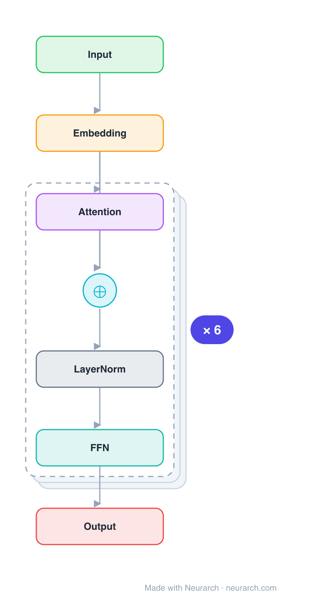

# Architecture: all-MiniLM-L6-v2

## Motivation

The most-downloaded sentence-embedding model in the world: a 6-layer MiniLM distilled from BERT, mean-pooled into a 384-dim vector. The default workhorse for semantic search, RAG retrieval, and clustering when you want fast and small.

## Core Idea

The most-downloaded sentence-embedding model in the world: a 6-layer MiniLM distilled from BERT, mean-pooled into a 384-dim vector.

## Architecture

### Overview

*Identical repeated blocks are folded into one representative block with a `× N` badge, so the whole architecture fits on screen. `model.json` uses a NAXS block template + `repeat` directive: the identical repeated layers are defined once and expand to all 27 nodes (open it in Neurarch to see and edit every layer). Vector: [diagram.svg](assets/diagram.svg).*

| Hyperparameter | Value |
|---|---|
| Type | Bidirectional encoder, sentence embedding |
| Parameters | 22.7M |
| Layers | 6 |
| Hidden size | 384 |
| Attention | Multi-head: 12 heads |
| FFN | Dense, 1536, GeLU |
| Normalization | LayerNorm, post-norm |
| Pooling | Mean over tokens → 384-dim sentence vector |
| Vocabulary | 30,522 |
| Max context | 256 (trained), 512 (max) |

`model.json` is the full graph (repeated layers expressed via a NAXS block template + `repeat`), produced with the same import path the Neurarch app uses for "load from Hugging Face".

### Design Notes

- Tiny BERT encoder (6 layers, 384 hidden) distilled via MiniLM's deep-self-attention distillation, then fine-tuned on 1B+ sentence pairs with a contrastive objective.
- The embedding is a mean pool over the token outputs (not the CLS token), then L2-normalized, so cosine similarity ranks relevance.
- At ~80MB and 384 dims it is the cheap retriever most RAG stacks start with.

### Parameter Check

Neurarch's per-layer parameter estimate over this graph: **22.4M**.
Hugging Face safetensors metadata reports **22.7M** for the real weights.
Deviation from the authoritative count (22.7M): **-1.5%**.

## Design Decisions

> **Analysis** — Observations derived from studying the architecture.

- Tiny BERT encoder (6 layers, 384 hidden) distilled via MiniLM's deep-self-attention distillation, then fine-tuned on 1B+ sentence pairs with a contrastive objective.
- The embedding is a mean pool over the token outputs (not the CLS token), then L2-normalized, so cosine similarity ranks relevance.
- At ~80MB and 384 dims it is the cheap retriever most RAG stacks start with.

## Implementation Notes

- `model.json` contains the full structural graph with real dimensions and parameters, using a NAXS block template + `repeat` for the identical repeated layers.
- Open in [Neurarch](https://www.neurarch.com/) to visualize, edit, or export training code.
- Diagrams fold repeated identical blocks with a `× N` badge; `model.json` defines each repeated layer once at real dimensions and expands to all nodes.

## Limitations

- This package focuses on the architectural structure. Training pipelines, 
dataset preparation, and production optimizations are out of scope.

## Evolution

> See `references/related/` for predecessor and successor architectures.

