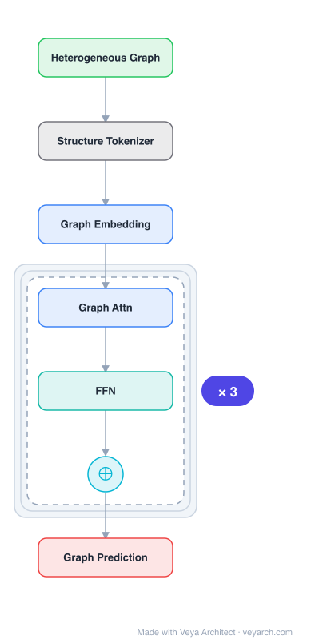

# Architecture: AnyGraph

## Motivation

The paper addresses **graph foundation models** — the need for a single graph learning model with exceptional generalization capabilities across diverse graph domains (social networks, academic networks, transportation, biology). Current graph learning models often struggle to extract generalizable insights, requiring extensive fine-tuning and limiting versatility. They face four key challenges: (i) **Structure Heterogeneity** — graphs vary in degree distributions (homogeneous to highly skewed) and topological complexity (simple to hierarchical); (ii) **Feature Heterogeneity** — node/edge features span categorical, continuous, and multi-modal content with varying dimensionality and semantics across domains; (iii) **Fast Adaptation** — the model must efficiently adapt to new graph domains without extensive retraining; (iv) **Scaling Law Emergence** — the model should exhibit scaling laws where performance improves with data and parameter size, as in CV and NLP foundation models.

Existing large graph models use fixed-capacity architectures that suffer from interference between different graph types and catastrophic forgetting when fine-tuned on new data. AnyGraph fills this gap with a **Graph Mixture-of-Experts (MoE) architecture** that handles structure and feature heterogeneity through specialized experts and a lightweight routing mechanism for fast adaptation.

## Core Idea

Graph foundation model designed to handle diverse graph types in the wild with adaptive architecture.

## Architecture

### Overview

<b>Layer-by-layer (7 nodes)</b>

| # | Layer | Type | Params |
|---|---|---|---|
| 1 | Heterogeneous Graph | `input` |  |
| 2 | Structure Tokenizer | `custom` |  |
| 3 | Graph Embedding | `embed` |  |
| 4 | Graph Attn | `attention` |  |
| 5 | FFN | `ffn` |  |
| 6 | ⊕ | `residual` |  |
| 7 | Graph Prediction | `output` |  |

AnyGraph is a graph foundation model built on a **Mixture-of-Experts (MoE) architecture**. Instead of a single fixed-capacity model, AnyGraph learns an ensemble of specialized graph expert networks, each tailored to capture distinct structural and feature-level characteristics. A **lightweight graph expert routing mechanism** dynamically selects the most relevant experts for a given input graph, enabling fast adaptation without extensive retraining. The MoE design handles both in-domain and cross-domain distribution shifts in structure-level and feature-level heterogeneity. The model is trained on diverse graph datasets and exhibits scaling law behavior (performance improves with model size and data).

### Components

- **Graph expert networks:** A set of specialized GNN expert networks, each designed to capture specific structural and feature-level patterns. Different experts specialize in different graph characteristics (e.g., homogeneous vs. skewed degree distributions, categorical vs. continuous features, simple vs. hierarchical topologies). This specialization avoids the interference and catastrophic forgetting that plague fixed-capacity models.
- **Lightweight graph expert routing mechanism:** A routing network that, given an input graph, dynamically identifies and activates the most relevant expert(s). The routing is lightweight (low computational overhead) to enable fast adaptation. This allows AnyGraph to quickly adjust to new graph domains by activating appropriate experts rather than retraining the entire model.
- **Feature alignment / unification:** Handles feature heterogeneity by unifying diverse feature spaces (categorical, continuous, multi-modal) into a common representation space that the experts can process. This addresses the challenge that different graph domains have features with different dimensionality and semantics.
- **Structure-aware processing:** Each expert processes graph structure in a way tailored to its specialization, accommodating the diversity of degree distributions and topological complexities across domains.
- **Scaling-aware design:** The MoE architecture naturally supports scaling — adding more experts or increasing expert capacity improves performance, exhibiting the scaling law behavior characteristic of foundation models.

### Data Flow

1. **Input:** A graph from any domain (social, academic, transportation, biological, etc.) with potentially heterogeneous structure and features.
2. **Feature unification:** Align the input graph's features into a common representation space, handling dimensionality and semantic differences across domains.
3. **Expert routing:** The lightweight routing mechanism identifies the most relevant expert(s) for the input graph based on its structural and feature characteristics.
4. **Expert processing:** The activated expert(s) process the graph, applying structure-aware message passing tailored to the graph's characteristics.
5. **Aggregation:** Combine the outputs of activated experts (if multiple) into a unified representation.
6. **Task output:** Produce task-specific outputs (node classification, link prediction, recommendation, etc.) from the unified representation.
7. **Training:** Trained on diverse graph datasets (38 datasets in the paper) to learn generalizable representations; the MoE design allows scaling by adding experts or parameters.

### State / Memory

Stateless at inference (the model processes each input graph independently). The learned expert parameters and routing network are the persistent model state. The routing mechanism provides adaptive per-input expert selection but no recurrent or cross-input memory. The MoE architecture's capacity scales with the number of experts, but only the activated experts are loaded/computed per input (sparse activation).

## Design Decisions

- **Mixture-of-Experts over fixed-capacity model:** A single fixed-capacity model suffers from interference between graph types and catastrophic forgetting. MoE allows different experts to specialize in different graph characteristics, avoiding interference and enabling fast adaptation via routing.
- **Lightweight routing for fast adaptation:** The routing mechanism is computationally cheap, allowing AnyGraph to adapt to new graph domains by selecting appropriate experts without retraining — a key requirement for foundation models.
- **Feature unification:** Handling feature heterogeneity (different dimensionality, semantics, modality) through a unification layer is essential for a model that must process graphs from arbitrary domains.
- **Scaling law design:** The MoE architecture naturally supports scaling — performance improves with more experts, data, or parameters, matching the scaling law behavior of successful foundation models in CV and NLP.
- **Training on diverse datasets:** Training across 38 diverse graph datasets ensures the model learns generalizable, transferable representations rather than overfitting to a single domain.

## Evolution

**Predecessors:**
- GraphSAGE (Hamilton et al., 2017), GAT (Veličković et al., 2018) — fixed-capacity GNNs; domain-specific, require fine-tuning.
- GraphGPT, OpenGraph — large graph models; fixed-capacity, struggle with heterogeneity and catastrophic forgetting.
- Pre-trained language/vision foundation models (GPT, ViT) — the scaling law paradigm AnyGraph adapts to graphs.
- Mixture-of-Experts in NLP (e.g., Switch Transformer, GShard) — the MoE paradigm AnyGraph adapts to graph learning.

**Successors:**
- Graph foundation models with larger expert ensembles and more diverse training data.
- Multi-modal graph foundation models incorporating text, image, and graph structure jointly.
- Adaptive expert routing with learned (rather than fixed) routing strategies for cross-domain transfer.

## Characteristics

| Property | Value |
|----------|-------|
| Year | 2025 |
| Authors | Xia & Huang |
| Category | GNN/Foundation |
| Source Paper | `AnyGraph_Graph_Foundation_Model_in_the_Wild_Unknown_2025.md` |
| PaperVault Path | `GNN/07-graph-foundation-models/AnyGraph_Graph_Foundation_Model_in_the_Wild_Unknown_2025.md` |

## Limitations

- **Expert specialization overhead:** The MoE architecture requires designing and maintaining multiple expert networks; the number of experts and their specializations are design choices that may not cover all possible graph characteristics.
- **Routing accuracy:** The routing mechanism must accurately identify the best expert(s); misrouting can lead to suboptimal predictions, especially for graphs with characteristics underrepresented in training.
- **Training data diversity requirement:** The model's generalization depends on the diversity of the 38 training datasets; graphs from domains not represented in training may not benefit from existing expert specializations.
- **Memory footprint:** While sparse activation reduces per-inference compute, the full model (all experts) must be stored in memory, which can be large.
- **Feature unification challenges:** Unifying heterogeneous feature spaces may lose domain-specific information; the alignment may not be perfect for all graph types.
- **Zero-shot limitations:** While strong zero-shot performance is demonstrated, very novel graph domains or tasks may still require fine-tuning for optimal performance.

## Implementation Notes

See `implementation/` for a minimal runnable implementation.

## Information Layers

- **Evidence:** Source paper available in `references/papers/`
- **Analysis:** AnyGraph's contribution is bringing the Mixture-of-Experts paradigm — successful in NLP and vision — to graph learning, addressing the fundamental heterogeneity challenge that limits fixed-capacity graph models. The lightweight routing mechanism enables the fast adaptation that distinguishes foundation models from task-specific models. The demonstrated scaling law behavior is a key indicator that graph foundation models can follow the trajectory of CV/NLP foundation models. Training on 38 diverse datasets provides broad coverage.
- **Hypothesis:** The expert specialization could be made adaptive (experts that evolve during training based on data characteristics) rather than pre-defined. The routing mechanism could incorporate graph-level (not just node-level) features for more holistic expert selection. The feature unification layer could leverage pre-trained encoders (e.g., language models for text features) for richer cross-modal alignment. The scaling law behavior may plateau for very large models if the diversity of training graph data does not keep pace with model capacity.
