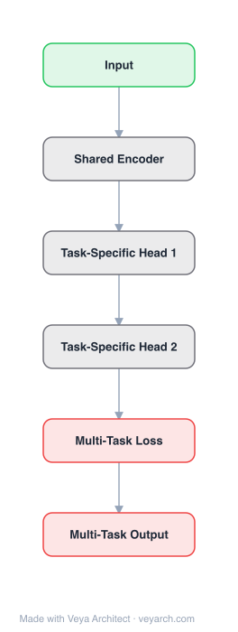

# Architecture: ARMT (Associative Recurrent Memory Transformer)

## Motivation

Creating a neural architecture for very long sequences that requires constant time for processing new information at each time step is a fundamental challenge. Transformers are limited by quadratic attention complexity, and while SSMs (like Mamba) offer linear-time inference, they are less efficient at memorization tasks, especially when questions are asked after the information is presented. ARMT addresses this by combining transformer self-attention for local context with segment-level recurrence for distributed long-context storage.

## Core Idea

An architecture based on transformer self-attention for local context processing and segment-level recurrence for storage of task-specific information distributed over a long context. ARMT combines the parallelizable training of transformers with the constant-time inference of recurrent models, enabling processing of sequences up to 50 million tokens.

## Architecture

### Overview

<b>Layer-by-layer (6 nodes)</b>

| # | Layer | Type | Params |
|---|---|---|---|
| 1 | Input | `input` |  |
| 2 | Shared Encoder | `custom` |  |
| 3 | Task-Specific Head 1 | `custom` |  |
| 4 | Task-Specific Head 2 | `custom` |  |
| 5 | Multi-Task Loss | `loss` |  |
| 6 | Multi-Task Output | `output` |  |

ARMT processes input in segments. Within each segment, standard transformer self-attention handles local context. Between segments, a recurrent memory mechanism passes information forward. The memory tokens are updated by the transformer and carry task-relevant associations across segment boundaries, enabling distributed storage over extremely long contexts.

### Components

1. **Local Self-Attention (Transformer)** — Within-segment processing:
   - Standard multi-head self-attention for local context
   - Processes all tokens within a segment in parallel
   - Captures local dependencies and patterns

2. **Segment-Level Recurrence** — Between-segment memory:
   - Memory tokens carry information from previous segments
   - Updated by the transformer at each segment
   - Enables distributed storage over long contexts
   - Constant-time per-step processing (only local attention + memory update)

3. **Memory Tokens** — Special tokens for inter-segment communication:
   - Added to the input sequence of each segment
   - Updated by the transformer's self-attention
   - Output memory tokens passed to the next segment
   - Store task-specific information (associations)

4. **Associative Memory** — Key-value storage:
   - Memory tokens can store key-value associations
   - Enables associative retrieval tasks over long contexts
   - Large and flexible storage for keeping associations

### Data Flow

1. **Input segmentation**: Split long sequence into segments of fixed size (e.g., 512 tokens)
2. **Memory injection**: Add memory tokens from previous segment to current segment input
3. **Local processing**: Transformer self-attention processes segment + memory tokens
4. **Memory update**: Output memory tokens are extracted and passed to next segment
5. **Recurrent processing**: Repeat for all segments (constant time per segment)
6. **Output**: Final segment output + memory state

### State / Memory

- **Segment-level recurrent memory**: The core memory mechanism. Memory tokens carry information across segment boundaries, enabling long-context processing.
- **Associative storage**: Memory tokens can store key-value pairs for associative retrieval.
- **Memory capacity**: Can be estimated using the formula k = nvα - n / (v - 1), where α is exact match accuracy, n is number of pairs, v is number of possible values.
- **Constant-time per step**: Each new token requires only local attention + memory update, not full-sequence attention.

## Design Decisions

1. **Segment-level recurrence** — Processing in fixed-size segments:
   - Enables constant-time per-step processing
   - Memory tokens carry information between segments
   - Avoids quadratic attention over full sequence

2. **Memory tokens (not hidden states)** — Using explicit memory tokens:
   - More flexible than hidden-state recurrence (RNN-style)
   - Can store specific information (associations)
   - Updated by transformer self-attention (not separate mechanism)
   - No changes to the transformer architecture itself

3. **Local self-attention** — Standard transformer within segments:
   - Parallelizable training (within segments)
   - Captures local context effectively
   - Familiar, well-optimized architecture

4. **Curriculum learning** — Training with increasing sequence lengths:
   - Start with short sequences, increase to maximum length
   - Enables stable training of long-context capabilities
   - 16k tokens for BABILong, 200 pairs for associative retrieval

## Evolution

**Predecessors:**
- **Transformer** (Vaswani et al., 2017) — Self-attention architecture.
- **Transformer-XL** (Dai et al., 2019) — Segment-level recurrence for transformers.
- **RMT** (Bulatov et al., 2022) — Recurrent Memory Transformer (predecessor with memory tokens).
- **Compressive Transformer** — Memory compression for long contexts.

**Successors:**
- **BABILong benchmark** — Multi-task long-context evaluation (ARMT set records).
- Further extensions of segment-level recurrent transformers.
- Hybrid attention-recurrence architectures.

## Characteristics

| Property | Value |
|----------|-------|
| Year | 2024 |
| Authors | Rodkin, Kuratov, Bulatov, Burtsev (MIPT, AIRI, LIMS) |
| Category | DL/Transformer |
| Source Paper | `Associative_Recurrent_Memory_Transformer_Mipt_Dolgoprudny_Russia_2024.md` |
| PaperVault Path | `DL-Architectures/01-transformers/Associative_Recurrent_Memory_Transformer_Mipt_Dolgoprudny_Russia_2024.md` |

## Limitations

1. **Segment size trade-off** — Smaller segments increase recurrence steps but reduce local context; larger segments increase attention cost.
2. **Memory bottleneck** — Information must be compressed into fixed-size memory tokens, potentially losing details.
3. **Training complexity** — Curriculum learning and memory management add training complexity.
4. **Sequential segment processing** — While each segment is parallelizable, segments must be processed sequentially (recurrence dependency).
5. **Memory interference** — Old information in memory tokens may interfere with new information over very long sequences.
6. **Limited to 50M tokens** — While impressive, truly infinite contexts would require external memory (RAG).

## Implementation Notes

See `implementation/` for a minimal runnable implementation. Key details:
- Segment size: 512 tokens (for RMT and ARMT)
- Memory tokens: added to segment input, updated by transformer, passed to next segment
- Local processing: standard transformer self-attention within segments
- Recurrence: memory tokens carry information across segment boundaries
- Curriculum learning: train on short sequences first, increase to max length
- BABILong: 50M tokens, 79.9% accuracy on single-fact questions
- Associative retrieval: 200 pairs for "Remember" task, 50 pairs for "Rewrite" task
- Language modeling: 1024 tokens (8 segments × 128 each)
- Code: available on GitHub
- Record: 79.9% accuracy on BABILong at 50M tokens

## Information Layers

- **Evidence:** Source paper available in `references/papers/` (Rodkin et al., 2024, "Associative Recurrent Memory Transformer")
- **Analysis:** ARMT's key contribution is demonstrating that segment-level recurrence with memory tokens can scale to extremely long contexts (50M tokens) while maintaining constant-time per-step processing. The associative memory capability is crucial — it's not just about processing long sequences but about being able to retrieve specific information from them. The 79.9% accuracy on BABILong at 50M tokens is a significant milestone, showing that the architecture can effectively store and retrieve information over contexts far beyond transformer attention windows. The memory capacity formula provides a theoretical foundation for understanding the architecture's storage limits.
- **Hypothesis:** The segment-level recurrence approach may be the practical path to infinite-context models — combining the strengths of transformers (local context) with recurrence (long-term memory). The memory token approach is more flexible than hidden-state recurrence because it allows the model to learn what to store explicitly. The associative retrieval capability suggests that memory tokens develop internal structure for key-value storage, which could be analyzed and improved.
