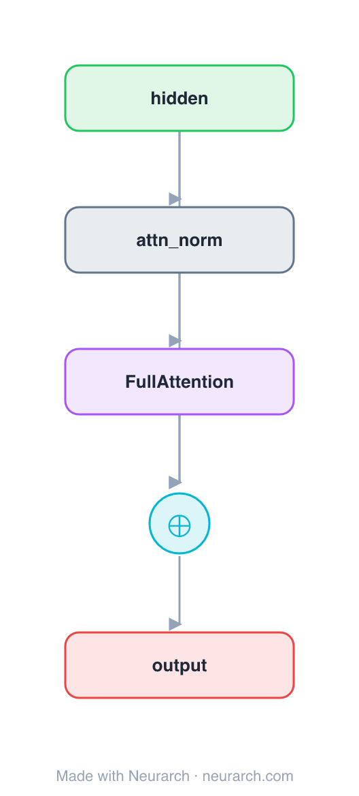

# Architecture: Full Attention Block

## Motivation

A minimal pre-norm residual attention sub-block with **dense (full) self-attention**: every token attends to every other token. The O(n²) baseline that the sliding-window and sparse variants trade away for longer context.

This is the **first of three sibling blocks** that are identical except for the attention op, so the diff is exactly the attention mechanism. See [COMPARISONS.md → Attention sparsity](../../COMPARISONS.md#attention-sparsity-full--sliding-window--sparse).

## Core Idea

A minimal pre-norm residual attention sub-block with **dense (full) self-attention**: every token attends to every other token.

## Architecture

### Overview

<b>Layer-by-layer (5 nodes)</b>

| # | Layer | Type | Params |
|---|---|---|---|
| 1 | hidden | `input` | shape: [128, 512] |
| 2 | attn_norm | `layerNorm` | normalizedShape: 512 |
| 3 | FullAttention | `multiHeadAttention` | embedDim: 512, numHeads: 8 |
| 4 | residual | `add` |   |
| 5 | output | `output` |   |

Shape-validated end to end (passes Neurarch's shape propagation with zero errors).

### Design Notes

- Dense attention: full n×n score matrix, quadratic in sequence length. Maximum expressivity, maximum cost.
- Pre-norm placement (norm before attention, residual around it), the modern default.
- Fork point: swap node 3 for `localAttention` or `nativeSparseAttention` to see the [sibling blocks](../../COMPARISONS.md#attention-sparsity-full--sliding-window--sparse), and re-validate instantly.

## Design Decisions

> **Analysis** — Observations derived from studying the architecture.

- Dense attention: full n×n score matrix, quadratic in sequence length. Maximum expressivity, maximum cost.
- Pre-norm placement (norm before attention, residual around it), the modern default.
- Fork point: swap node 3 for `localAttention` or `nativeSparseAttention` to see the [sibling blocks](../../COMPARISONS.md#attention-sparsity-full--sliding-window--sparse), and re-validate instantly.

## Implementation Notes

- `model.json` contains the full structural graph with real dimensions and parameters.
- Open in [Neurarch](https://www.neurarch.com/) to visualize, edit, or export training code.
- Diagrams fold repeated identical blocks with a `× N` badge; `model.json` holds all nodes at real dimensions.

## Limitations

- This package focuses on the architectural structure. Training pipelines, 
dataset preparation, and production optimizations are out of scope.

## Evolution

> See `references/related/` for predecessor and successor architectures.

