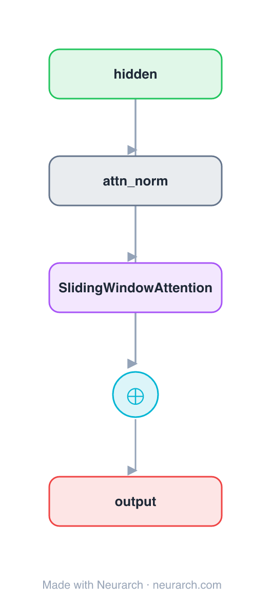

# Architecture: Sliding-Window Attention Block

## Motivation

The same pre-norm residual attention sub-block as [attn-full](../attn-full/), with one node swapped: each token attends only to a fixed **window** of nearby tokens instead of the whole sequence. Cost drops from O(n²) to O(n·w), and stacking layers still grows the effective receptive field. The mechanism behind Longformer and Mistral.

**Second of three sibling blocks** (full → sliding-window → sparse), identical except the attention op. See [COMPARISONS.md → Attention sparsity](../../COMPARISONS.md#attention-sparsity-full--sliding-window--sparse).

## Core Idea

The same pre-norm residual attention sub-block as [attn-full](.

## Architecture

### Overview

<b>Layer-by-layer (5 nodes)</b>

| # | Layer | Type | Params |
|---|---|---|---|
| 1 | hidden | `input` | shape: [128, 512] |
| 2 | attn_norm | `layerNorm` | normalizedShape: 512 |
| 3 | SlidingWindowAttention | `localAttention` | embedDim: 512, numHeads: 8, windowSize: 256 |
| 4 | residual | `add` |   |
| 5 | output | `output` |   |

Shape-validated end to end (passes Neurarch's shape propagation with zero errors).

### Design Notes

- `windowSize` is the one knob: each query sees `windowSize` neighbours, so attention is linear in sequence length.
- Receptive field grows with depth: L stacked windows of size w reach ~L·w tokens, the trick that lets Mistral run a 4K window over much longer context.
- Same I/O shape as full attention, so it is a drop-in swap, exactly what the [comparison](../../COMPARISONS.md#attention-sparsity-full--sliding-window--sparse) shows.

## Design Decisions

> **Analysis** — Observations derived from studying the architecture.

- `windowSize` is the one knob: each query sees `windowSize` neighbours, so attention is linear in sequence length.
- Receptive field grows with depth: L stacked windows of size w reach ~L·w tokens, the trick that lets Mistral run a 4K window over much longer context.
- Same I/O shape as full attention, so it is a drop-in swap, exactly what the [comparison](../../COMPARISONS.md#attention-sparsity-full--sliding-window--sparse) shows.

## Implementation Notes

- `model.json` contains the full structural graph with real dimensions and parameters.
- Open in [Neurarch](https://www.neurarch.com/) to visualize, edit, or export training code.
- Diagrams fold repeated identical blocks with a `× N` badge; `model.json` holds all nodes at real dimensions.

## Limitations

- This package focuses on the architectural structure. Training pipelines, 
dataset preparation, and production optimizations are out of scope.

## Evolution

> See `references/related/` for predecessor and successor architectures.

