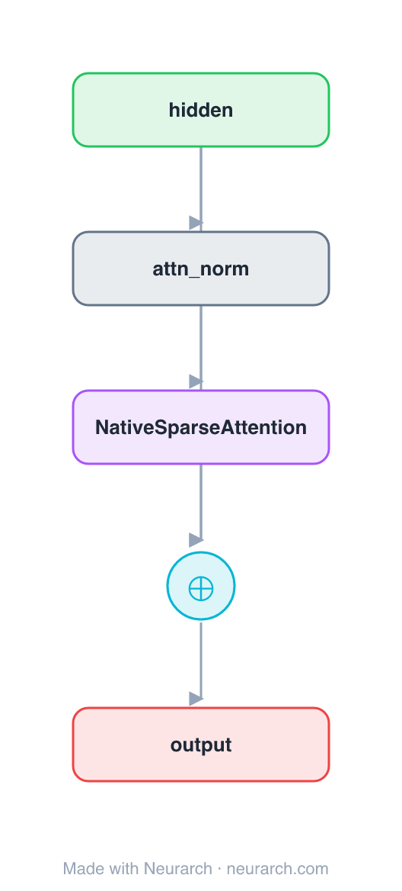

# Architecture: Native Sparse Attention Block

## Motivation

The same pre-norm residual attention sub-block as [attn-full](../attn-full/), with one node swapped for **block-sparse attention**: the sequence is chunked into blocks and each query attends only to a selected top-k of them. Long-range reach without the full n×n cost, and hardware-aligned (block-granular) so it is fast in practice. The mechanism behind DeepSeek's Native Sparse Attention.

**Third of three sibling blocks** (full → sliding-window → sparse), identical except the attention op. See [COMPARISONS.md → Attention sparsity](../../COMPARISONS.md#attention-sparsity-full--sliding-window--sparse).

## Core Idea

The same pre-norm residual attention sub-block as [attn-full](.

## Architecture

### Overview

<b>Layer-by-layer (5 nodes)</b>

| # | Layer | Type | Params |
|---|---|---|---|
| 1 | hidden | `input` | shape: [128, 512] |
| 2 | attn_norm | `layerNorm` | normalizedShape: 512 |
| 3 | NativeSparseAttention | `nativeSparseAttention` | embedDim: 512, numHeads: 8, blockSize: 64, topBlocks: 16 |
| 4 | residual | `add` |   |
| 5 | output | `output` |   |

Shape-validated end to end (passes Neurarch's shape propagation with zero errors).

### Design Notes

- Two knobs: `blockSize` (granularity of a chunk) and `topBlocks` (how many chunks each query keeps). Unlike a fixed window, the selected blocks can be anywhere in the sequence, so it keeps genuine long-range links.
- Block granularity is the point: selection and compute align to hardware tiles, which is why it stays fast where token-level sparsity does not.
- Drop-in with full / sliding-window attention (same I/O shape), the contrast the [comparison](../../COMPARISONS.md#attention-sparsity-full--sliding-window--sparse) draws.

## Design Decisions

> **Analysis** — Observations derived from studying the architecture.

- Two knobs: `blockSize` (granularity of a chunk) and `topBlocks` (how many chunks each query keeps). Unlike a fixed window, the selected blocks can be anywhere in the sequence, so it keeps genuine long-range links.
- Block granularity is the point: selection and compute align to hardware tiles, which is why it stays fast where token-level sparsity does not.
- Drop-in with full / sliding-window attention (same I/O shape), the contrast the [comparison](../../COMPARISONS.md#attention-sparsity-full--sliding-window--sparse) draws.

## Implementation Notes

- `model.json` contains the full structural graph with real dimensions and parameters.
- Open in [Neurarch](https://www.neurarch.com/) to visualize, edit, or export training code.
- Diagrams fold repeated identical blocks with a `× N` badge; `model.json` holds all nodes at real dimensions.

## Limitations

- This package focuses on the architectural structure. Training pipelines, 
dataset preparation, and production optimizations are out of scope.

## Evolution

> See `references/related/` for predecessor and successor architectures.

