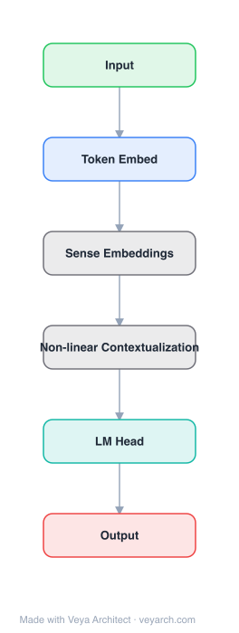

# Architecture: Backpack Language Models

## Motivation

Transformer language models produce contextual representations that are monolithic functions of their input, making interpretability and control difficult. Interventions to change model behavior (e.g., debiasing) require making non-contextual changes that apply globally, but Transformer representations are inherently contextual. The goal is to build a language model that maintains strong modeling performance while providing an interpretable interface for control.

## Core Idea

A neural architecture that learns multiple non-contextual sense vectors for each word in a vocabulary, and represents a word in a sequence as a context-dependent, non-negative linear combination of sense vectors. Sense vectors specialize to encode different aspects of a word, enabling interpretation by inspecting non-contextual projections and control by intervening on sense vectors.

## Architecture

### Overview

<b>Layer-by-layer (6 nodes)</b>

| # | Layer | Type | Params |
|---|---|---|---|
| 1 | Input | `input` |  |
| 2 | Token Embed | `embed` |  |
| 3 | Sense Embeddings | `custom` |  |
| 4 | Non-linear Contextualization | `custom` |  |
| 5 | LM Head | `linear` |  |
| 6 | Output | `output` |  |

A Backpack represents each word as k sense vectors (non-contextual, learned). The output for a word in context is a weighted sum of sense vectors from all words in the sequence, with context-dependent weights computed by a contextualization function (a Transformer). This decomposes the contextual representation into interpretable, non-contextual components.

### Components

1. **Sense Vectors** — For each word x in vocabulary V, k sense vectors C(x)_1, ..., C(x)_k ∈ R^d. These are non-contextual (word-level) representations, analogous to word2vec/GloVe but with k vectors per word. C: V → R^{k×d}.

2. **Contextualization Function (A)** — A (non-linear) function that computes contextualization weights α from the entire sequence:
   - α = A(x_{1:n}), where A: V^n → R^{k×n×n}
   - In practice, A is a Transformer model
   - α_ℓij determines how much sense ℓ of word j contributes to position i

3. **Backpack Representation** — The output for position i is:
   - o_i = Σ_j Σ_ℓ α_ℓij C(x_j)_ℓ
   - A weighted sum of sense vectors from all words, with context-dependent weights

4. **Output Layer** — Log-linear function of the Backpack representation:
   - p(y|o_{1:n}) = softmax(E(o_{1:n}))
   - E: R^{n×d} → R^{|Y|} is a linear transformation
   - Sense vectors contribute log-linearly to predictions

### Data Flow

1. **Input**: Sequence of symbols x_{1:n} = (x_1, ..., x_n)
2. **Sense vectors**: For each word x_j, retrieve k sense vectors C(x_j)_1, ..., C(x_j)_k
3. **Contextualization**: Compute weights α = A(x_{1:n}) using the Transformer contextualization function
4. **Backpack representation**: o_i = Σ_j Σ_ℓ α_ℓij C(x_j)_ℓ (weighted sum of sense vectors)
5. **Output**: p(y|o_{1:n}) = softmax(E(o_{1:n})) (log-linear prediction)

**Interpretation:**
- Sense vectors are non-contextual (word-level) → can be inspected independently
- Contextualization weights are context-dependent → capture how senses combine
- Output is a linear function of sense vectors → each sense's contribution is traceable

### State / Memory

- **Sense vectors (persistent)**: The k sense vectors per word are persistent model parameters, non-contextual and inspectable.
- **Contextualization state (transient)**: The Transformer contextualization function maintains standard Transformer state (KV cache, attention patterns) during processing.
- **No recurrent state**: The Backpack representation is computed per-sequence without recurrent state.

## Design Decisions

1. **Non-contextual sense vectors** — Making sense vectors non-contextual (word-level) enables:
   - Interpretability: inspect a sense by projecting to output space
   - Control: intervene on senses to change behavior globally
   - Analogy to word2vec/GloVe but with richer, multi-sense representations

2. **Linear combination** — The output being a non-negative linear combination of sense vectors:
   - Each sense's contribution is traceable and quantifiable
   - Log-linear output means sense vectors contribute log-linearly to predictions
   - Enables decomposition of model behavior into sense-level contributions

3. **k sense vectors per word** — Multiple senses capture different aspects of a word:
   - After training, senses specialize (e.g., one sense for gender, another for topic)
   - More senses = more granular control but more parameters

4. **Transformer contextualization** — Using a Transformer for the contextualization function:
   - Leverages Transformer's strong sequence modeling
   - Maintains modeling performance comparable to GPT-2

5. **170M parameters matching GPT-2 small** — Demonstrates that Backpacks can match Transformer performance while adding interpretability.

## Evolution

**Predecessors:**
- **Transformer** (Vaswani et al., 2017) — Base architecture for contextualization.
- **word2vec / GloVe** — Non-contextual word embeddings (single vector per word).
- **CBOW** (Mikolov et al., 2013) — Continuous bag-of-words (special case of Backpack).
- **Self-Attention-Only networks** (Elhage et al., 2021) — Special case of Backpack.
- **GPT-2** (Radford et al., 2019) — Performance baseline.

**Successors:**
- Larger Backpack models with more sense vectors.
- Backpack variants for other tasks (classification, retrieval).
- Interpretability frameworks building on sense vectors.

## Characteristics

| Property | Value |
|----------|-------|
| Year | 2023 |
| Authors | Hewitt, Thickstun, Manning, Liang (Stanford University) |
| Category | DL/Transformer |
| Source Paper | `Backpack_language_models_Hewitt_Thickstun_Manning_etal_2023.md` |
| PaperVault Path | `DL-Architectures/01-transformers/Backpack_language_models_Hewitt_Thickstun_Manning_etal_2023.md` |

## Limitations

1. **Fixed number of senses** — The number of sense vectors k is fixed at training time; words that need more or fewer senses cannot adapt.
2. **Sense granularity** — Senses may not align with human-interpretable concepts; some senses may be polysemantic.
3. **Contextualization function is still a black box** — While sense vectors are interpretable, the contextualization function (Transformer) remains opaque.
4. **Scale limitations** — 170M parameters is small; scaling to larger models may introduce new challenges.
5. **Non-negativity constraint** — The non-negative linear combination constraint may limit representational capacity.
6. **Performance gap at scale** — Matching GPT-2 small (124M) with 170M parameters; performance at larger scales is unverified.

## Implementation Notes

See `implementation/` for a minimal runnable implementation. Key details:
- Sense vectors: C: V → R^{k×d} (k senses per word, d-dimensional)
- Contextualization: A: V^n → R^{k×n×n} (Transformer)
- Backpack representation: o_i = Σ_j Σ_ℓ α_ℓij C(x_j)_ℓ
- Output: p(y|o) = softmax(E(o)) (log-linear)
- 170M parameters, trained on OpenWebText
- Matches GPT-2 small (124M) loss
- Sense vectors outperform 6B Transformer LM word embeddings on lexical similarity
- Controllable text generation via sense vector intervention
- Debiasing by localizing bias to a sense and suppressing it

## Information Layers

- **Evidence:** Source paper available in `references/papers/` (Hewitt et al., 2023, "Backpack Language Models")
- **Analysis:** Backpack's key innovation is decomposing the contextual representation into non-contextual sense vectors combined by context-dependent weights. This provides a tractable interface for interpretability: you can inspect what each sense encodes by projecting it to the output space, and you can intervene by modifying sense vectors. The linear combination structure ensures that interventions have predictable, global effects. The fact that sense vectors outperform much larger Transformer embeddings on lexical similarity suggests that the non-contextual representation is learning something fundamental about word meaning.
- **Hypothesis:** The sense vector decomposition may reveal the "building blocks" of word meaning that contextual models compose. The number of senses k may be task-dependent: more senses for nuanced tasks, fewer for simple classification. The Backpack framework may be particularly valuable for safety-critical applications where interpretability and control are essential.
