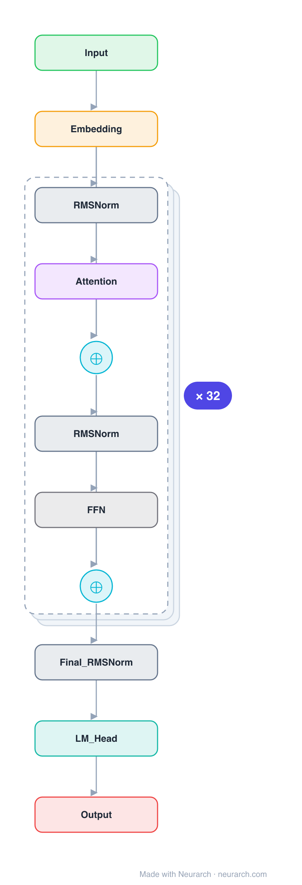

# Architecture: Baichuan2-7B

## Motivation

Baichuan Inc.'s second-generation 7B base model, a Llama-shaped pre-norm decoder distinguished by a large Chinese-optimized vocabulary and a normalized output head (NormHead).

## Core Idea

Baichuan Inc.

## Architecture

### Overview

*Identical repeated blocks are folded into one representative block with a `× N` badge, so the whole architecture fits on screen. `model.json` uses a NAXS block template + `repeat` directive: the 32 identical decoder layers are defined once and expanded by consumers (6 components expand to the full 197-node graph). Vector: [diagram.svg](assets/diagram.svg).*

| Hyperparameter | Value |
|---|---|
| Type | Decoder-only transformer (causal LM) |
| Parameters | 7.5B |
| Layers | 32 |
| Hidden size | 4096 |
| Attention | Multi-head: 32 heads |
| Head dim | 128 |
| FFN | SwiGLU, intermediate size 11,008 |
| Normalization | RMSNorm, pre-norm |
| Positions | RoPE (rotary dim 128) |
| Vocabulary | 125,696 |
| Max context | 4,096 |

`model.json` is the full 32-layer graph (via a NAXS block template repeated 32 times), produced with the same import path the Neurarch app uses for "load from Hugging Face", with all hyperparameters from the official `config.json`.

### Design Notes

- Llama-2-7B shape (32 layers, 4096 hidden, 11008 FFN) with a much larger 125696-token vocabulary optimized for Chinese.
- NormHead: the output embedding (LM head) rows are L2-normalized before the logit matmul, which the tech report credits with stabilizing training.
- The 7B model uses RoPE; do not confuse it with the 13B sibling, which uses ALiBi instead.
- Trained on 2.6T tokens; one of the first Chinese LLMs to ship intermediate training checkpoints for research.

### Parameter Check

Neurarch's per-layer parameter estimate over this graph: **7.51B**.
Deviation from the authoritative count (7.51B): **+0.0%**.

## Design Decisions

> **Analysis** — Observations derived from studying the architecture.

- Llama-2-7B shape (32 layers, 4096 hidden, 11008 FFN) with a much larger 125696-token vocabulary optimized for Chinese.
- NormHead: the output embedding (LM head) rows are L2-normalized before the logit matmul, which the tech report credits with stabilizing training.
- The 7B model uses RoPE; do not confuse it with the 13B sibling, which uses ALiBi instead.
- Trained on 2.6T tokens; one of the first Chinese LLMs to ship intermediate training checkpoints for research.

## Implementation Notes

- `model.json` contains the full structural graph with real dimensions and parameters, using a NAXS block template + `repeat` for the 32 identical layers.
- Open in [Neurarch](https://www.neurarch.com/) to visualize, edit, or export training code.
- Diagrams fold repeated identical blocks with a `× N` badge; `model.json` defines each repeated layer once at real dimensions and expands to all nodes.

## Limitations

- This package focuses on the architectural structure. Training pipelines, 
dataset preparation, and production optimizations are out of scope.

## Evolution

> See `references/related/` for predecessor and successor architectures.

