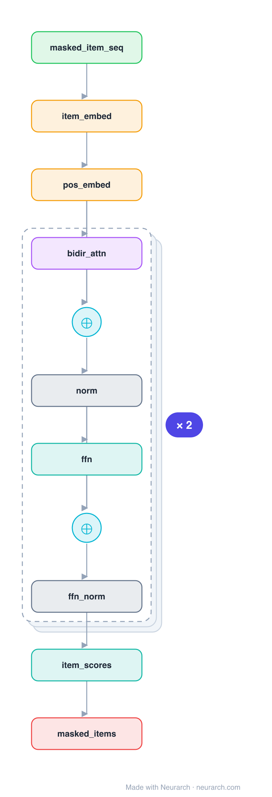

# Architecture: BERT4Rec

## Motivation

The recsys answer to BERT: a bidirectional Transformer over the item sequence trained with masked-item (Cloze) prediction. Each item sees both its past and future neighbours, unlike causal SASRec.

## Core Idea

The recsys answer to BERT: a bidirectional Transformer over the item sequence trained with masked-item (Cloze) prediction.

## Architecture

### Overview

*Identical repeated blocks are folded into one representative block with a `× N` badge, so the whole architecture fits on screen. `model.json` keeps all 17 nodes (open it in Neurarch to see and edit every layer). Vector: [diagram.svg](assets/diagram.svg).*

| Hyperparameter | Value |
|---|---|
| Type | Sequential recommendation |
| Embedding | Item + learned positional |
| Backbone | Bidirectional Transformer encoder |
| Objective | Masked-item (Cloze) prediction |
| Key idea | Both-directions context, BERT-style |

`model.json` is the full graph, hand-built against the official config.json.

### Design Notes

- Bidirectional self-attention plus a masked-item training objective (randomly mask items, predict them from both sides).
- The both-directions context can capture patterns a left-to-right model misses, at the cost of the Cloze-style training/serving mismatch.
- Directly comparable to [sasrec](../sasrec/): same inputs, bidirectional-masked vs causal.

### Parameter Check

Neurarch's per-layer parameter estimate over this graph: **27.2M**.

## Design Decisions

> **Analysis** — Observations derived from studying the architecture.

- Bidirectional self-attention plus a masked-item training objective (randomly mask items, predict them from both sides).
- The both-directions context can capture patterns a left-to-right model misses, at the cost of the Cloze-style training/serving mismatch.
- Directly comparable to [sasrec](../sasrec/): same inputs, bidirectional-masked vs causal.

## Implementation Notes

- `model.json` contains the full structural graph with real dimensions and parameters.
- Open in [Neurarch](https://www.neurarch.com/) to visualize, edit, or export training code.
- Diagrams fold repeated identical blocks with a `× N` badge; `model.json` holds all nodes at real dimensions.

## Limitations

- This package focuses on the architectural structure. Training pipelines, 
dataset preparation, and production optimizations are out of scope.

## Evolution

> See `references/related/` for predecessor and successor architectures.

