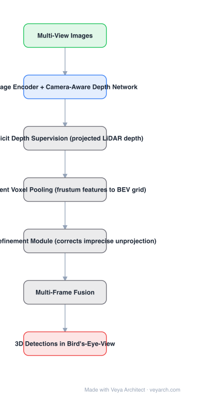

# Architecture: BEVDepth

## Motivation

Camera-BEV 3D detection lifts 2D features into 3D using estimated depth, so depth quality bounds everything downstream. BEVDepth's observation is that in prior work **depth estimation was surprisingly inadequate** given how central it is — the rest of the pipeline had been optimized while depth was left weakly supervised (learned only through the detection loss).

## Core Idea

Make depth trustworthy: **explicit depth supervision**, a **camera-aware depth estimation module**, and a **depth refinement module** that counteracts the errors imprecise depth introduces during feature unprojection. Supported by efficient voxel pooling and a multi-frame mechanism.

## Architecture

### Overview

<b>Layer-by-layer (7 nodes)</b>

| # | Layer | Type | Params |
|---|---|---|---|
| 1 | Multi-View Images | `input` |  |
| 2 | Image Encoder + Camera-Aware Depth Network | `conv2d` |  |
| 3 | Explicit Depth Supervision (projected LiDAR depth) | `custom` |  |
| 4 | Efficient Voxel Pooling (frustum features to BEV grid) | `custom` |  |
| 5 | Depth Refinement Module (corrects imprecise unprojection) | `custom` |  |
| 6 | Multi-Frame Fusion | `custom` |  |
| 7 | 3D Detections in Bird's-Eye-View | `output` |  |

### Components

1. **Image encoder** — per-view 2D features.
2. **Camera-aware depth estimation module** — the depth network receives camera parameters, so it predicts depth for the actual camera geometry rather than an implicit one.
3. **Explicit depth supervision** — depth is supervised against projected LiDAR points rather than only through the detection objective.
4. **Efficient voxel pooling** — a faster operation that scatters frustum features into the BEV grid.
5. **Depth refinement module** — corrects the side effects of imprecise feature unprojection, i.e. errors that propagate from depth into BEV features.
6. **Multi-frame mechanism** — temporal fusion across frames.
7. **BEV detection head** — standard detection head over the BEV features.

### Data Flow

Multi-view images → image encoder + camera-aware depth net (supervised by projected LiDAR) → efficient voxel pooling → BEV grid → depth refinement module → multi-frame fusion → BEV detection head → 3D detections.

### State / Memory

The multi-frame mechanism carries features across frames; the depth refinement module acts on the depth-conditioned feature unprojection. Depth itself is an explicit intermediate supervision target, not just an internal tensor.

## Design Decisions

- **Supervise depth directly** — the diagnosis is that learning depth only via detection loss leaves it too weak for the role it plays.
- **Make the depth net camera-aware** — intrinsics/extrinsics are informative inputs, not nuisance parameters.
- **Add a refinement module downstream, not just a better depth net** — imprecise unprojection has its own error signature and deserves its own correction.
- **Optimize the pooling** — efficient voxel pooling keeps the added depth machinery affordable.

## Evolution

- **LSS (Lift-Splat-Shoot)** and **OFT** (predecessors): depth-based view transformation with implicit depth.
- **BEVDepth (2022)**: explicit supervision + camera awareness + refinement.
- **Siblings**: BEVFormer (attention-based, no explicit depth), PETR (no view transform at all), SparseBEV, StreamPETR.
- **Successors**: BEVDepth4D, SOLOFusion, StreamPETR — temporal extensions of the same recipe.

## Characteristics

| Property | Value |
|---|---|
| Task | camera-based BEV 3D object detection |
| Depth | explicitly supervised (projected LiDAR), camera-aware |
| View transform | efficient voxel pooling (frustum → BEV) |
| Extra module | depth refinement for imprecise unprojection |
| Temporal | multi-frame mechanism |
| Result | 60.9% NDS on nuScenes test — first camera model past 60% |

## Limitations

- Requires LiDAR for depth supervision at training time (LiDAR is not needed at inference, but the training pipeline needs it).
- Depth supervision quality depends on LiDAR-to-image calibration and point sparsity.
- Multi-frame fusion assumes ego-motion compensation is accurate.
- Camera-only perception still lags LiDAR in adverse conditions.

## Implementation Notes

Essentials: (1) add an explicit depth loss against projected LiDAR — do not rely on the detection loss alone to teach depth, (2) feed camera intrinsics/extrinsics into the depth network, (3) implement efficient voxel pooling rather than a naive scatter, since depth supervision adds cost, (4) include the depth refinement module and ablate it: it targets unprojection error, which is distinct from depth error, (5) report NDS with and without multi-frame so the temporal gain is separable.
