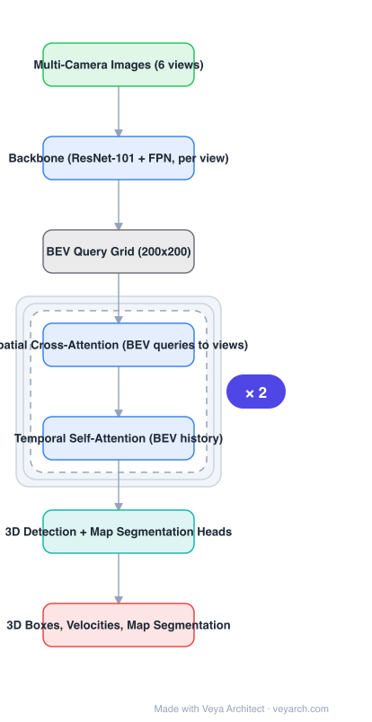

# Architecture: BEVFormer

## Motivation

Camera-only 3D perception needs a representation that downstream tasks can use directly. Depth-based lifting (LSS/BEVDet) estimates depth per pixel and splats features into BEV — an error-prone intermediate. BEVFormer asks whether the BEV representation can be learned **without explicit depth**, by letting BEV queries gather what they need directly from the multi-view features.

## Core Idea

Represent the ground plane as a **grid of learnable BEV queries**, and have each query gather information through two attention mechanisms:
- **Spatial cross-attention** — each BEV cell lifts to a column of heights and samples the corresponding image locations across all cameras (deformable sampling), so the network learns the implicit depth where it matters.
- **Temporal self-attention** — current BEV queries attend to the previous frame's BEV features, giving motion cues, occlusion reasoning, and temporal smoothing for free.

## Architecture

### Overview

<b>Layer-by-layer (7 nodes)</b>

| # | Layer | Type | Params |
|---|---|---|---|
| 1 | Multi-Camera Images (6 views) | `input` |  |
| 2 | Backbone (ResNet-101 + FPN, per view) | `conv2d` |  |
| 3 | BEV Query Grid (200x200) | `custom` |  |
| 4 | Spatial Cross-Attention (BEV queries to views) | `attention` |  |
| 5 | Temporal Self-Attention (BEV history) | `attention` |  |
| 6 | 3D Detection + Map Segmentation Heads | `linear` |  |
| 7 | 3D Boxes, Velocities, Map Segmentation | `output` |  |

### Components

1. **Per-view backbone (ResNet-101 + FPN)** — multi-scale features for each of the surround cameras.
2. **BEV query grid** — learnable queries arranged on an H×W grid (e.g. 200×200) plus a learnable BEV positional embedding; each query owns a grid cell of the ego-centric ground plane.
3. **Spatial cross-attention (deformable)** — for each BEV query, project a column of 3D reference points into each camera view and attend only to the sampled locations that are actually visible. No depth supervision is used; the sampling weights learn the lifting.
4. **Temporal self-attention** — BEV queries additionally attend to the previous frame's BEV features (aligned by ego-motion), implemented as a deformable self-attention across time; this is what enables velocity prediction and improves heavily occluded cases.
5. **BEV encoder refinement** — a few self-attention/convolution blocks over the BEV map.
6. **Task heads** — 3D box detection (and map segmentation) heads operating on the BEV features, in DETR-style set prediction or anchor-based form.
7. **Training** — Hungarian-style matching for detection, plus segmentation losses; no depth ground truth required.

### Data Flow

Surround images → per-view backbone → BEV queries (initialized + carried from previous frame) → spatial cross-attention to multi-view features → temporal self-attention to previous BEV → BEV encoder → 3D boxes / velocities / map segmentation.

### State / Memory

The previous frame's BEV feature map is the recurrent state — the temporal self-attention is the mechanism that makes BEVFormer a recurrent model over frames rather than a per-frame detector.

## Design Decisions

- **No explicit depth estimation** — avoids committing to a depth map and lets the network learn task-relevant lifting.
- **BEV grid queries** — a structured, interpretable representation shared by detection and map segmentation.
- **Deformable sampling** — keeps cross-view attention affordable (each query samples a handful of points per camera).
- **Recurrent temporal attention** — reuses past computation for velocity/occlusion rather than stacking more frames in the batch.
- **Ego-motion alignment** — history BEV features must be transformed into the current frame, otherwise temporal attention is harmful.

## Evolution

- **LSS / BEVDet / DETR3D** (predecessors): depth-based lifting or sparse 3D object queries.
- **BEVFormer**: grid BEV queries + spatial/temporal attention, no depth supervision; reported ~9-point NDS improvement on nuScenes test.
- **BEVFormer v2**: adds perspective supervision to guide the backbone.
- **Successors**: StreamPETR (object-query propagation, streaming), SparseBEV (sparse sampling), OccTransformer (occupancy), Far3D / Sparse4D (long-range, 4D sparse).
- **Related**: occupancy-based world models, VGGT-style feed-forward geometry as an alternative source of 3D structure.

## Characteristics

| Property | Value |
|---|---|
| Task | multi-camera 3D detection + map segmentation |
| Backbone | ResNet-101 + FPN per view |
| Representation | BEV query grid (e.g. 200×200) |
| Attention | spatial cross-attention (deformable, multi-view) + temporal self-attention |
| Depth supervision | none (implicit) |
| Reported | ~9-point NDS gain on nuScenes test |

## Limitations

- BEV grid resolution is the main accuracy/latency dial; small objects and long-range perception suffer at coarse grids.
- Recurrent temporal attention needs accurate ego-motion; calibration or pose errors degrade it.
- Two attention stages plus a per-view backbone make it heavy for embedded deployment.
- Implicit depth means no explicit geometric output for other tasks (no depth map, no point cloud).

## Implementation Notes

Essentials: (1) build the BEV query grid with positional embedding, (2) implement deformable spatial cross-attention with per-camera visibility masking, (3) cache and ego-motion-align the previous BEV map for temporal self-attention, (4) share the BEV feature map across detection and map heads. Start with a single temporal frame before adding more history — most of the gain comes from one previous frame.
