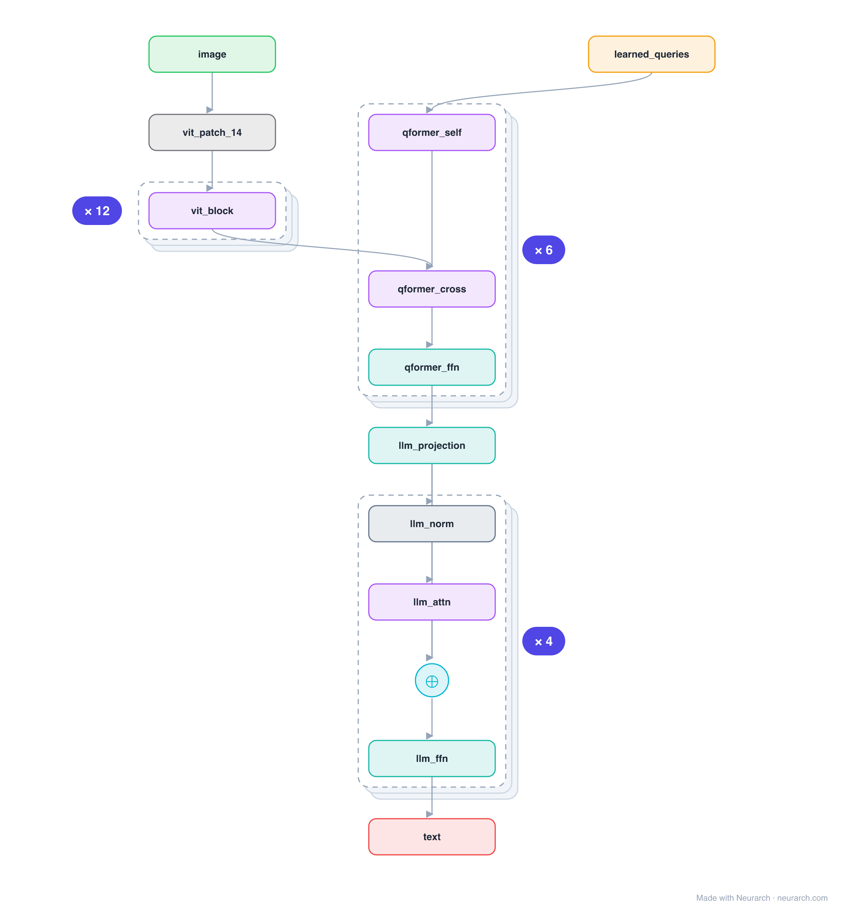

# Architecture: BLIP-2

## Motivation

Bridges a frozen image encoder and a frozen LLM with a lightweight Querying Transformer. A fixed set of 32 learned query tokens cross-attend the image features, distilling them into something the language model can read, so almost no parameters are trained.

## Core Idea

Bridges a frozen image encoder and a frozen LLM with a lightweight Querying Transformer.

## Architecture

### Overview

*Identical repeated blocks are folded into one representative block with a `× N` badge, so the whole architecture fits on screen. `model.json` uses NAXS block templates + `repeat` directives and expands back to all 51 nodes (open it in Neurarch to see and edit every layer). Vector: [diagram.svg](assets/diagram.svg).*

| Hyperparameter | Value |
|---|---|
| Type | Multimodal (image-to-text) |
| Vision encoder | Frozen ViT |
| Bridge | Q-Former: 32 learned queries, self + cross-attention to image |
| LLM | Frozen (OPT / Flan-T5), fed the projected queries |
| Trained | Only the Q-Former (everything else frozen) |

`model.json` is the full graph, hand-built against the official config.json.

### Design Notes

- The Q-Former is the whole idea: learned queries that self-attend each other and cross-attend the frozen image features, outputting a fixed 32-token visual summary.
- Both the vision encoder and the LLM stay frozen; only the small Q-Former (and a linear projection) are trained, which is why BLIP-2 is so cheap to build.
- A different bridge from [llava-1.5-7b](../llava-1.5-7b/)'s simple MLP projector, a learned cross-attention compressor vs a direct projection.

### Parameter Check

Neurarch's per-layer parameter estimate over this graph: **1.15B**.

## Design Decisions

> **Analysis** — Observations derived from studying the architecture.

- The Q-Former is the whole idea: learned queries that self-attend each other and cross-attend the frozen image features, outputting a fixed 32-token visual summary.
- Both the vision encoder and the LLM stay frozen; only the small Q-Former (and a linear projection) are trained, which is why BLIP-2 is so cheap to build.
- A different bridge from [llava-1.5-7b](../llava-1.5-7b/)'s simple MLP projector, a learned cross-attention compressor vs a direct projection.

## Implementation Notes

- `model.json` contains the full structural graph with real dimensions and parameters, using NAXS block templates + `repeat` for repeated units.
- Open in [Neurarch](https://www.neurarch.com/) to visualize, edit, or export training code.
- Diagrams fold repeated identical blocks with a `× N` badge; `model.json` defines each repeated unit once at real dimensions and expands to all nodes.

## Limitations

- This package focuses on the architectural structure. Training pipelines, 
dataset preparation, and production optimizations are out of scope.

## Evolution

> See `references/related/` for predecessor and successor architectures.

