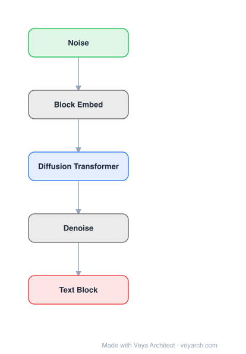

# Architecture: Block Diffusion

## Motivation

Diffusion language models offer unique benefits over autoregressive models due to their potential for parallelized generation and controllability. However, they lag in likelihood modeling and are limited to fixed-length generation. Discrete diffusion models face three key limitations: (1) inability to generate arbitrary-length sequences (fixed-length only), (2) inefficiency from lack of KV caching due to bidirectional context, and (3) quality gaps compared to autoregressive models.

## Core Idea

A class of block diffusion language models that interpolate between discrete denoising diffusion and autoregressive models. Block diffusion overcomes key limitations of both approaches by supporting flexible-length generation and improving inference efficiency with KV caching and parallel token sampling. It sets a new state-of-the-art among diffusion models on language modeling benchmarks.

## Architecture

### Overview

<b>Layer-by-layer (5 nodes)</b>

| # | Layer | Type | Params |
|---|---|---|---|
| 1 | Noise | `input` |  |
| 2 | Block Embed | `custom` |  |
| 3 | Diffusion Transformer | `attention` |  |
| 4 | Denoise | `custom` |  |
| 5 | Text Block | `output` |  |

Block diffusion models generate text in blocks of L' tokens. Within each block, a discrete diffusion process denoises all tokens simultaneously (parallel generation). Between blocks, the model is autoregressive (each block conditions on previous blocks). This hybrid approach combines the parallelism of diffusion with the flexibility and KV-cache efficiency of autoregressive models.

### Components

1. **Base Denoiser (xθ)** — A transformer with block-causal attention mask that:
   - Takes noisy block xb_t and clean previous blocks x<b as input
   - Outputs predictions for clean tokens in block b: xb_logits
   - Supports KV caching: outputs Kb, Vb keys/values for efficient computation

2. **Block-causal attention mask** — Tokens in block b attend to tokens in blocks 1 to b (causal at block level), but within a block, tokens attend bidirectionally (diffusion-style).

3. **KV Cache** — Keys and values from previous blocks (K1:b-1, V1:b-1) are cached and reused, enabling efficient autoregressive block-by-block generation.

4. **Noise schedule** — Data-driven noise schedule that minimizes gradient variance during training.

5. **Gradient variance estimators** — Theoretical framework for estimating and minimizing gradient variance in block diffusion training.

### Data Flow

1. **Input**: Sequence of tokens → split into B blocks of L' tokens each
2. **Training**:
   - Forward pass 1: Compute KV cache for full sequence: (∅, K1:B, V1:B) ← xθ(x)
   - Forward pass 2: For each block, denoise: xb_logits ← xbθ(xb_t, K1:b-1, V1:b-1)
   - Loss: LBD(x; θ) computed in parallel for all blocks
3. **Generation (autoregressive block-by-block)**:
   - For each block b = 1, 2, ..., B:
     - Initialize xb_t with noise
     - Denoising steps: iteratively denoise xb_t using xθ(xb_t, K1:b-1, V1:b-1)
     - Cache: compute Kb, Vb from denoised xb for next block
   - Output: concatenation of all denoised blocks

### State / Memory

- **KV cache (inter-block)**: Keys and values from previous blocks are cached for efficient autoregressive block generation. This is a key advantage over pure diffusion models.
- **No intra-block state**: Within a block, the diffusion process is stateless (bidirectional attention).
- **Denoising step state**: During denoising within a block, the noisy representation xb_t is the "state" that evolves through denoising steps.

## Design Decisions

1. **Block-level interpolation** — By generating text in blocks, block diffusion interpolates between:
   - Pure diffusion (block size = full sequence): fully parallel, fixed-length
   - Pure autoregressive (block size = 1 token): sequential, flexible-length
   - Block diffusion (block size = L' tokens): parallel within blocks, sequential between blocks

2. **KV caching** — Unlike pure diffusion models (which use bidirectional attention and cannot cache), block diffusion caches KV from previous blocks, enabling efficient autoregressive generation.

3. **Block-causal attention** — The attention mask allows bidirectional attention within blocks (for diffusion) while maintaining causality across blocks (for autoregressive generation).

4. **Data-driven noise schedule** — Rather than a fixed noise schedule, block diffusion uses a data-driven schedule that minimizes gradient variance, improving training stability and quality.

5. **Efficient training algorithm** — The two-pass training algorithm (first pass for KV cache, second pass for denoising) minimizes computational requirements.

## Evolution

**Predecessors:**
- **Transformer** (Vaswani et al., 2017) — Base architecture for the denoiser.
- **Discrete diffusion models** (Austin et al., 2021; Lou et al., 2024; Sahoo et al., 2024a) — Discrete denoising diffusion for text.
- **Autoregressive models** (GPT series) — Sequential token-by-token generation.
- **D3PM** (Austin et al., 2021) — Discrete denoising diffusion probabilistic models.
- **MDLM** (Sahoo et al., 2024a) — Masked diffusion language models.

**Successors:**
- Future hybrid diffusion-autoregressive models with larger block sizes.
- Models combining block diffusion with advanced denoising architectures.

## Characteristics

| Property | Value |
|----------|-------|
| Year | 2025 |
| Authors | Arriola, Gokaslan, Chiu, Yang, Qi, Han, Sahoo, Kuleshov |
| Category | DL/Diffusion |
| Source Paper | `Block_Diffusion_Interpolating_Between_Autoregressive_and_Dif_Models_2025.md` |
| PaperVault Path | `DL-Architectures/03-diffusion-models/Block_Diffusion_Interpolating_Between_Autoregressive_and_Dif_Models_2025.md` |

## Limitations

1. **Block size trade-off** — Larger blocks enable more parallelism but may reduce quality; smaller blocks are more autoregressive but less efficient.
2. **Two-pass training** — Training requires two forward passes (KV cache + denoising), increasing training cost.
3. **Denoising steps** — Within-block denoising requires multiple steps, adding inference latency compared to pure autoregressive.
4. **Likelihood modeling** — Despite improvements, still lags behind autoregressive models in likelihood modeling.
5. **Fixed block size** — Block size is fixed at training time; adaptive block sizes are not explored.

## Implementation Notes

See `implementation/` for a minimal runnable implementation. Key details:
- Block size L' tokens per block
- Base denoiser: transformer with block-causal attention mask
- Full signature: xb_logits, Kb, Vb ← xbθ(xb_t, K1:b-1, V1:b-1)
- Training: two-pass algorithm (KV cache pass + denoising pass)
- Generation: autoregressive block-by-block with parallel denoising within blocks
- Data-driven noise schedule with gradient variance minimization
- State-of-the-art among diffusion models on language modeling
- Supports arbitrary-length generation
- KV caching for efficient inference
- Code at github.com/m-arriola.com/bd3lms

## Information Layers

- **Evidence:** Source paper available in `references/papers/` (Arriola et al., 2025, "Block Diffusion: Interpolating Between Autoregressive and Diffusion Language Models")
- **Analysis:** Block diffusion's key insight is that the dichotomy between autoregressive and diffusion models is false — they are endpoints of a spectrum. By operating at the block level, the model captures the best of both: parallelism from diffusion, flexibility and KV-cache efficiency from autoregressive. The data-driven noise schedule and gradient variance estimators provide a principled framework for training. The block-causal attention mask is an elegant solution that enables both bidirectional (intra-block) and causal (inter-block) attention within a single architecture.
- **Hypothesis:** The optimal block size likely depends on the task: tasks with strong local dependencies benefit from larger blocks, while tasks requiring long-range planning benefit from smaller blocks. The KV caching mechanism may enable block diffusion to scale to very long sequences efficiently. The interpolation framework suggests a continuum of models parameterized by block size, with pure diffusion and pure autoregressive as special cases.
