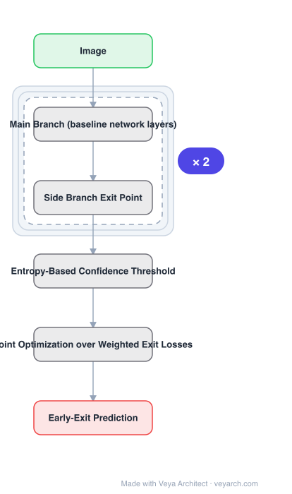

# Architecture: BranchyNet

## Motivation

The progression toward deeper networks — 8 layers (AlexNet), 19 (VGGNet), 152 (ResNet) within four years — dramatically increased the **latency and energy** required for feedforward inference. VGGNet versus AlexNet on a Titan X GPU shows a **20× increase in runtime and power** for roughly a 4% error reduction, and ResNet has an order of magnitude more layers than VGGNet. That trade makes deeper networks less tractable where latency and energy matter, such as real-time control.

## Core Idea

Add **side branches to the main branch** so certain test samples can **exit early**. The enabling observation: **features learned at earlier stages of a deep network can correctly infer a large subset of the data population**. Exiting those samples early avoids layer-by-layer processing through all layers. Confidence is measured by the **entropy** of the classification result at each exit point, compared against a learned threshold.

## Architecture

### Overview

<b>Layer-by-layer (6 nodes)</b>

| # | Layer | Type | Params |
|---|---|---|---|
| 1 | Image | `input` |  |
| 2 | Main Branch (baseline network layers) | `custom` |  |
| 3 | Side Branch Exit Point | `custom` |  |
| 4 | Entropy-Based Confidence Threshold | `custom` |  |
| 5 | Joint Optimization over Weighted Exit Losses | `custom` |  |
| 6 | Early-Exit Prediction | `output` |  |

### Components

1. **Main branch** — the original baseline network, unmodified in structure.
2. **Side branch exit points** — added branches, each producing a prediction and a confidence measure.
3. **Entropy-based confidence** — entropy of the softmax result at an exit point measures confidence.
4. **Learned threshold** — below it the sample exits with that prediction; above it the sample continues. The last exit point always classifies.
5. **Joint optimization over weighted exit losses** — training solves a joint optimization problem on the weighted sum of the losses at the exit points, so all exits are trained together.

### Data Flow

Image → main branch layers → at the first exit point, compute the side branch prediction and its entropy → if entropy is below the learned threshold, output and stop; otherwise continue to the next exit point → the final exit point always classifies.

### State / Memory

No recurrent state. The saving is compute and energy: samples that exit early never traverse the remaining layers, which is the source of the runtime and energy reduction.

## Design Decisions

- **Exploit early-layer sufficiency** — the stated observation that early features suffice for a large subset of samples.
- **Entropy as the exit criterion** — an interpretable, threshold-based confidence measure rather than a learned gate.
- **Learned thresholds** — tuned rather than hand-set.
- **Joint training of all exits** — weighted sum of exit losses, so early exits are trained rather than bolted on.
- **Always classify at the last exit** — guarantees an output for hard samples.

## Evolution

- **AlexNet (8 layers)**, **VGGNet (19 layers)**, **ResNet (152 layers)** (predecessors): the depth-increase trend that BranchyNet responds to.
- **BranchyNet (2017)**: side branches with entropy-based early exiting.
- **Siblings**: Slimmable, Once-for-All.
- **Contrast**: fixed-depth networks, which process every sample through every layer regardless of difficulty.

## Characteristics

| Property | Value |
|---|---|
| Task | fast inference via early exiting |
| Structure | main branch + side branch exit points |
| Exit criterion | entropy of softmax vs learned threshold |
| Training | joint optimization on weighted sum of exit losses |
| Guarantee | last exit point always performs classification |
| Effect | significant runtime and energy reduction for most samples |

## Limitations

- Exit thresholds trade accuracy against speed; aggressive thresholds degrade accuracy on hard samples.
- Each side branch adds parameters and its own loss weight to tune.
- Entropy is a heuristic confidence measure; it can be confidently wrong.
- Benefits concentrate on easy samples — if a dataset is uniformly hard, few samples exit early and the saving vanishes.

## Implementation Notes

Essentials: (1) attach **side branches at intermediate depths** and let samples stop there — a network with only a final output has no early exit, and the depth-motivated saving disappears, (2) train all exits **jointly** with a weighted sum of exit-point losses; training only the final head leaves early exits untrained and inaccurate, (3) use **entropy of the softmax** against a learned threshold as the exit criterion, which is the stated mechanism, and keep the threshold learned rather than hand-set, (4) guarantee the **last exit point always classifies**, so hard samples still get a full-depth prediction, (5) measure the actual early-exit **rate** on the target dataset — if few samples exit early, the runtime and energy benefit does not materialize, and report accuracy at each exit since the accuracy-speed trade lives there.
