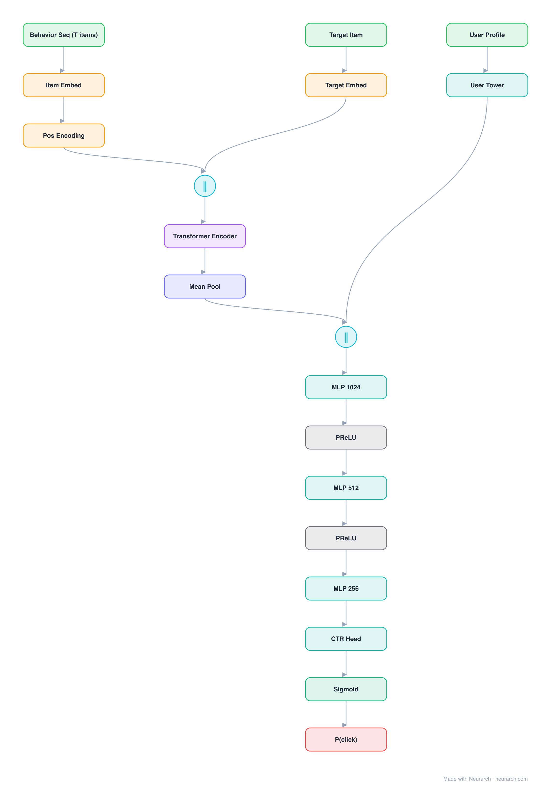

# Architecture: Behavior Sequence Transformer

## Motivation

Alibaba's CTR model that replaced sum-pooled user history with a Transformer encoder over the click sequence, with the candidate item appended as the final sequence element.

## Core Idea

Alibaba's CTR model that replaced sum-pooled user history with a Transformer encoder over the click sequence, with the candidate item appended as the final sequence element.

## Architecture

### Overview

<b>Layer-by-layer (19 nodes)</b>

| # | Layer | Type | Params |
|---|---|---|---|
| 1 | Behavior Seq (T items) | `input` | shape: [50] |
| 2 | Item Embed | `embedding` | vocabSize: 1000000, embeddingDim: 64 |
| 3 | Pos Encoding | `positionalEncoding` | dModel: 64, maxLen: 50 |
| 4 | Target Item | `input` | shape: [1] |
| 5 | Target Embed | `embedding` | vocabSize: 1000000, embeddingDim: 64 |
| 6 | [seq; tgt] | `concatenate` | dim: 1, numInputs: 2 |
| 7 | Transformer Encoder | `transformerBlock` | dModel: 64, numHeads: 8, dFf: 256, numLayers: 1, causal: false |
| 8 | Mean Pool | `globalAvgPool1d` |   |
| 9 | User Profile | `input` | shape: [16] |
| 10 | User Tower | `linear` | inFeatures: 16, outFeatures: 32 |
| 11 | Concat all | `concatenate` | dim: -1, numInputs: 2 |
| 12 | MLP 1024 | `linear` | inFeatures: 96, outFeatures: 1024 |
| 13 | PReLU | `prelu` |   |
| 14 | MLP 512 | `linear` | inFeatures: 1024, outFeatures: 512 |
| 15 | PReLU | `prelu` |   |
| 16 | MLP 256 | `linear` | inFeatures: 512, outFeatures: 256 |
| 17 | CTR Head | `linear` | inFeatures: 256, outFeatures: 1 |
| 18 | Sigmoid | `sigmoid` |   |
| 19 | P(click) | `output` |   |

This graph ships in Neurarch's in-app template library; the copy here passes shape propagation with zero errors.

### Design Notes

- The candidate-in-sequence trick lets self-attention compute target-aware interest weights directly.
- Deployed in Taobao ranking; one of the first production proofs that Transformers transfer to recsys sequences.

## Design Decisions

> **Analysis** — Observations derived from studying the architecture.

- The candidate-in-sequence trick lets self-attention compute target-aware interest weights directly.
- Deployed in Taobao ranking; one of the first production proofs that Transformers transfer to recsys sequences.

## Implementation Notes

- `model.json` contains the full structural graph with real dimensions and parameters.
- Open in [Neurarch](https://www.neurarch.com/) to visualize, edit, or export training code.
- Diagrams fold repeated identical blocks with a `× N` badge; `model.json` holds all nodes at real dimensions.

## Limitations

- This package focuses on the architectural structure. Training pipelines, 
dataset preparation, and production optimizations are out of scope.

## Evolution

> See `references/related/` for predecessor and successor architectures.

