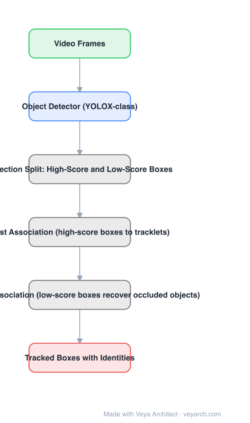

# Architecture: ByteTrack

## Motivation

Tracking-by-detection discards detection boxes below a score threshold. But a low score usually means the object is *occluded*, not absent — so thresholding silently deletes real objects, producing missing detections and fragmented trajectories. ByteTrack's argument is that the fix is not a better association metric but simply **using the low-score boxes**.

## Core Idea

A **two-round association**: match high-score detections to existing tracklets first; then match the remaining (low-score) detections to the tracklets that are still unmatched, which recovers occluded objects while background false positives — having no tracklet to match — are dropped.

## Architecture

### Overview

<b>Layer-by-layer (6 nodes)</b>

| # | Layer | Type | Params |
|---|---|---|---|
| 1 | Video Frames | `input` |  |
| 2 | Object Detector (YOLOX-class) | `conv2d` |  |
| 3 | Detection Split: High-Score and Low-Score Boxes | `custom` |  |
| 4 | First Association (high-score boxes to tracklets) | `custom` |  |
| 5 | Second Association (low-score boxes recover occluded objects) | `custom` |  |
| 6 | Tracked Boxes with Identities | `output` |  |

### Components

1. **Object detector** — a YOLOX-class single-stage detector producing boxes with scores per frame; detection quality is the ceiling for the tracker.
2. **Score split** — detections are partitioned by a score threshold (high vs. low) instead of the low ones being discarded.
3. **First association** — high-score boxes matched to existing tracklets by IoU plus Kalman-filter-predicted motion.
4. **Second association** — low-score boxes matched to the *unmatched* tracklets by IoU only (appearance-free, and motion prediction is unreliable for occluded objects).
5. **Tracklet lifecycle** — unmatched tracklets are kept for a short buffer in case they reappear; new tracks are initialized from unmatched high-score boxes.
6. **No appearance model** — association is motion + IoU, which is the reason for the 30 FPS figure.

### Data Flow

Frame → detector → boxes split by score → association 1 (high-score ↔ tracklets) → association 2 (low-score ↔ leftover tracklets) → Kalman update → tracks with identities.

### State / Memory

Tracklet state (Kalman filter mean/covariance, last box, age, id) is the whole memory — a small per-object state, no feature gallery.

## Design Decisions

- **Use every detection box** — the central claim; the cost of a wrong low-score match is lower than the cost of a missing object.
- **Two rounds, not one** — occluded objects must not compete with confident detections for the same tracklet.
- **Skip appearance features** — keeps the tracker real-time; the price is weaker re-identification after long occlusion.
- **Detector-agnostic wrapper** — the association method applies to any tracker; the paper shows gains on 9 trackers.

## Evolution

- **SORT (2016)** / **DeepSORT (2017)** (predecessors): Kalman + IoU, then added appearance features.
- **ByteTrack (2021)**: second association over low-score boxes.
- **Siblings**: OC-SORT (observation-centric fixes to the filter), BoT-SORT, StrongSORT.
- **Successors**: ByteTrackv2, hybrid motion + lightweight-appearance trackers.

## Characteristics

| Property | Value |
|---|---|
| Task | multi-object tracking (tracking-by-detection) |
| Detector | YOLOX-class |
| Association | two rounds: high-score, then low-score |
| Appearance model | none (motion + IoU) |
| Speed | 30 FPS on a single V100 |
| Reported | 80.3 MOTA, 77.3 IDF1, 63.1 HOTA on MOT17 |

## Limitations

- No appearance model means identity switches after long occlusion or when objects cross.
- Depends entirely on detector recall: if the detector misses the object even at low score, nothing can be recovered.
- Camera motion and non-linear motion break the linear Kalman assumption (OC-SORT targets this).
- Threshold value matters and is detector-dependent.

## Implementation Notes

Essentials: (1) do not filter detections before association — pass all boxes and split by threshold inside the tracker, (2) run the second association against only the *unmatched* tracklets, (3) drop motion gating in the second round, since occluded objects violate the motion model, (4) keep lost tracklets alive briefly so reappearance can be matched, (5) tune the score threshold against your detector's score distribution; the published default assumes YOLOX scores.
