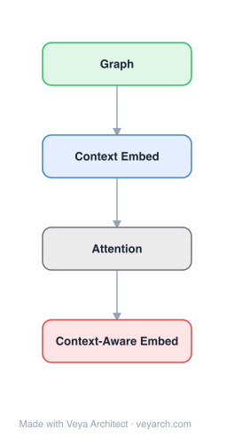

# Architecture: CANE

## Motivation

Network embedding (NE) maps vertices of a network into a low-dimensional space according to their structural roles, alleviating the computation and sparsity issues of conventional symbol-based representations. It has achieved promising performance on link prediction, vertex classification, and community detection.

However, existing NE models learn a fixed, context-free embedding for each vertex and neglect the diverse roles a vertex plays when interacting with different neighbors. In real-world social and information networks, a vertex typically demonstrates various aspects depending on its interaction partner: a researcher collaborates with different partners on diverse research topics; a social-media user contacts different friends sharing distinct interests; a web page links to multiple pages for different purposes. Conventional NE models assign a single static embedding per vertex, causing two issues: (1) they cannot flexibly cope with the aspect transition of a vertex when interacting with different neighbors; (2) they force the embeddings of a vertex's neighbors close to each other, even when those neighbors share little common interest — making vertex embeddings indiscriminative.

CANE addresses this by learning context-aware embeddings: a vertex receives different embeddings depending on which neighbor it interacts with, enabling precise modeling of the semantic relationships between vertices. CANE is implemented on text-based information networks (where each vertex has associated text), and can be extended to other information network types.

## Core Idea

Context-aware network embedding modeling relationships between nodes with mutual attention.

## Architecture

### Overview

<b>Layer-by-layer (4 nodes)</b>

| # | Layer | Type | Params |
|---|---|---|---|
| 1 | Graph | `input` |  |
| 2 | Context Embed | `embed` |  |
| 3 | Attention | `custom` |  |
| 4 | Context-Aware Embed | `output` |  |

CANE (Context-Aware Network Embedding) learns both context-free and context-aware embeddings for each vertex. The context-free embedding is a static vector for the vertex. The context-aware embedding is dynamic — it changes depending on which neighbor the vertex is interacting with. For an edge (u, v), CANE derives context embeddings for u and v from their text information (S_u and S_v) using neural text models. To make these embeddings context-aware, CANE introduces a mutual (selective) attention mechanism between u and v: each vertex's text representation is guided to emphasize the words focused on by the other vertex. The context-free and context-aware embeddings are concatenated and learned together via existing NE methods (DeepWalk, LINE, node2vec). This enables CANE to model the diverse relationships between vertices more precisely than fixed-embedding methods.

### Components

1. **Context-Free Embedding**:
   - A static embedding vector for each vertex (as in conventional NE)
   - Captures the vertex's overall, context-independent representation
   - Learned alongside the context-aware embeddings

2. **Context-Aware Text Embedding (per edge)**:
   - For each edge (u, v), the text of u (S_u) and v (S_v) is processed by a neural text model to produce text-based embeddings
   - These embeddings are dynamic: u's embedding when interacting with v differs from u's embedding when interacting with another neighbor w
   - Neural text models used: convolutional neural networks (CNNs) and recurrent neural networks (RNNs/LSTMs)

3. **Mutual Attention Mechanism (selective attention)**:
   - The core of CANE's context-awareness: for an edge (u, v), a mutual attention is built between the two vertices' text representations
   - Each vertex's attention guides the other vertex's neural text model to emphasize the words the other focuses on
   - Produces context-aware embeddings: u(v) is u's embedding in the context of v, and v(u) is v's embedding in the context of u
   - Enables precise relationship modeling — the embedding reflects the specific interaction

4. **Concatenation of Context-Free + Context-Aware**:
   - The final per-edge representation combines the context-free embedding with the context-aware embedding (via concatenation)
   - This preserves both the vertex's stable identity and its interaction-specific aspect

5. **NE Training Framework**:
   - The combined embeddings are trained using existing NE methods (DeepWalk, LINE, node2vec) as the backbone
   - Leverages the proven objective functions of these methods (Skip-Gram, proximity preservation)
   - CANE plugs context-aware embeddings into these frameworks

### Data Flow

1. **Input**: Information network G = (V, E, T), where T is the text information associated with each vertex
2. **Edge sampling**: For training, sample edges (u, v) from E (and non-edges as negatives)
3. **Text encoding**: For vertex u, process its text S_u with a neural text model (CNN/RNN) to get a base text representation; similarly for v
4. **Mutual attention**: Build mutual attention between u's and v's text representations — u's attention weights highlight words in S_v that matter to u, and vice versa
5. **Context-aware embedding generation**: Apply the attention weights to produce u(v) (u's embedding in context of v) and v(u) (v's embedding in context of u)
6. **Concatenation**: Combine each vertex's context-free embedding with its context-aware embedding
7. **NE objective**: Feed the combined embeddings into the chosen NE framework (DeepWalk/LINE/node2vec objective) to preserve network structure
8. **Backprop**: Update the text encoders, attention parameters, and context-free embeddings via gradient descent
9. **Inference**: For a given edge (u, v), retrieve/compute u(v) and v(u); for vertex classification, aggregate a vertex's context-aware embeddings across its neighbors

### State / Memory

- **No recurrent state across edges**: The text encoder (CNN/RNN) processes each vertex's text independently per edge; there is no temporal memory across edges or time steps (RNN state is per-text-sequence and transient).
- **Persistent parameters**: The context-free embeddings (one per vertex), the neural text model weights (CNN/RNN), and the mutual attention parameters are the learned, persistent parameters.
- **Context-aware embeddings are derived, not stored**: A vertex's context-aware embedding u(v) is computed on-the-fly for a specific edge (u, v) — it is a function of u's text, v's text, and the attention parameters. A vertex has as many context-aware embeddings as it has neighbors.
- **Text as vertex memory**: Each vertex's associated text S_v serves as a rich, persistent information source that the attention mechanism selectively reads from depending on context.

## Design Decisions

1. **Context-aware over context-free embeddings** — Models diverse roles:
   - A single static embedding cannot capture that a vertex shows different aspects to different neighbors
   - Context-aware embeddings let a vertex's representation adapt to the interaction, precisely modeling relationships
   - Directly addresses the indiscriminativeness caused by forcing all of a vertex's neighbors close together

2. **Mutual (selective) attention** — Bidirectional context:
   - Building attention mutually between u and v means each vertex's representation is shaped by the other
   - Each vertex emphasizes the words in its text that the other vertex focuses on
   - Produces genuinely interaction-specific embeddings, not just independent context vectors

3. **Text-based information networks** — Rich external information:
   - Text is a natural, abundant source of multi-faceted vertex information (research interests, post content, page content)
   - Neural text models (CNN/RNN) extract semantic features from raw text
   - Easily extensible to other information types (labels, meta-data)

4. **Concatenation of context-free + context-aware** — Stability + flexibility:
   - Context-free embedding preserves the vertex's stable identity
   - Context-aware embedding captures the interaction-specific aspect
   - Concatenation keeps both, letting downstream tasks use the combined representation

5. **Plugging into existing NE frameworks** — Proven objectives:
   - Using DeepWalk/LINE/node2vec as the backbone reuses their well-tested proximity-preservation objectives
   - CANE contributes the context-aware embedding mechanism; the backbone contributes the network-structure learning
   - Reduces engineering burden and isolates the contribution

6. **CNN and RNN text encoders** — Complementary text modeling:
   - CNNs capture local n-gram features in text
   - RNNs/LSTMs capture sequential/long-range dependencies
   - Offering both lets the model suit different text characteristics

## Evolution

**Predecessors:**
- **DeepWalk** (Perozzi et al., 2014) — Random-walk + Skip-Gram; context-free, structure-only embeddings.
- **LINE** (Tang et al., 2015) — First/second-order proximity; context-free.
- **node2vec** (Grover & Leskovec, 2016) — Biased random walks; context-free.
- **TADW** (Yang et al., 2015) — Text-Associated DeepWalk; incorporates text via matrix factorization but still context-free.
- **MMDW** (Tu et al., 2016) — Max-margin DeepWalk; uses label info; context-free.
- **CENE** (Sun et al., 2016) — Context-enhanced network embedding; treats text as special vertices.
- **GENE** (Chen et al., 2016) — Group-enhanced NE; incorporates group info.
- **Attention mechanisms** (Bahdanau et al., 2014; Vaswani et al., 2017) — The selective/mutual attention foundation CANE builds on.

**Successors:**
- **Attention-based graph neural networks** (GAT, 2018) — Graph attention networks that learn edge-specific attention; extend the attention-over-neighbors idea to broader GNNs.
- **Multi-relational / edge-aware graph embeddings** — Methods modeling edge-specific interactions build on CANE's context-aware framing.
- **Heterogeneous information network embedding** — Subsequent work on role- and relation-aware embeddings in heterogeneous graphs.

## Characteristics

| Property | Value |
|----------|-------|
| Year | 2017 |
| Authors | Cunchao Tu, Han Liu, Zhiyuan Liu, Maosong Sun (Tsinghua University / Northeastern University) |
| Category | GNN/Embedding |
| Source Paper | `CANE_Context_aware_network_embedding_for_relation_modeling_Tu_Liu_Sun_2017.md` |
| PaperVault Path | `GNN/02-network-embedding/CANE_Context_aware_network_embedding_for_relation_modeling_Tu_Liu_Sun_2017.md` |

## Limitations

1. **Requires rich text/information per vertex** — Context-awareness depends on having external information (text) for vertices; for plain graphs without text, the method's advantage over context-free NE diminishes.
2. **Computational cost of per-edge attention** — Computing mutual attention for every edge (and its text) is more expensive than static embedding methods; scales with the number of edges and text length.
3. **Context-aware embeddings are not stored** — A vertex has a different embedding per neighbor; aggregation strategies for tasks like vertex classification (which expect one vector per vertex) add complexity.
4. **Transductive** — CANE learns embeddings for observed vertices and does not naturally generalize to unseen vertices without retraining (though the text encoder offers some inductive potential).
5. **Backbone-dependent** — The quality of context-aware embeddings partly depends on the chosen NE backbone (DeepWalk/LINE/node2vec) and its limitations.
6. **Static networks only** — Designed for static information networks; does not handle evolving networks.
7. **Attention interpretability** — While attention provides context-awareness, the learned attention weights may not always correspond to human-interpretable word importance.

## Implementation Notes

See `implementation/` for a minimal runnable implementation. Key details:
- Each vertex has a context-free embedding (static) + context-aware embeddings (one per neighbor)
- For edge (u, v): neural text models (CNN and/or RNN) encode S_u and S_v
- Mutual selective attention: u's attention highlights words in S_v; v's attention highlights words in S_u
- Produces u(v) and v(u) — context-aware embeddings specific to the edge
- Final per-edge representation = concatenation of context-free + context-aware embeddings
- Trained via existing NE frameworks (DeepWalk, LINE, node2vec) as backbone
- Source code and datasets: https://github.com/thunlp/CANE
- Significant improvement over state-of-the-art on link prediction; comparable performance on vertex classification
- Implemented on text-based information networks; extensible to other information types

## Information Layers

- **Evidence:** Source paper available in `references/papers/` (Tu, Liu, Liu, Sun, 2017, "CANE: Context-Aware Network Embedding for Relation Modeling", IJCAI '17)
- **Analysis:** CANE's central insight is that a single static embedding per vertex is fundamentally inadequate for modeling the diverse relationships a vertex has with different neighbors. By introducing mutual selective attention between the text of two endpoints of an edge, CANE makes each vertex's representation depend on its interaction partner — the embedding of a researcher differs when collaborating with different partners, reflecting different research topics. The concatenation of context-free and context-aware embeddings preserves both stable identity and interaction-specific aspects. Empirically, this yields significant gains on link prediction (where the relationship between two specific vertices matters most) and comparable performance on vertex classification (where a single aggregated representation is needed). The success confirms that context-awareness is critical for tasks involving complicated vertex interactions.
- **Hypothesis:** The success of CANE suggests that network embedding should be relational rather than absolute — a vertex's representation is best defined relative to its interaction context, not in isolation. The mutual attention mechanism implies that relationship modeling is bidirectional: the relevant aspects of u depend on v, and vice versa. A natural extension is to combine context-awareness with inductive text encoders and dynamic/evolving networks, and to replace the NE backbone with end-to-end graph attention networks.
