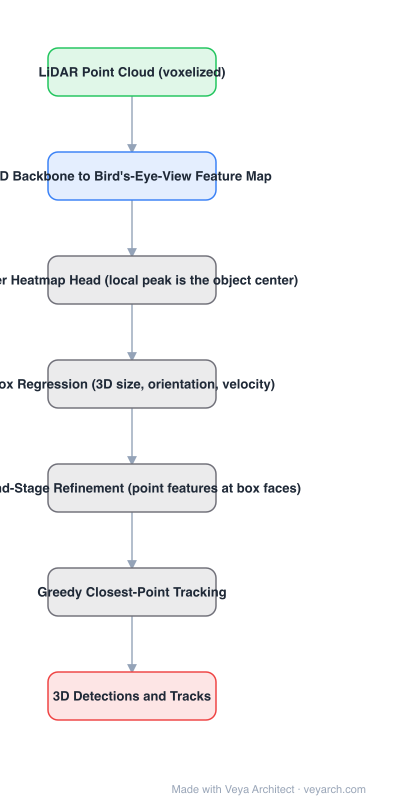

# Architecture: CenterPoint

## Motivation

3D detection inherited the 2D anchor-box representation, and it fits badly. 3D objects have arbitrary orientation, so an axis-aligned box is a poor proxy and anchor-based detectors must enumerate orientations — extra compute and a source of false positives. The paper argues this **representation** mismatch, not the backbone, is the crux of the 2D→3D transfer difficulty.

## Core Idea

Represent, detect and track 3D objects as **points**. A keypoint detector finds object centers in a bird's-eye-view feature map and regresses 3D size, orientation and velocity; a second stage refines using point features. Tracking then collapses to greedy **closest-point matching** with no hidden state.

## Architecture

### Overview

<b>Layer-by-layer (7 nodes)</b>

| # | Layer | Type | Params |
|---|---|---|---|
| 1 | LiDAR Point Cloud (voxelized) | `input` |  |
| 2 | 3D Backbone to Bird's-Eye-View Feature Map | `conv2d` |  |
| 3 | Center Heatmap Head (local peak is the object center) | `custom` |  |
| 4 | Box Regression (3D size, orientation, velocity) | `custom` |  |
| 5 | Second-Stage Refinement (point features at box faces) | `custom` |  |
| 6 | Greedy Closest-Point Tracking | `custom` |  |
| 7 | 3D Detections and Tracks | `output` |  |

### Components

1. **3D point-cloud encoder** — a standard voxel backbone (VoxelNet or PointPillars in the paper) producing a bird's-eye-view feature map; the paper shows BEV features are sufficient and more efficient than voxel features (versus VSA and RBF interpolation baselines).
2. **Center heatmap head** — a keypoint detector over the BEV map; a local peak is the object center, with refinement.
3. **Box regression head** — regresses 3D size, orientation and velocity at the detected center.
4. **Second-stage refinement** — point features on the object refine the estimates.
5. **Tracking** — with learned point velocity, tracking is greedy closest-point matching: no 3D Kalman filter, no hidden state.

### Data Flow

LiDAR point cloud → voxel encoder → BEV feature map → center heatmap (peaks) + box attribute regression → second-stage refinement → 3D boxes; across frames → greedy closest-point tracking.

### State / Memory

Track state is just the previous frame's detected centers plus learned velocity — explicitly no hidden state, which is why tracking costs 1 ms versus 73 ms for a 3D Kalman filter.

## Design Decisions

- **Points instead of boxes** — eliminates orientation enumeration and the axis-alignment mismatch in one move.
- **Detect in BEV** — the paper argues BEV features are sufficient while being more efficient than voxel features.
- **Learn velocity, match by distance** — replaces Mahalanobis matching over box states; reported +3.7 AMOTA and far cheaper.
- **Keep it simple and near real-time** — a standard encoder plus a few convolutional head layers.

## Evolution

- **VoxelNet, PointPillars, PV-RCNN** (predecessors): anchor-based 3D detection, with PV-RCNN adding Voxel-Set Abstraction.
- **CenterPoint (2020)**: center-based representation.
- **Siblings**: PillarNet, VoxelNeXt, CenterPoint++, FSD.
- **Contrast**: camera-BEV detection (PETR, BEVDepth, BEVFormer) — different sensor, same BEV output space.
- **Status**: the standard LiDAR baseline for several years.

## Characteristics

| Property | Value |
|---|---|
| Task | 3D object detection and tracking from LiDAR |
| Representation | objects as points (center keypoint + attributes) |
| Features | bird's-eye-view map (voxel encoder backbone) |
| Stages | center heatmap + regression, then point-feature refinement |
| Tracking | greedy closest-point matching, no Kalman filter |
| Results | 65.5 NDS / 63.8 AMOTA nuScenes; first among LiDAR-only Waymo submissions |

## Limitations

- LiDAR-only; no camera fusion (later work adds it).
- Center-based representation relies on the object having a well-defined center in BEV — heavily overlapping objects can share peaks.
- The linear velocity model assumes roughly constant velocity between frames.
- Second-stage refinement adds a pass over point features, so it is not free.

## Implementation Notes

Essentials: (1) detect centers as a heatmap peak in BEV rather than matching anchors — do not reintroduce orientation-specific anchors, (2) regress size, orientation and velocity at the peak, (3) implement tracking as greedy closest-point matching using the learned velocity, and confirm no hidden state is needed, (4) verify against a voxel-feature baseline: the paper's claim is that BEV features suffice and are cheaper, (5) evaluate detection and tracking separately so gains are attributable.
