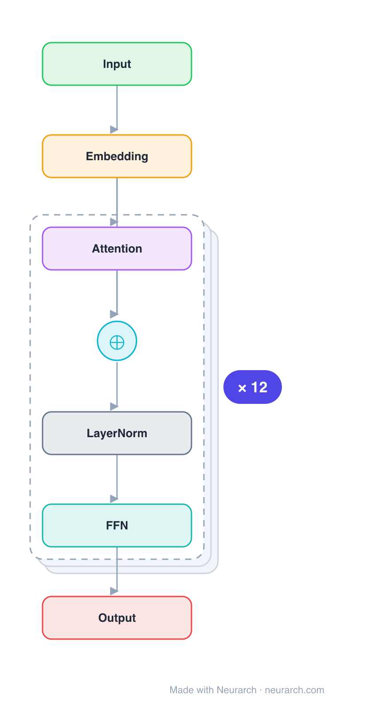

# Architecture: Chinese-RoBERTa-wwm-ext

## Motivation

The standard Chinese encoder from HFL: BERT-base architecture trained RoBERTa-style with whole-word masking on extended data. Still the default starting point for Chinese classification, NER, and retrieval fine-tuning.

## Core Idea

The standard Chinese encoder from HFL: BERT-base architecture trained RoBERTa-style with whole-word masking on extended data.

## Architecture

### Overview

*Identical repeated blocks are folded into one representative block with a `× N` badge, so the whole architecture fits on screen. `model.json` uses a NAXS block template + `repeat` directive: the identical repeated layers are defined once and expand to all 51 nodes (open it in Neurarch to see and edit every layer). Vector: [diagram.svg](assets/diagram.svg).*

| Hyperparameter | Value |
|---|---|
| Type | Bidirectional encoder (BERT family) |
| Parameters | 102M |
| Layers | 12 |
| Hidden size | 768 |
| Attention | Multi-head: 12 heads |
| FFN | Dense, 3,072, GeLU |
| Normalization | LayerNorm, post-norm |
| Positions | Absolute learned, max 512 |
| Vocabulary | 21,128 |

`model.json` is the full 12-layer graph (the repeated layers expressed via a NAXS block template + `repeat`), produced with the same import path the Neurarch app uses for "load from Hugging Face", with all hyperparameters from the official `config.json`.

### Design Notes

- Despite the RoBERTa name, this is architecturally BERT-base: it loads as BertModel with absolute learned positions and post-layer-norm. "RoBERTa" refers to the training recipe (no NSP, dynamic masking), not the architecture.
- Whole-word masking (wwm) masks all WordPiece pieces of a Chinese word together, which matters because Chinese has no whitespace word boundaries.
- 21128-token Chinese WordPiece vocabulary, the de facto standard for Chinese BERT-family checkpoints.
- For a decade of Chinese NLU benchmarks (CLUE, etc.), this checkpoint was the baseline everyone compared against.

### Parameter Check

Neurarch's per-layer parameter estimate over this graph: **101.3M**.
Deviation from the authoritative count (102.0M): **-0.7%**.

## Design Decisions

> **Analysis** — Observations derived from studying the architecture.

- Despite the RoBERTa name, this is architecturally BERT-base: it loads as BertModel with absolute learned positions and post-layer-norm. "RoBERTa" refers to the training recipe (no NSP, dynamic masking), not the architecture.
- Whole-word masking (wwm) masks all WordPiece pieces of a Chinese word together, which matters because Chinese has no whitespace word boundaries.
- 21128-token Chinese WordPiece vocabulary, the de facto standard for Chinese BERT-family checkpoints.
- For a decade of Chinese NLU benchmarks (CLUE, etc.), this checkpoint was the baseline everyone compared against.

## Implementation Notes

- `model.json` contains the full structural graph with real dimensions and parameters, using a NAXS block template + `repeat` for the identical repeated layers.
- Open in [Neurarch](https://www.neurarch.com/) to visualize, edit, or export training code.
- Diagrams fold repeated identical blocks with a `× N` badge; `model.json` defines each repeated layer once at real dimensions and expands to all nodes.

## Limitations

- This package focuses on the architectural structure. Training pipelines, 
dataset preparation, and production optimizations are out of scope.

## Evolution

> See `references/related/` for predecessor and successor architectures.

