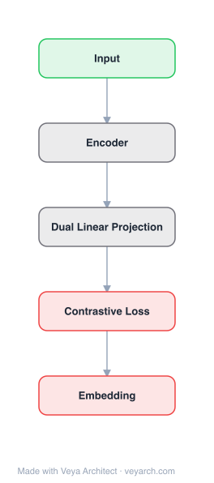

# Architecture: Continuous Latent Diffusion Language Model

## Motivation

Large language models have achieved remarkable success under the autoregressive paradigm, yet high-quality text generation need not be tied to a fixed left-to-right order. Autoregressive models directly parameterize token-level conditional probabilities, yielding a clear training objective, but their fixed generation order incurs inherent sequential inference cost and introduces a strong hand-crafted inductive bias that limits performance on non-monotonic generation tasks (infilling, local editing, global reorganization).

Existing alternatives struggle to jointly achieve generation efficiency, scalable representation learning, and effective global semantic modeling. Discrete diffusion language models remove explicit left-to-right factorization but still perform observation recovery in discrete token space, leading to costly multi-step sampling with intermediate states not well suited to represent global semantic structure. Continuous diffusion methods introduce continuous representation spaces but typically use the diffusion path to recover token-aligned representations rather than to explicitly model a latent prior. No existing method provides a unified framework combining non-autoregressive generation, continuous representation, and probabilistic text modeling.

## Core Idea

Language modeling via continuous latent diffusion in embedding space rather than discrete token space.

## Architecture

### Overview

<b>Layer-by-layer (5 nodes)</b>

| # | Layer | Type | Params |
|---|---|---|---|
| 1 | Input | `input` |  |
| 2 | Encoder | `custom` |  |
| 3 | Dual Linear Projection | `custom` |  |
| 4 | Contrastive Loss | `loss` |  |
| 5 | Embedding | `output` |  |

Cola DLM is a hierarchical latent-space diffusion language model that explicitly decomposes text generation into two levels: **global semantic organization** in continuous latent space and **local textual realization** through conditional decoding. The model first learns a stable text-to-latent mapping with a Text VAE, then models a global semantic prior in continuous latent space with a block-causal Diffusion Transformer (DiT), and finally generates text through conditional decoding. The key idea is to use diffusion not for token-level observation recovery, but for **latent prior transport** — separating global semantic organization from local textual realization.

The generative model is defined as: `p(x, z_0) = p_θ(x | z_0) · p_ψ(z_0)`, where `z_0 ∈ R^d` is a continuous latent variable, `p_θ(x | z_0)` is the conditional decoder, and `p_ψ(z_0)` is the latent prior. The latent is decomposed into blocks `z_0 = (z_0^{(1)}, ..., z_0^{(B)})` with a block-causal factorization.

### Components

1. **Text VAE (Encoder + Decoder)** — The encoder `q_ϕ(z_0 | x)` maps text into continuous latent space; the decoder `p_θ(x | z_0)` reconstructs text conditioned on the latent. Both are strictly causal (to prevent information leakage and enable streaming generation). The VAE does not compress sequence length. The Text VAE objective combines reconstruction loss, KL divergence, and a BERT-style masking loss: `L_VAE = -E_{q_ϕ}[log p_θ(x|z_0)] + β·KL(q_ϕ(z_0|x) || p_base(z_0)) + λ_mask·L_mask`.

2. **Block-Causal DiT (Diffusion Transformer)** — Models the latent prior `p_ψ(z_0)` using a continuous-flow prior with a vector field `v_ψ(z_t, t)`. The base distribution is `p_1(z_1) = N(0, I)`, and `z_0 = Φ_{0←1}^ψ(z_1)` induces `p_ψ = (Φ_{0←1}^ψ)_# p_1`. The latent is decomposed into blocks with block-causal factorization: `p_ψ(z_0) = p_ψ(z_0^{(1)}) · Π_{b=2}^B p_ψ(z_0^{(b)} | z_0^{(<b)})`. This preserves cross-block causal structure while allowing efficient parallel computation within each block.

3. **Flow Matching Prior** — The prior is learned via Flow Matching (a solver for the prior, not the model definition itself). The conditional FM objective for block `b` is: `L_FM = Σ_{b=1}^B E_{t,z_0,z_1} [||v_ψ(z_t, t; z_0^{(<b)}) - u_t(z_0, z_1)||²]`.

4. **Reference Encoder Regularizer** — A reference encoder `q_ϕ^{ref}(z_0 | x)` suppresses latent drift during joint training: `L_ref = E_{p_data(x)}[KL(q_ϕ(z_0|x) || q_ϕ^{ref}(z_0|x))]`.

5. **BERT-Style Masking Loss** — Prevents the VAE encoder from collapsing semantically while the decoder merely memorizes surface text. This is critical for maintaining meaningful latent representations.

### Data Flow

**Training Stage 1 (Text VAE Pretraining):**
1. **Encoding**: The VAE encoder maps text `x` to latent `z_0 ~ q_ϕ(z_0 | x)`.
2. **Reconstruction**: The decoder reconstructs text: `x̂ ~ p_θ(x | z_0)`.
3. **Loss**: Combined reconstruction + KL + BERT masking loss establishes a stable division of labor between information stored in the latent and information recovered by the decoder.

**Training Stage 2 (Prior Learning with Block-Causal DiT):**
1. **Latent extraction**: Text is encoded into clean latents via the (Stage 1) VAE encoder.
2. **Block-causal attention**: For block `b`, the visible set consists of historical clean latent blocks and the current noisy block: `V_b = {sg(z_0^{(<b)}), z_t^{(b)}}` (stop-gradient on historical blocks). This enforces bidirectional attention within each block and causal dependence across blocks.
3. **Flow Matching**: The DiT learns the vector field `v_ψ` to transport noise to the clean latent distribution, conditioned on historical blocks.
4. **Joint optimization**: Combines VAE preservation, prior learning (FM), and reference regularization to prevent latent drift.

**Inference Stage:**
1. **Prefix encoding**: The prefix is encoded into clean latent conditions: `z^{pre} ~ q_ϕ(z^{pre} | x^{pre})`.
2. **Block-wise generation**: Response latents are generated block by block, each obtained by transporting a noise seed under historical condition: `ẑ_0^{(b)} = Φ_{0←1}^ψ(ϵ^{(b)}; z^{pre}, ẑ_0^{(<b)}, ϵ^{(b)})`, where `ϵ^{(b)} ~ N(0, I)`.
3. **Conditional decoding**: The decoder outputs text conditioned on the prefix and generated latent blocks: `x̂^{res} ~ p_θ(x^{res} | z^{pre}, ẑ_0^{(1:B)})`.

### State / Memory

- **KV cache for streaming decoding**: During inference, the decoder uses a KV cache for efficient block-wise generation.
- **Block-causal latent state**: The block-causal factorization means each block's generation depends on all previous blocks, creating a sequential dependency at the block level while allowing parallelism within blocks.
- **No recurrent hidden state**: The DiT processes the entire latent sequence via attention; state is maintained through the block-causal attention mask, not through recurrent propagation.
- **Latent space as persistent semantic memory**: The continuous latent space serves as a compressed semantic representation that carries global meaning, decoupled from surface text.

## Design Decisions

1. **Latent prior transport (not token-level observation recovery)** — The key design decision: diffusion is used to model a global semantic prior in continuous latent space, not to recover noisy token-level representations. This separates global semantic organization from local textual realization, enabling more flexible non-autoregressive generation.

2. **Block-causal factorization** — The latent is decomposed into blocks with causal dependence across blocks and bidirectional attention within blocks. This preserves cross-block causal structure (important for coherent generation) while allowing efficient parallel computation within each block (important for generation efficiency).

3. **Strictly causal VAE** — Both encoder and decoder are strictly causal to prevent information leakage and enable streaming generation. This is unusual for VAEs (typically bidirectional) but necessary for the block-causal prior to be consistent with the decoder's causal structure.

4. **BERT-style masking loss** — Added to prevent semantic collapse where the encoder produces uninformative latents and the decoder memorizes surface text. This ensures the latent carries meaningful global semantics.

5. **Reference encoder regularizer** — During joint training of the VAE and DiT, the latent distribution can drift (co-evolution of `q̄_ϕ` and `p_ψ`). The reference encoder `q_ϕ^{ref}` suppresses this drift, stabilizing optimization.

6. **Flow Matching over direct density optimization** — Flow Matching is used as a solver for the prior rather than optimizing density directly. This is an implementation choice; the underlying model remains a hierarchical latent-variable language model.

7. **No sequence length compression in VAE** — The VAE does not compress the sequence length, maintaining a one-to-one correspondence between latent blocks and text segments. This simplifies the architecture and avoids information loss from compression.

## Evolution

**Predecessors:**
- **Autoregressive LMs** — The dominant paradigm that Cola DLM aims to improve upon; factorizes discrete text via chain rule with fixed left-to-right order.
- **Discrete diffusion LMs (e.g., SEDD, D3PM)** — Remove explicit left-to-right factorization but perform observation recovery in discrete token space; suffer from slow sampling and limited global semantic structure.
- **Continuous diffusion LMs (e.g., Diffusion-LM, CDCD)** — Introduce continuous representation spaces but use diffusion to recover token-aligned representations, not to model a latent prior.
- **Latent-space continuous methods** — Compress text into latent spaces with autoencoders/VAEs then perform diffusion, but typically treat the latent as a fixed representation rather than modeling it under a hierarchical latent-variable framework.
- **LLaDA** — A masked diffusion language model used as a baseline in Cola DLM experiments.

**Successors:**
- Cola DLM (2026) is recent; its design suggests future work exploring alternative latent modeling components, extending to other continuous modalities (the paper provides preliminary evidence for vision), and scaling to larger parameter counts.

## Characteristics

| Property | Value |
|----------|-------|
| Year | 2026 |
| Authors | Guo et al. |
| Category | DL/Diffusion |
| Source Paper | `Continuous_Latent_Diffusion_Language_Model_Guo_Zhao_Zhao_etal_2026.md` |
| PaperVault Path | `DL-Architectures/03-diffusion-models/Continuous_Latent_Diffusion_Language_Model_Guo_Zhao_Zhao_etal_2026.md` |

## Limitations

1. **Likelihood vs. generation quality mismatch** — The paper explicitly identifies a mismatch between likelihood estimation and generation quality. Better likelihood does not necessarily mean better generation, complicating model selection and evaluation.

2. **Two-stage training complexity** — The two-stage training pipeline (Text VAE pretraining → joint prior learning) is more complex than single-stage autoregressive training. The reference encoder regularizer and gradient control add further complexity.

3. **Latent drift during joint training** — The co-evolution of the aggregated posterior `q̄_ϕ` and the learned prior `p_ψ` can cause instability, requiring the reference encoder regularizer to mitigate.

4. **Block size as a hyperparameter** — The block size determines the tradeoff between parallelism (larger blocks = more parallelism) and causal structure (smaller blocks = finer-grained causality). The optimal block size may be task-dependent.

5. **Scalability validation limited** — Experiments use ~2B-parameter models with scaling curves up to ~2000 EFLOPs. Whether the favorable scaling behavior extends to much larger scales remains to be verified.

6. **No sequence length compression** — The VAE does not compress sequence length, meaning the latent sequence is as long as the text sequence. This limits efficiency gains compared to approaches that compress into shorter latent sequences.

## Implementation Notes

See `implementation/` for a minimal runnable implementation.

Key implementation details from the paper:
- Generative model: `p(x) = ∫ p_θ(x|z_0) · p_ψ(z_0) dz_0`
- Latent prior: continuous-flow, `z_0 = Φ_{0←1}^ψ(z_1)`, `z_1 ~ N(0, I)`
- Block-causal factorization: `p_ψ(z_0) = p_ψ(z_0^{(1)}) · Π p_ψ(z_0^{(b)} | z_0^{(<b)})`
- Training Stage 1: VAE with reconstruction + KL + BERT masking loss
- Training Stage 2: joint VAE + DiT with Flow Matching + reference regularizer + gradient control
- Inference: prefix encoding → block-wise latent generation → conditional decoding with KV cache
- Experiments: 4 research questions, 8 benchmarks, ~2B-parameter models, scaling to ~2000 EFLOPs
- Baselines: strictly matched autoregressive and LLaDA models
- Evaluation: ELBO and IWAE estimators for likelihood; generation quality benchmarks

## Information Layers

- **Evidence:** Source paper available in `references/papers/` — all architectural details (hierarchical factorization, block-causal DiT, Flow Matching, two-stage training, inference workflow) are directly stated in the paper.
- **Analysis:** Cola DLM's key insight is that diffusion should be used for latent prior transport (modeling global semantic organization) rather than token-level observation recovery (recovering surface text). This hierarchical decomposition — global semantics in continuous space, local realization through conditional decoding — provides a principled alternative to strictly token-level language modeling with a more flexible non-autoregressive inductive bias.
- **Hypothesis:** The natural extensibility to continuous modalities (preliminary evidence for vision) suggests that hierarchical continuous latent prior modeling may be a path toward unified modeling across discrete text and continuous modalities. Whether the likelihood-quality mismatch can be resolved, and whether scaling beyond 2B parameters maintains favorable behavior, remain open questions.
