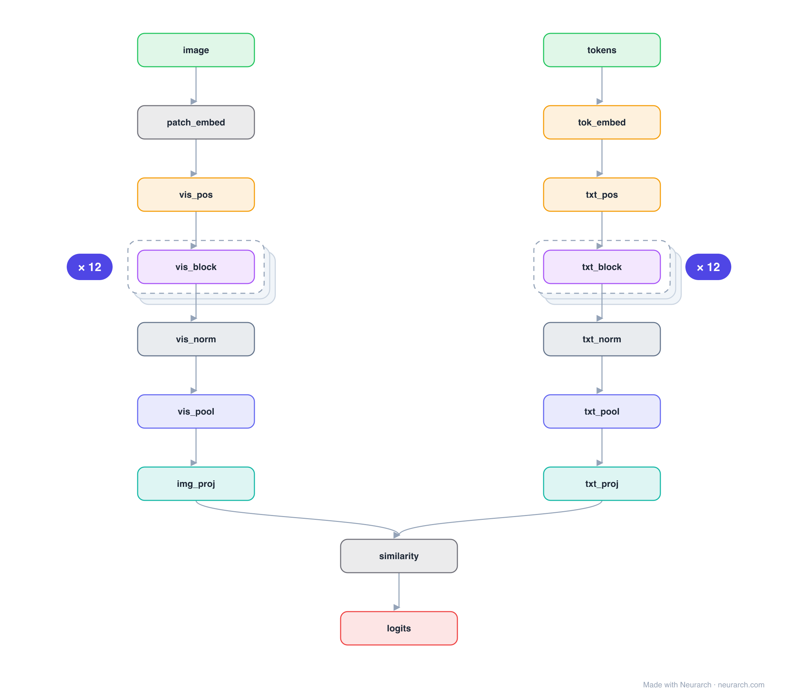

# Architecture: CLIP ViT-B/32

## Motivation

The contrastive image-text model that underpins modern multimodality: a full 12-block ViT image tower and a full 12-block Transformer text tower projected into one 512-dim space, trained so matching pairs score high by dot product. Stable Diffusion's text encoder is the text half of this design.

## Core Idea

The contrastive image-text model that underpins modern multimodality: a full 12-block ViT image tower and a full 12-block Transformer text tower projected into one 512-dim space, trained so matching pairs score high by dot product.

## Architecture

### Overview

*Identical repeated blocks are folded into one representative block with a `× N` badge, so the whole architecture fits on screen. `model.json` uses a NAXS block template + `repeat` directive: the identical repeated layers are defined once and expand to all 38 nodes (open it in Neurarch to see and edit every layer). Vector: [diagram.svg](assets/diagram.svg).*

| Hyperparameter | Value |
|---|---|
| Type | Contrastive image-text dual encoder |
| Parameters | 151M (88M vision + 63M text) |
| Vision tower | ViT-B/32: 12 blocks, 768 hidden, 12 heads |
| Text tower | 12 blocks, 512 hidden, 8 heads, causal |
| Projection | Both towers project to a shared 512-dim space |
| Similarity | Scaled dot product, learned temperature |
| Vocabulary | 49,408 BPE (text), 77-token max |
| Input | 224x224 image, 32x32 patches |

`model.json` is the full graph (repeated layers expressed via a NAXS block template + `repeat`), hand-built against the official config.json.

### Design Notes

- Two towers, one space: each tower ends in a linear projection to 512 dims; the similarity logit is a scaled dot product.
- The graph pools each tower with an average-pool node as a stand-in for CLIP's token selection (class token for the image tower, EOT token for text).
- Tower dims verified from the official config.json; the text tower is causal, a quirk inherited from GPT-style pretraining.

### Parameter Check

Neurarch's per-layer parameter estimate over this graph: **151.2M**.
Deviation from the authoritative count (151.3M): **-0.1%**.

## Design Decisions

> **Analysis** — Observations derived from studying the architecture.

- Two towers, one space: each tower ends in a linear projection to 512 dims; the similarity logit is a scaled dot product.
- The graph pools each tower with an average-pool node as a stand-in for CLIP's token selection (class token for the image tower, EOT token for text).
- Tower dims verified from the official config.json; the text tower is causal, a quirk inherited from GPT-style pretraining.

## Implementation Notes

- `model.json` contains the full structural graph with real dimensions and parameters, using a NAXS block template + `repeat` for the identical repeated layers.
- Open in [Neurarch](https://www.neurarch.com/) to visualize, edit, or export training code.
- Diagrams fold repeated identical blocks with a `× N` badge; `model.json` defines each repeated layer once at real dimensions and expands to all nodes.

## Limitations

- This package focuses on the architectural structure. Training pipelines, 
dataset preparation, and production optimizations are out of scope.

## Evolution

> See `references/related/` for predecessor and successor architectures.

