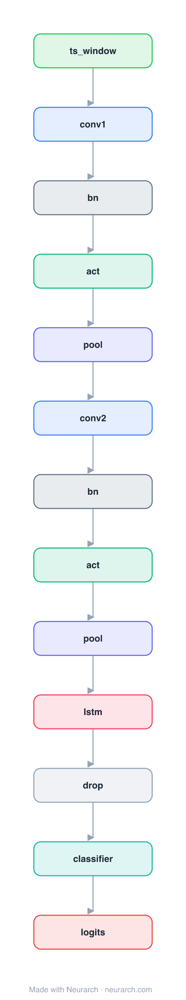

# Architecture: 1D CNN + LSTM

## Motivation

The standard hybrid for long 1D physiological signals (ECG, PPG, IMU): a Conv1D front-end extracts local morphology, an LSTM models long-range temporal context, a dense head classifies.

## Core Idea

The standard hybrid for long 1D physiological signals (ECG, PPG, IMU): a Conv1D front-end extracts local morphology, an LSTM models long-range temporal context, a dense head classifies.

## Architecture

### Overview

<b>Layer-by-layer (13 nodes)</b>

| # | Layer | Type | Params |
|---|---|---|---|
| 1 | ts_window | `input` | shape: [1, 12, 5000] |
| 2 | conv1 | `conv1d` | outChannels: 64, kernelSize: 7, stride: 1, padding: 3, inChannels: 1 |
| 3 | bn | `batchNorm` | normalizedShape: 64 |
| 4 | act | `relu` |   |
| 5 | pool | `maxpool1d` | kernelSize: 2, stride: 2 |
| 6 | conv2 | `conv1d` | outChannels: 128, kernelSize: 5, stride: 1, padding: 2, inChannels: 64 |
| 7 | bn | `batchNorm` | normalizedShape: 128 |
| 8 | act | `relu` |   |
| 9 | pool | `maxpool1d` | kernelSize: 2, stride: 2 |
| 10 | lstm | `lstm` | inFeatures: 128, hiddenSize: 128, numLayers: 2, returnSequences: false |
| 11 | drop | `dropout` | p: 0.3 |
| 12 | classifier | `linear` | outFeatures: 5, inFeatures: 128 |
| 13 | logits | `output` |   |

This graph ships in Neurarch's in-app template library; the copy here passes shape propagation with zero errors.

### Design Notes

- No single canonical paper: this is the pattern that appears in hundreds of biosignal papers, included as the reference baseline.
- The conv stem downsamples aggressively so the LSTM sees a short, feature-rich sequence instead of raw samples.

## Design Decisions

> **Analysis** — Observations derived from studying the architecture.

- No single canonical paper: this is the pattern that appears in hundreds of biosignal papers, included as the reference baseline.
- The conv stem downsamples aggressively so the LSTM sees a short, feature-rich sequence instead of raw samples.

## Implementation Notes

- `model.json` contains the full structural graph with real dimensions and parameters.
- Open in [Neurarch](https://www.neurarch.com/) to visualize, edit, or export training code.
- Diagrams fold repeated identical blocks with a `× N` badge; `model.json` holds all nodes at real dimensions.

## Limitations

- This package focuses on the architectural structure. Training pipelines, 
dataset preparation, and production optimizations are out of scope.

## Evolution

> See `references/related/` for predecessor and successor architectures.

