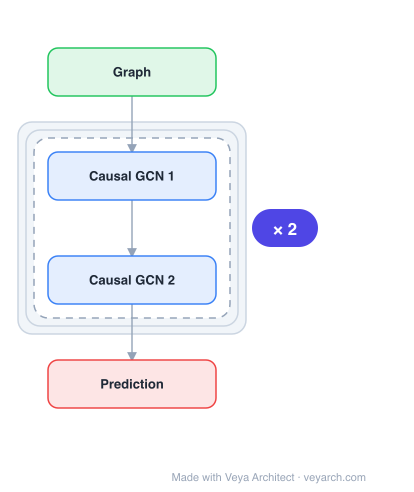

# Architecture: Cooperative GNN

## Motivation

The message-passing paradigm has been very influential in graph ML, but it comes with well-known limitations related to information flow on a graph. To receive information from k-hop neighbors, a network needs at least k layers, which implies exponential growth of a node's receptive field. The growing amount of information must be compressed into fixed-sized node embeddings, leading to information loss known as over-squashing. Additionally, node features become increasingly similar as layers increase (over-smoothing).

Classical message passing updates all nodes in a fixed and synchronous manner, not allowing nodes to react to messages from their neighbors individually. This does not allow nodes to determine which neighbors are relevant for the task at hand. Existing approaches to address these limitations include graph rewiring, new message-passing architectures acting on distant nodes, and techniques to avoid feature collapse. However, these approaches do not fundamentally address the rigidity of the message-passing scheme.

CO-GNNs address these limitations by generalizing the message-passing scheme: each node can dynamically decide whether to listen, broadcast, isolate, or do both, enabling a flexible and asynchronous information flow that adapts to the task and graph topology.

## Core Idea

Cooperative graph neural networks with multi-agent message passing.

## Architecture

### Overview

<b>Layer-by-layer (4 nodes)</b>

| # | Layer | Type | Params |
|---|---|---|---|
| 1 | Graph | `input` |  |
| 2 | Causal GCN 1 | `gcn_conv` |  |
| 3 | Causal GCN 2 | `gcn_conv` |  |
| 4 | Prediction | `output` |  |

CO-GNNs comprise two jointly trained cooperating message-passing neural networks: an **action network** π (for choosing the best actions) and an **environment network** η (for solving the given task by updating node representations). Every node is viewed as a player that can take one of four actions at each layer: STANDARD (S), LISTEN (L), BROADCAST (B), or ISOLATE (I).

When all nodes perform STANDARD, the framework recovers standard message-passing. When all nodes ISOLATE, it corresponds to removing all edges and making node-wise predictions. The interplay between these actions and the ability to change them dynamically makes the approach richer, allowing the model to decouple the input graph from the computational graph and incorporate directionality into message passing.

### Components

- **Action network π**: A GNN that predicts, for each node v at each layer ℓ, a probability distribution p_v ∈ R^4 over the actions {S, L, B, I} given the node's state and the states of its neighbors. Can be any GNN architecture (SUM GNN, MEAN GNN, GCN, GIN, GAT).

- **Environment network η**: A GNN that updates node representations based on the sampled actions. Also configurable as any GNN architecture.

- **Straight-through Gumbel-softmax estimator**: Provides a differentiable, continuous approximation of discrete action sampling. Uses Gumbel-distributed vectors to estimate categorical distributions, with a temperature parameter τ controlling the sharpness. During the forward pass, ordinary sampling is used; during the backward pass, the GS estimator provides gradients.

- **Induced computational graph G(ℓ)**: At each layer ℓ, the sampled actions induce a directed computational graph where edges are determined by which nodes are broadcasting and which are listening. This graph can be different at every layer.

- **Action set {S, L, B, I}**: STANDARD = broadcast to listening neighbors and listen to broadcasting ones; LISTEN = receive from broadcasting neighbors; BROADCAST = send to listening neighbors; ISOLATE = neither listen nor broadcast (node-wise update only).

### Data Flow

1. **Input**: Graph G = (V, E, X) with node feature matrix X.
2. **Action prediction**: At layer ℓ, the action network π predicts a probability distribution p_v^(ℓ) ∈ R^4 over actions {S, L, B, I} for each node v, given h_v^(ℓ) and neighbor states.
3. **Action sampling**: Sample action a_v ∼ p_v using Straight-through Gumbel-softmax for differentiability.
4. **Computational graph construction**: The sampled actions induce a directed graph G(ℓ) = (V, E(ℓ)) where directed edges connect broadcasting nodes to listening nodes.
5. **Environment update**: The environment network η updates each node's representation: if v chose L or S, it aggregates from broadcasting/standard neighbors; if v chose I or B, it updates based only on its own previous state.
6. **Stack layers**: Repeat for L layers to obtain final representations h_v^(L).
7. **Output**: Use final representations for node-level prediction or pool to form graph embedding z_G for graph-level tasks.

### State / Memory

The action network and environment network jointly maintain node-level state h_v^(ℓ) that evolves across layers. The computational graph itself is dynamic—different at every layer based on the sampled actions. No explicit external memory mechanism is used; the state is entirely carried through the node representations across layers.

## Design Decisions

- **Four discrete actions**: The action set {S, L, B, I} was chosen to provide a minimal yet expressive vocabulary for node behavior. STANDARD recovers classical message passing; ISOLATE enables node-wise computation; LISTEN and BROADCAST decouple receiving from sending, enabling directional information flow.

- **Straight-through Gumbel-softmax**: Chosen to make discrete action sampling differentiable for gradient-based optimization. The straight-through variant uses hard sampling in the forward pass (for correct action selection) and the soft GS estimator in the backward pass (for gradient flow).

- **Two cooperating networks**: Separating action selection (π) from representation update (η) allows each to specialize—the action network learns which neighbors are relevant, while the environment network focuses on task-specific representation learning. Both are jointly trained.

- **Configurable base architectures**: CO-GNNs can use any GNN as π and η (SUM GNN, MEAN GNN, GCN, GIN, GAT), making the framework a meta-architecture that wraps existing models rather than replacing them.

- **Dynamic computational graph**: Rather than rewiring the input graph or adding long-range edges, CO-GNNs induce a different directed computational graph at each layer through actions, naturally addressing over-squashing and long-range dependency issues.

## Evolution

**Predecessors:**
- GCN (Kipf & Welling, 2017) — graph convolutional networks as foundational message-passing
- GIN (Xu et al., 2019) — graph isomorphism networks for expressive power
- GAT (Veličković et al., 2018) — attention-based neighbor weighting
- GraphSAGE (Hamilton et al., 2017) — inductive representation learning
- Lai et al. (2020) — updating nodes with different numbers of layers over fixed topology
- Dai et al. (2022) — message passing on a learned topology that is the same at every layer

**Successors:**
- CO-GNNs open directions for adaptive computation in GNNs, where the computational graph is learned per-layer rather than fixed
- The cooperative paradigm can be extended to other graph learning tasks beyond node/graph classification

## Characteristics

| Property | Value |
|----------|-------|
| Year | 2025 |
| Authors | Unknown |
| Category | GNN/Architecture |
| Source Paper | `Cooperative_Graph_Neural_Networks_Unknown_2025.md` |
| PaperVault Path | `GNN/03-gnn-architectures/Cooperative_Graph_Neural_Networks_Unknown_2025.md` |

## Limitations

- The Straight-through Gumbel-softmax estimator introduces a train-test discrepancy (hard sampling vs. soft gradients), which can affect training stability.
- The temperature parameter τ requires careful tuning—too high leads to near-uniform action distributions, too low leads to premature commitment to actions.
- Adding an action network doubles the parameter count compared to the base GNN architecture.
- The theoretical analysis shows CO-GNNs are more expressive than 1-WL, but the empirical gains depend on the task and dataset characteristics.
- The action selection adds non-determinism during training (due to sampling), which may require multiple runs or careful seed management.
- On homophilic graphs, the gains over standard message passing are smaller since most neighbors are already relevant.

## Implementation Notes

See `implementation/` for a minimal runnable implementation.

## Information Layers

- **Evidence:** Source paper available in `references/papers/`
- **Analysis:** CO-GNNs' key insight is that decoupling the input graph from the computational graph—by letting each node dynamically choose its communication pattern—naturally addresses over-squashing and over-smoothing without graph rewiring or architectural changes to the message function. The four-action vocabulary is minimal yet sufficient to express arbitrary directed information flow patterns.
- **Hypothesis:** The gains on heterophilic graphs may stem from the ability to selectively ignore dissimilar neighbors (via ISOLATE or BROADCAST-only), effectively learning a task-relevant subgraph at each layer. The dynamic computational graph may also serve as an implicit regularization, preventing the model from over-aggregating irrelevant information.
