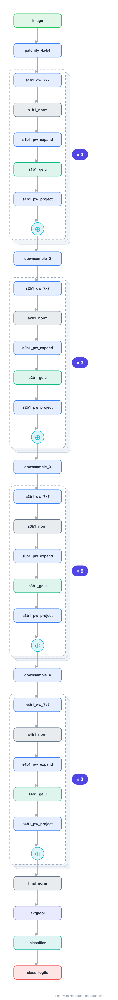

# Architecture: ConvNeXt-Tiny

## Motivation

A pure ConvNet rebuilt with every Transformer-era trick (large 7x7 depthwise kernels, LayerNorm not BatchNorm, GeLU, inverted bottleneck, fewer activations) until it matched Swin on ImageNet. The "ConvNets strike back" architecture.

## Core Idea

A pure ConvNet rebuilt with every Transformer-era trick (large 7x7 depthwise kernels, LayerNorm not BatchNorm, GeLU, inverted bottleneck, fewer activations) until it matched Swin on ImageNet.

## Architecture

### Overview

*Identical repeated blocks are folded into one representative block with a `× N` badge, so the whole architecture fits on screen. `model.json` uses NAXS block templates + `repeat` directives and expands back to all 117 nodes (open it in Neurarch to see and edit every layer). Vector: [diagram.svg](assets/diagram.svg).*

| Hyperparameter | Value |
|---|---|
| Type | Modernized convolutional network |
| Parameters | 28M |
| Stem | 4x4/4 patchify conv (96) |
| Stages | 4 stages, depths 3/3/9/3 |
| ConvNeXt block | depthwise 7x7 → LayerNorm → 1x1 expand → GeLU → 1x1 project + residual |
| Downsampling | 2x2/2 conv between stages |

`model.json` is the full graph, hand-built against the official config.json.

### Design Notes

- The block is essentially a Transformer block with the attention replaced by a large-kernel depthwise conv: depthwise mixes space, the 1x1s mix channels (an inverted bottleneck), with one LayerNorm and one GeLU.
- No attention anywhere, yet it tracks [swin-tiny](../swin-tiny/) closely, the paper's point about how much of ViT's win was design vs attention.

### Parameter Check

Neurarch's per-layer parameter estimate over this graph: **28.6M**.

## Design Decisions

> **Analysis** — Observations derived from studying the architecture.

- The block is essentially a Transformer block with the attention replaced by a large-kernel depthwise conv: depthwise mixes space, the 1x1s mix channels (an inverted bottleneck), with one LayerNorm and one GeLU.
- No attention anywhere, yet it tracks [swin-tiny](../swin-tiny/) closely, the paper's point about how much of ViT's win was design vs attention.

## Implementation Notes

- `model.json` contains the full structural graph with real dimensions and parameters, using NAXS block templates + `repeat` for repeated units.
- Open in [Neurarch](https://www.neurarch.com/) to visualize, edit, or export training code.
- Diagrams fold repeated identical blocks with a `× N` badge; `model.json` defines each repeated unit once at real dimensions and expands to all nodes.

## Limitations

- This package focuses on the architectural structure. Training pipelines, 
dataset preparation, and production optimizations are out of scope.

## Evolution

> See `references/related/` for predecessor and successor architectures.

