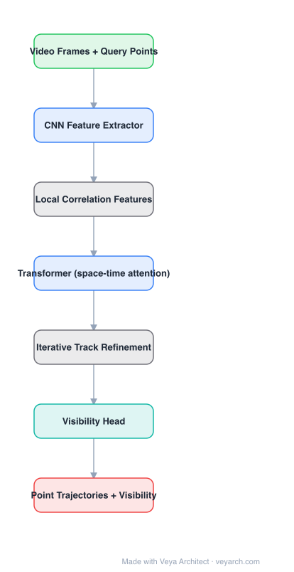

# Architecture: CoTracker3

## Motivation

State-of-the-art point trackers are trained on synthetic data (Kubric), because real videos have no dense trajectory annotations. That caps their generalization. CoTracker3's premise: instead of collecting more labelled real data, **pseudo-label real videos** with an existing tracker and train on those labels. Combined with a simpler architecture, this yields a better tracker with a fraction of the data.

## Core Idea

Track **points jointly, not independently**. All query points plus a set of learned support points are fed to a transformer that mixes information across time and across tracks, then trajectories are refined iteratively over a sliding window. Training is a two-stage recipe: synthetic pre-training, then pseudo-labelled real-video fine-tuning.

## Architecture

### Overview

<b>Layer-by-layer (7 nodes)</b>

| # | Layer | Type | Params |
|---|---|---|---|
| 1 | Video Frames + Query Points | `input` |  |
| 2 | CNN Feature Extractor | `conv2d` |  |
| 3 | Local Correlation Features | `custom` |  |
| 4 | Transformer (space-time attention) | `attention` |  |
| 5 | Iterative Track Refinement | `custom` |  |
| 6 | Visibility Head | `linear` |  |
| 7 | Point Trajectories + Visibility | `output` |  |

### Components

1. **CNN feature extractor** — per-frame feature maps for the video clip (multi-scale features, typically bilinear-sampled).
2. **Correlation / local cost features** — for each tracked point, correlation features are sampled around its current estimate, giving the tracker local matching evidence (the same primitive as in optical flow).
3. **Transformer tracker** — the core: tokens are (time × tracks), and attention mixes across both time and tracks, so a point that is occluded can be inferred from other points' motion.
4. **Support (context) points** — additional learned/grid points tracked alongside the query points; they act as context that stabilizes the query trajectories.
5. **Iterative refinement** — the trajectory estimate is updated over several iterations within the window, as in RAFT-style iterative refinement.
6. **Visibility head** — predicts whether each point is visible in each frame; crucial for occlusion handling and downstream use (e.g. SfM).
7. **Sliding-window chaining** — windows are processed with overlap and trajectories are chained, so videos of arbitrary length can be handled with bounded memory.

### Data Flow

Video clip → per-frame features → sample correlation around current estimates → transformer over (time × tracks) tokens → iterative trajectory updates → trajectories + visibility → chain windows across the video.

### State / Memory

Trajectory estimates carried across windows and iterations are the model's state; within a window, refinement is iterative recurrence over the same token set.

## Design Decisions

- **Joint tracking** — points help each other; the main accuracy advantage over independent trackers.
- **Support points** — tracking extra points that nobody asked for improves the points that were asked for.
- **No optical flow prior** — the architecture is self-contained, unlike TAPIR which builds on a flow model. Simpler, and easier to train with pseudo-labels.
- **Pseudo-labelling protocol** — the data-side contribution: train on real videos labelled by a teacher; reported to beat prior SoTA using only ~0.1% of the competitors' real training data.

## Evolution

- **Particle Video / PIPs** (predecessors): per-point iterative tracking.
- **TAPIR / BootsTAPIR**: TAP benchmark, flow-based initialization and occlusion reasoning.
- **CoTracker**: joint tracking formulation with support points.
- **CoTracker3**: simpler architecture + pseudo-labelled real-video training; strong reported robustness to occlusions.
- **Related**: LocoTrack (efficient local matching), SpatialTracker (track in 3D), DOT (dense optical tracking).

## Characteristics

| Property | Value |
|---|---|
| Task | dense point tracking with visibility |
| Input | video clip + query points |
| Core module | transformer over (time × track) tokens |
| Inference | sliding window + iterative refinement |
| Output | trajectories + per-frame visibility |
| Training data | synthetic (Kubric) pre-train + pseudo-labelled real videos |

## Limitations

- Sliding-window inference means accuracy depends on window length and chaining quality.
- Pseudo-label quality caps the student; errors from the teacher propagate.
- Long-term occlusions and re-identification after leaving the frame remain hard.
- Cost grows with the number of tracked points × window length.

## Implementation Notes

Key pieces: (1) per-frame CNN features, (2) correlation sampling around current estimates, (3) a transformer whose token axis includes both time and tracks, (4) iterative updates inside the window, (5) an explicit visibility head, (6) window chaining with overlap. Keep the support-point mechanism — it is cheap and is a large part of the accuracy.
