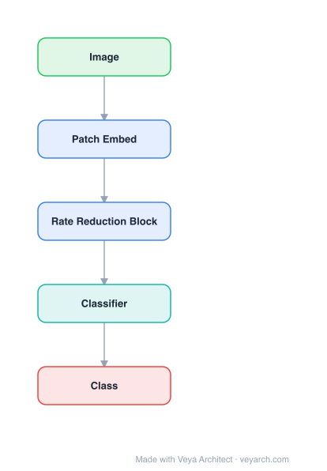

# Architecture: CRATE (White-Box Transformer)

## Motivation

Despite the empirical success of deep learning, most neural network architectures remain black boxes — their internal computations are not mathematically interpretable. Transformers achieve state-of-the-art performance but lack principled theoretical understanding of why they work. The goal is to build transformer-like architectures that are mathematically interpretable from the ground up, with each component having a clear optimization interpretation.

## Core Idea

A white-box transformer architecture derived from the sparse rate reduction objective. The standard transformer block is shown to naturally implement alternating optimization: multi-head self-attention compresses token sets by minimizing lossy coding rate, and the MLP sparsifies the representation. CRATE architectures are mathematically fully interpretable while achieving performance close to engineered transformers like ViT.

## Architecture

### Overview

<b>Layer-by-layer (5 nodes)</b>

| # | Layer | Type | Params |
|---|---|---|---|
| 1 | Image | `input` |  |
| 2 | Patch Embed | `conv2d` |  |
| 3 | Rate Reduction Block | `attention` |  |
| 4 | Classifier | `linear` |  |
| 5 | Class | `output` |  |

CRATE is constructed by unrolling the optimization of the sparse rate reduction objective into a deep network. Each layer performs two alternating steps: (1) MSSA (Multi-head Subspace Self-Attention) for local denoising and compression of tokens towards a mixture-of-subspace structure, and (2) ISTA (Iterative Shrinkage-Thresholding Algorithm) block for global compression and sparsification. The resulting layer is: `Z^{l+1/2} = Z^l + MSSA(Z^l)`, `Z^{l+1} = ISTA(Z^{l+1/2})`.

### Components

1. **Sparse Rate Reduction Objective** — The unified objective function that measures representation quality as the difference between the coding rate of the input distribution and the sparse coding rate of the compressed representation:
   - Compress token distribution towards a mixture of low-dimensional Gaussian distributions on incoherent subspaces
   - Sparsify the representation across all samples

2. **MSSA (Multi-head Subspace Self-Attention)** — The self-attention block, interpreted as a gradient descent step to compress token sets by minimizing their lossy coding rate:
   - `Z^{l+1/2} = Z^l + MSSA(Z^l | U^l_[K])`
   - The parameters U^l_[K] are learned incoherent bases for supporting subspaces
   - Each head corresponds to a subspace in the mixture model

3. **ISTA (Sparsification Block)** — The MLP block, interpreted as attempting to sparsify the representation through sparse coding:
   - `Z^{l+1} = ISTA(Z^{l+1/2} | D^l)`
   - D^l is a learned sparsifying dictionary
   - Implements one step of the Iterative Shrinkage-Thresholding Algorithm

4. **Layer parameters** — Each layer has:
   - U^l_[K]: incoherent bases for subspace structure (for MSSA)
   - D^l: sparsifying dictionary (for ISTA)
   - These are layer-dependent, learning a local parametric model at each layer

### Data Flow

1. **Input**: Token set Z^0 (e.g., image patches or text tokens)
2. **Per layer (×L)**:
   - MSSA step: `Z^{l+1/2} = Z^l + MSSA(Z^l | U^l_[K])` — compress tokens towards mixture-of-subspace structure
   - ISTA step: `Z^{l+1} = ISTA(Z^{l+1/2} | D^l)` — sparsify the compressed representation
3. **Output**: Final representation Z^L — compact and sparse union of incoherent subspaces

**Mathematical interpretation:**
- Forward pass: Given local signal models, denoise/compress/sparsify the input
- Backward pass: Learn the local signal models from data via supervision

### State / Memory

- **No explicit memory mechanism**: CRATE is a feedforward architecture without recurrent state.
- **Layer-specific parameters**: Each layer learns its own incoherent bases (U^l) and dictionary (D^l), which are persistent model parameters.
- **Token representations**: The token set Z is transformed through layers, with each layer incrementally optimizing the sparse rate reduction objective.

## Design Decisions

1. **Unrolled optimization** — The architecture is constructed by unrolling the optimization of the sparse rate reduction objective into layers, making each layer's computation interpretable as an optimization step.

2. **Alternating optimization** — Each layer alternates between compression (MSSA) and sparsification (ISTA), mirroring the two terms in the sparse rate reduction objective.

3. **Layer-dependent parameters** — Unlike some unrolled optimization approaches, CRATE learns different parameters at each layer, modeling the input distribution locally at each stage.

4. **Mathematical interpretability** — Every component has a clear mathematical interpretation:
   - Self-attention = lossy coding rate minimization
   - MLP = sparse coding (ISTA step)
   - Residual connections = incremental optimization

5. **Minimal deviations from Transformer** — CRATE closely follows the standard Transformer architecture, making it easy to adopt and compare.

## Evolution

**Predecessors:**
- **Transformer** (Vaswani et al., 2017) — Base architecture being interpreted.
- **ViT** (Dosovitskiy et al., 2021) — Vision Transformer baseline.
- **ReduNet** (Chan et al., 2021) — Prior unrolled optimization for neural networks.
- **Rate distortion theory** — Theoretical foundation for coding rate.
- **Sparse coding / ISTA** — Algorithmic foundation for the sparsification block.

**Successors:**
- CRATE-α, CRATE-β — Improved variants.
- White-box architectures for other modalities (NLP, multimodal).
- Theoretical frameworks for deep learning interpretability.

## Characteristics

| Property | Value |
|----------|-------|
| Year | 2023 |
| Authors | Yu, Buchanan, Pai, Chu, Wu, Tong, Haeffele, Ma (UC Berkeley, TTIC, Johns Hopkins) |
| Category | DL/Transformer |
| Source Paper | `White_Box_Transformers_via_Sparse_Rate_Reduction_Ma_Ttic_2023.md` |
| PaperVault Path | `DL-Architectures/01-transformers/White_Box_Transformers_via_Sparse_Rate_Reduction_Ma_Ttic_2023.md` |

## Limitations

1. **Performance gap** — Despite close performance, CRATE does not fully match engineered transformers (ViT) on all benchmarks.
2. **Theoretical assumptions** — The sparse rate reduction objective assumes data can be well-modeled as a mixture of low-dimensional Gaussians on incoherent subspaces, which may not hold for all data types.
3. **Simplicity trade-offs** — The "arguably simplest" choices at each construction stage may limit performance; more complex variants might improve results.
4. **Scalability** — Primarily evaluated on vision tasks (ImageNet); scalability to language and other modalities is less explored.
5. **Training dynamics** — The interpretability of the forward pass does not guarantee interpretability of the learned parameters' behavior.

## Implementation Notes

See `implementation/` for a minimal runnable implementation. Key details:
- Layer: `Z^{l+1/2} = Z^l + MSSA(Z^l | U^l_[K])`, `Z^{l+1} = ISTA(Z^{l+1/2} | D^l)`
- MSSA: multi-head subspace self-attention (compression step)
- ISTA: iterative shrinkage-thresholding (sparsification step)
- Parameters: U^l_[K] (incoherent bases) and D^l (sparsifying dictionary) per layer
- Objective: sparse rate reduction (compress + sparsify)
- Code at github.com/Ma-Lab-Berkeley/CRATE
- Performance close to ViT on ImageNet
- Fully interpretable: each component = optimization step

## Information Layers

- **Evidence:** Source paper available in `references/papers/` (Yu et al., 2023, "White-Box Transformers via Sparse Rate Reduction")
- **Analysis:** CRATE's key contribution is demonstrating that the standard Transformer architecture can be derived from first principles — specifically, from the sparse rate reduction objective. This provides a mathematical foundation for understanding why self-attention and MLPs work: they implement complementary optimization steps (compression and sparsification). The white-box nature means every computation is interpretable, not just the final output. The close-to-ViT performance validates that the theoretical framework is not just elegant but practical.
- **Hypothesis:** The sparse rate reduction framework may be a universal principle for representation learning, applicable beyond transformers. The interpretability of CRATE may enable better debugging, adversarial robustness, and controlled modification of model behavior. The layer-dependent parameterization suggests that deep networks learn a hierarchy of increasingly refined local models of the data distribution.
