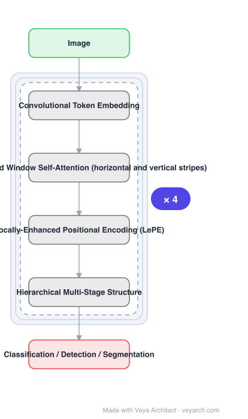

# Architecture: CSWin Transformer

## Motivation

Transformer backbone design faces a direct dilemma: **global self-attention is very expensive to compute**, while **local self-attention limits the field of interaction of each token**. The usual workaround — windowed attention with **halo and shift** operations to bridge windows — works, but the receptive field is **enlarged quite slowly**. CSWin wants a large effective field without paying for global attention.

## Core Idea

**Cross-Shaped Window (CSWin) self-attention**: compute self-attention in **horizontal and vertical stripes in parallel**, each stripe obtained by splitting the input feature into stripes of equal width, so the two together form a cross-shaped window. The effect of **stripe width** is analyzed mathematically, and the width is **varied across layers** to get strong modeling capability while limiting computation cost. Add **Locally-enhanced Positional Encoding (LePE)**, which handles local position better and supports arbitrary input resolutions.

## Architecture

### Overview

<b>Layer-by-layer (6 nodes)</b>

| # | Layer | Type | Params |
|---|---|---|---|
| 1 | Image | `input` |  |
| 2 | Convolutional Token Embedding | `custom` |  |
| 3 | Cross-Shaped Window Self-Attention (horizontal and vertical stripes) | `custom` |  |
| 4 | Locally-Enhanced Positional Encoding (LePE) | `custom` |  |
| 5 | Hierarchical Multi-Stage Structure | `custom` |  |
| 6 | Classification / Detection / Segmentation | `output` |  |

### Components

1. **Convolutional token embedding** — produces tokens and provides locality at the stem.
2. **Cross-Shaped Window self-attention** — horizontal and vertical stripes computed in parallel, forming a cross-shaped window; the core mechanism.
3. **Stripe width scheduling** — stripe width is varied for different layers of the network, guided by a mathematical analysis of its effect.
4. **Locally-enhanced Positional Encoding (LePE)** — handles local positional information better than existing encoding schemes and naturally supports arbitrary input resolutions.
5. **Hierarchical multi-stage structure** — stages with downsampling, as in other general vision backbones.

### Data Flow

Image → convolutional token embedding → hierarchical stages, each applying CSWin self-attention (split into horizontal and vertical stripes → parallel self-attention within each stripe → merge) with LePE added → downsampling between stages → classification / detection / segmentation heads.

### State / Memory

No recurrent state. The efficiency concern is attention cost: stripes bound the interaction set to a cross rather than the full image, and stripe width controls that bound.

## Design Decisions

- **Cross-shaped instead of square window** — horizontal and vertical stripes together cover a much larger field than a local window at comparable cost.
- **Analyze stripe width mathematically, then vary it per layer** — width is the cost/capability knob; the analysis and the per-layer variation are both part of the contribution.
- **LePE instead of standard positional encoding** — chosen for better local positional handling and for supporting arbitrary input resolutions, which matters for downstream tasks.
- **Keep a hierarchical structure** — required for dense prediction.
- **Compare at similar FLOPs** — the reported gains over Swin are explicitly under a similar FLOPs setting.

## Evolution

- **ViT** (predecessor): full attention, computationally inefficient.
- **Swin Transformer** (predecessor): windowed attention bridged by halo/shift, receptive field grows slowly.
- **CSWin Transformer (2021)**: cross-shaped window attention with LePE.
- **Siblings**: Swin V2, PVT, MaxViT, MViTv2.
- **Contrast**: halo/shift window-bridging designs, whose receptive field grows slowly.

## Characteristics

| Property | Value |
|---|---|
| Task | classification / detection / segmentation |
| Core attention | Cross-Shaped Window (horizontal + vertical stripes in parallel) |
| Stripe width | analyzed mathematically, varied per layer |
| Position encoding | Locally-enhanced Positional Encoding (LePE), arbitrary resolution |
| ImageNet | 85.4% top-1 no extra data; 87.5% with ImageNet-21K |
| COCO / ADE20K | 53.9 box AP / 46.4 mask AP; 52.2 mIoU (55.7 with 21K) |

## Limitations

- Stripe width is a per-layer hyper-parameter; the mathematical analysis guides it but does not eliminate tuning.
- Cross-shaped coverage is not full global attention — interactions outside the cross are still indirect.
- Reported gains are at similar FLOPs; latency behaviour on specific hardware is not the reported metric.
- LePE is convolutional in nature, so the backbone is not purely attention-based.

## Implementation Notes

Essentials: (1) compute attention separately along horizontal and vertical stripes and combine them — a single square-window attention is the baseline being improved, not the mechanism, (2) vary stripe width across layers following the width analysis; a fixed width forgoes the cost/capability trade the paper derives, (3) use LePE rather than absolute or standard relative position encoding, and confirm it works at resolutions different from pre-training — arbitrary input resolution support is a stated property, (4) compare against Swin at similar FLOPs, since the reported deltas (+1.2 top-1, +2.0 box AP, +1.4 mask AP, +2.0 mIoU) are FLOP-matched, (5) evaluate on detection and segmentation, not only classification, because LePE and the hierarchical structure are justified by downstream use.
