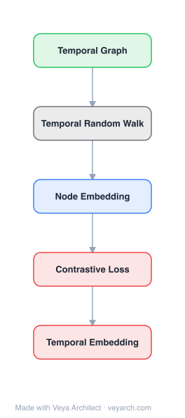

# Architecture: Continuous-Time Dynamic Network Embeddings

## Motivation

Network embedding preserves the first- and/or second-order proximity of nodes to learn low-dimensional representations, enabling node classification, clustering, link prediction, recommendation, and community detection. Methods like LINE, DeepWalk, and node2vec are effective — but they learn representations on static graphs.

In reality, networks are dynamic in nature: new and old nodes are added and deleted (users, products), and edges between nodes evolve over time (users add or delete friends in social networks). This temporal evolution is critical, yet most existing methods ignore it. A simple solution splits the graph into discrete snapshots and treats each as a static graph, adapting node representations from snapshot to snapshot — but this loses the temporal information within each time slot, requires smoothness enforcement between consecutive snapshots, and incurs high computational complexity.

CTNE addresses these gaps by working directly in continuous time. It learns time-dependent network embeddings for link prediction (where all nodes are known, no edge deletion, and edges carry timestamps) and learns representations for out-of-sample nodes. The core idea is to generate valid temporal random walks that respect the time ordering of edges, then feed them into random-walk-based embedding (like DeepWalk) to learn time-preserving embeddings.

## Core Idea

Temporal network embedding in continuous time via point process-based neighborhood formation.

## Architecture

### Overview

<b>Layer-by-layer (5 nodes)</b>

| # | Layer | Type | Params |
|---|---|---|---|
| 1 | Temporal Graph | `input` |  |
| 2 | Temporal Random Walk | `custom` |  |
| 3 | Node Embedding | `embed` |  |
| 4 | Contrastive Loss | `loss` |  |
| 5 | Temporal Embedding | `output` |  |

CTNE (Continuous-Time Dynamic Network Embeddings) operates on a continuous-time dynamic network G = (V, E_T, T), where V is the set of vertices, E_T is the set of temporal edges, and T is a function mapping each edge to a timestamp. The method learns a time-dependent embedding function that maps nodes to feature representations that evolve with time. The core mechanism is the temporal random walk: a sequence of vertices <v1, v2, ..., vk> such that each consecutive pair is a temporal edge and the timestamps are non-decreasing (T(v_i, v_{i+1}) ≤ T(v_{i+1}, v_{i+2})). These temporal walks respect causality — you can only traverse edges in the order they formed. Temporal random walks are generated via two biased selection steps (initial edge selection and temporal neighbor selection), then fed into a Skip-Gram-style objective (as in DeepWalk) to learn time-preserving embeddings.

### Components

1. **Continuous-Time Dynamic Network (input)**:
   - G = (V, E_T, T): vertices V, temporal edges E_T, timestamp function T
   - Edges carry timestamps; all nodes are known; no edge deletion (in the paper's task setting)
   - Differs from snapshot-based models — time is continuous, not discretized

2. **Temporal Walk**:
   - A sequence <v1, v2, ..., vk> where <v_i, v_{i+1}> ∈ E_T and T(v_i, v_{i+1}) ≤ T(v_{i+1}, v_{i+2})
   - Respects causality: traversal follows the temporal order of edges
   - Example: v1→v2→v3 is a valid temporal walk if edges respect time; v4→v1→v2 may be invalid if the timestamps don't align
   - The temporal analogue of a random walk in DeepWalk

3. **Initial Temporal Edge Selection**:
   - Selects the starting edge of a temporal walk
   - Provides a mechanism to temporally bias the walk
   - Unbiased: uniform selection over temporal edges
   - Biased: exponential or linear bias over time (e.g., bias toward more recent edges)

4. **Temporal Neighborhood & Neighbor Selection**:
   - Temporal neighborhood Γ_t(v): the set of temporal neighbors of node v at time t (neighbors reachable via edges valid at time t)
   - A distribution F_T temporally biases neighbor selection:
     - Unbiased: uniform over temporal neighbors
     - Biased: bias toward distant-in-time or close-in-time neighbors via a monotonic decreasing function

5. **Time-Preserving Embedding Objective (Skip-Gram)**:
   - Given a temporal walk S_t, optimize a Skip-Gram-style objective
   - Assumes conditional independence of nodes within a window size
   - Learns embeddings that preserve temporal co-occurrence — nodes appearing together in temporal walks are close in embedding space
   - Builds on DeepWalk's Skip-Gram, but with temporally-valid walks

6. **Time-Dependent Embedding Function**:
   - The learned function maps nodes to time-dependent feature representations
   - Embeddings reflect the network's state at different times

### Data Flow

1. **Input**: Continuous-time dynamic network G = (V, E_T, T) with timestamped edges
2. **Initial edge selection**: Sample a starting temporal edge (unbiased, or biased exponentially/linearly toward recent edges)
3. **Temporal walk generation**: From the starting edge, repeatedly select temporal neighbors using distribution F_T, ensuring timestamps are non-decreasing — producing valid temporal walks
4. **Walk corpus**: Generate many temporal random walks forming a corpus (analogous to DeepWalk's random walk sentences)
5. **Skip-Gram training**: Feed the temporal walk corpus into a Skip-Gram objective with a window size, assuming conditional independence of context nodes
6. **Embedding learning**: Update node embeddings to preserve temporal co-occurrence — nodes co-occurring in temporal walks become close in embedding space
7. **Inference**: Retrieve time-dependent embeddings for link prediction at specific times; generate embeddings for out-of-sample nodes via their temporal edges

### State / Memory

- **Temporal state via timestamps**: The edge timestamps T are the persistent temporal memory of the network — they encode when each connection formed, which the temporal walks must respect.
- **Time-dependent embeddings**: Unlike static embeddings, CTNE's node representations are functions of time; the embedding reflects the network's temporal state. This is explicit temporal state, not a single static vector.
- **No recurrent neural memory**: The method does not use an RNN/LSTM; the "memory" is the timestamped edge set and the time-dependent embedding parameters. Temporal order is enforced structurally (via temporal-walk validity), not via recurrent hidden state.
- **Persistent parameters**: The node embedding parameters (and the Skip-Gram model weights) are the learned, persistent parameters. They are optimized to preserve temporal co-occurrence.
- **Walk corpus is transient**: Generated temporal walks are ephemeral training data, regenerated each epoch.

## Design Decisions

1. **Continuous time over discrete snapshots** — Preserves temporal information:
   - Snapshot-based methods lose intra-slot temporal order and require inter-snapshot smoothness enforcement
   - Continuous-time temporal walks respect the exact ordering of edge formation, capturing causality
   - Avoids the arbitrary choice of snapshot granularity

2. **Temporal random walks (causality-respecting)** — Principled dynamic structure:
   - A temporal walk only traverses edges in non-decreasing timestamp order
   - Mirrors how information/influence actually propagates in real networks
   - Generalizes DeepWalk's random walks to the temporal setting

3. **Biased initial edge & neighbor selection** — Flexibility:
   - Unbiased selection gives a baseline temporal-walk distribution
   - Exponential/linear biases let the model emphasize recent edges (recency) or other temporal patterns
   - The monotonic decreasing function for neighbor selection controls whether walks favor close-in-time or distant-in-time neighbors

4. **Skip-Gram objective with temporal walks** — Reuse of proven machinery:
   - DeepWalk's Skip-Gram is well-tested for static walks; CTNE reuses it with temporally-valid walks
   - Assumes conditional independence of context nodes within a window — a simplification that works empirically
   - Minimizes engineering burden by building on DeepWalk

5. **Time-dependent embeddings** — True dynamics:
   - Embeddings are functions of time, not static vectors
   - Supports link prediction at specific times and representation of out-of-sample nodes

6. **No edge deletion setting** — Tractable dynamics:
   - The paper's task assumes all nodes are known and no edge deletion, focusing on edge addition over time
   - Simplifies the temporal-walk generation (edges remain valid once formed)

## Evolution

**Predecessors:**
- **DeepWalk** (Perozzi et al., 2014) — Random-walk + Skip-Gram on static graphs; the direct predecessor whose machinery CTNE extends to temporal walks.
- **LINE** (Tang et al., 2015) — First/second-order proximity on static graphs.
- **node2vec** (Grover & Leskovec, 2016) — Biased random walks on static graphs.
- **Snapshot-based dynamic embedding** (e.g., TGNet, Song et al., CIKM 2018) — Discrete-snapshot approach whose limitations (intra-slot temporal loss, smoothness enforcement, computational cost) CTNE addresses.
- **Temporal network analysis** — Prior work on temporal graphs and temporal reachability that defines temporal walks.

**Successors:**
- **Temporal random-walk embedding methods** — Subsequent temporal embedding methods build on CTNE's temporal-walk formulation.
- **Temporal/evolving graph neural networks** (e.g., TGAT, TGN, EvolveGCN) — Neural methods for dynamic graphs that extend temporal representation learning with attention/recurrent mechanisms.
- **Point-process-based dynamic network models** — Methods modeling edge formation as temporal point processes, a continuous-time framing related to CTNE.

## Characteristics

| Property | Value |
|----------|-------|
| Year | 2018 |
| Authors | Giang Hoang Nguyen, J. B. Lee, R. A. Rossi, N. K. Ahmed, E. Koh, S. Kim (WWW '18) |
| Category | GNN/Embedding |
| Source Paper | `Continuous_Time_Dynamic_Network_Embeddings_18_Embeddings_2018.md` |
| PaperVault Path | `GNN/02-network-embedding/Continuous_Time_Dynamic_Network_Embeddings_18_Embeddings_2018.md` |

## Limitations

1. **No edge deletion** — The method assumes edges, once formed, remain valid; it does not handle edge removal, limiting applicability to networks where relationships are revoked (e.g., unfollows, contract terminations).
2. **No node deletion** — Assumes all nodes are known; does not naturally handle nodes leaving the network.
3. **Temporal-walk generation cost** — Generating valid temporal walks (respecting timestamp order) is more expensive than static random walks, especially on large temporal graphs.
4. **Skip-Gram conditional independence assumption** — The objective assumes context nodes are conditionally independent within a window, an approximation that may not hold for strongly correlated temporal sequences.
5. **Discrete embedding parameters per time** — While embeddings are time-dependent, the representation of continuous time still relies on discrete parameters; interpolating to arbitrary continuous times is not native.
6. **No attribute utilization** — CTNE focuses on temporal structure and does not leverage node attributes that could complement temporal signals.
7. **Comparison limited to static baselines** — Evaluated against DeepWalk, LINE, node2vec (static methods); the field has since developed stronger dynamic baselines.

## Implementation Notes

See `implementation/` for a minimal runnable implementation. Key details:
- Input: continuous-time dynamic network G = (V, E_T, T) with timestamped edges
- Temporal walk: sequence <v1, ..., vk> with non-decreasing edge timestamps
- Initial edge selection: unbiased, or biased (exponential/linear) toward recent edges
- Temporal neighbor selection: Γ_t(v) with distribution F_T (unbiased or biased via monotonic decreasing function)
- Temporal walk corpus fed into Skip-Gram objective (DeepWalk-style) with window size
- Conditional independence of context nodes assumed
- Learns time-dependent node embeddings
- Tasks: time-dependent link prediction; out-of-sample node representation
- Setting: all nodes known, no edge deletion, edges with timestamps
- Evaluated on eight datasets across domains; compared with DeepWalk, LINE, node2vec (AUC metric)
- Outperforms static baselines on temporal link prediction

## Information Layers

- **Evidence:** Source paper available in `references/papers/` (Nguyen et al., 2018, "Continuous-Time Dynamic Network Embeddings", WWW '18)
- **Analysis:** CTNE's central insight is that temporal order is a first-class structural constraint that snapshot-based methods discard. By defining temporal walks that respect the non-decreasing timestamp order of edges, CTNE captures causality — how influence and connection actually propagate through time — and feeds these causally-valid walks into the proven DeepWalk Skip-Gram machinery. The biased initial-edge and neighbor-selection mechanisms add flexibility to emphasize recency or other temporal patterns. Empirically, CTNE outperforms static baselines (DeepWalk, LINE, node2vec) on temporal link prediction across eight datasets, confirming that respecting continuous-time temporal order yields better dynamic representations than discretizing into snapshots.
- **Hypothesis:** The success of CTNE suggests that the right inductive bias for dynamic network embedding is causality-respecting traversal — temporal walks encode not just who is connected to whom, but when those connections became traversable. The reuse of Skip-Gram implies that temporal co-occurrence (nodes appearing together in temporal walks) is a sufficient signal for learning time-preserving embeddings. A limitation is the no-deletion assumption; extending temporal walks to handle edge/node deletion and incorporating node attributes are natural next steps, pointing toward temporal graph attention/recurrent networks that combine CTNE's temporal-walk insight with neural attribute encoding.
