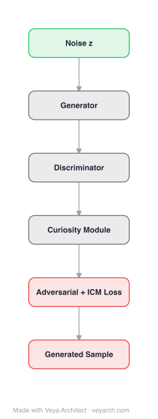

# Architecture: Curiosity GAN (Adversarial Curiosity)

## Motivation

Generative Adversarial Networks (GANs) learn to model data distributions through two unsupervised neural networks, each minimizing the objective function maximized by the other. This game-theoretic strategy has roots in earlier neural networks playing unsupervised minimax games. The paper relates GANs to earlier work on Adversarial Curiosity (1990) and Predictability Minimization (1990s), providing historical context and correcting claims about the minimax nature of these earlier approaches.

## Core Idea

GANs can be formulated as a special case of Adversarial Curiosity (1990), which is based on a minimax duel between two networks: one generating data through its probabilistic actions, the other predicting consequences thereof. The generator maximizes the objective function minimized by the predictor, creating an adversarial dynamic that drives learning without external supervision.

## Architecture

### Overview

<b>Layer-by-layer (6 nodes)</b>

| # | Layer | Type | Params |
|---|---|---|---|
| 1 | Noise z | `input` |  |
| 2 | Generator | `custom` |  |
| 3 | Discriminator | `custom` |  |
| 4 | Curiosity Module | `custom` |  |
| 5 | Adversarial + ICM Loss | `loss` |  |
| 6 | Generated Sample | `output` |  |

The Adversarial Curiosity framework consists of two unsupervised neural networks playing a minimax game. The first network (generator/actor) generates data through probabilistic actions, while the second network (predictor/critic) learns to predict the consequences or properties of the generated outputs. The generator tries to maximize the predictor's error, while the predictor tries to minimize it.

### Components

1. **Generator Network (Actor)** — The first network:
   - Generates data through probabilistic actions
   - Tries to maximize the error of the predictor
   - Learns to produce outputs that are unpredictable/informative

2. **Predictor Network (Critic)** — The second network:
   - Predicts consequences or properties of the generated outputs
   - Tries to minimize its prediction error
   - Learns to model the generator's output distribution

3. **Minimax Objective** — The adversarial game:
   - Generator maximizes: the predictor's error
   - Predictor minimizes: its prediction error
   - Equilibrium: generator produces maximally informative data, predictor perfectly predicts

### Data Flow

1. **Generator**: Produces output data (actions/generations)
2. **Predictor**: Attempts to predict properties/consequences of the generated data
3. **Error computation**: Prediction error is computed
4. **Generator update**: Maximize error (produce more unpredictable data)
5. **Predictor update**: Minimize error (improve prediction)
6. **Equilibrium**: Generator produces informative data, predictor models it accurately

### State / Memory

- **No explicit memory mechanism**: Both networks are feedforward (in the basic formulation).
- **Adversarial state**: The two networks' parameters co-evolve through the minimax game.
- **Generator state**: The generator's parameters encode the learned data distribution.
- **Predictor state**: The predictor's parameters encode the learned prediction function.

## Design Decisions

1. **Unsupervised minimax game** — No external teacher or reward:
   - Both networks learn without supervision
   - The adversarial dynamic provides the learning signal
   - Enables unsupervised learning of data distributions

2. **Generator maximizes predictor error** — The generator's objective:
   - Encourages exploration (generating diverse, informative data)
   - Drives the generator to produce outputs the predictor cannot yet model
   - Creates a "curiosity" drive — the generator seeks novelty

3. **Predictor minimizes error** — The predictor's objective:
   - Learns to model the generator's output distribution
   - Provides a "world model" of the generated data
   - The better the predictor, the harder the generator must work

4. **Connection to GANs** — GANs as a special case:
   - GAN generator = Adversarial Curiosity generator
   - GAN discriminator = Adversarial Curiosity predictor (binary prediction)
   - GAN's minimax objective = Adversarial Curiosity's minimax objective

5. **Predictability Minimization correction** — Correcting prior claims:
   - PM (1990s) is also based on a minimax game
   - Encoder maximizes the objective minimized by the predictor
   - Models data distributions through competitive encoding

## Evolution

**Predecessors:**
- **Minimax in game theory** (von Neumann, 1944) — Game-theoretic foundations.
- **Chess programs** (1945) — Early minimax in computing.
- **Adversarial Curiosity** (Schmidhuber, 1990) — Original minimax neural network framework.
- **Predictability Minimization** (Schmidhuber, 1990s) — Another minimax neural network approach.

**Successors:**
- **GAN** (Goodfellow et al., 2014) — Generative Adversarial Networks (popularized the minimax approach).
- **Variants of GANs** — DCGAN, WGAN, CycleGAN, etc.
- **Curiosity-driven RL** — Intrinsic motivation in reinforcement learning.
- **Self-supervised learning** — Modern unsupervised representation learning.

## Characteristics

| Property | Value |
|----------|-------|
| Year | 2019 |
| Authors | Jürgen Schmidhuber (IDSIA, USI & SUPSI) |
| Category | DL/GAN |
| Source Paper | `Unsupervised_Minimax_Curiosity_Adversarial_2019.md` |
| PaperVault Path | `DL-Architectures/06-gan-kan/Unsupervised_Minimax_Curiosity_Adversarial_2019.md` |

## Limitations

1. **Historical/analytical paper** — This is primarily a historical and theoretical analysis, not a new architecture proposal.
2. **Training instability** — Minimax games are notoriously difficult to train (GAN training instability).
3. **Mode collapse** — The generator may produce limited variety, a well-known GAN problem.
4. **Equilibrium finding** — Reaching Nash equilibrium in minimax games is not guaranteed.
5. **Scale** — Early implementations (1990) were very small; scaling to modern datasets is non-trivial.
6. **Evaluation** — Unsupervised minimax objectives are hard to evaluate without external metrics.

## Implementation Notes

See `implementation/` for a minimal runnable implementation. Key details:
- Two networks: generator (actor) and predictor (critic)
- Generator: maximizes predictor error (curiosity/exploration)
- Predictor: minimizes prediction error (world modeling)
- Minimax objective: max_G min_P error(G, P)
- GAN as special case: discriminator = binary predictor
- Predictability Minimization: encoder maximizes, predictor minimizes
- Unsupervised: no external teacher or reward
- Historical context: Adversarial Curiosity (1990) predates GAN (2014)
- Code: conceptual/historical paper, implementation based on GAN frameworks

## Information Layers

- **Evidence:** Source paper available in `references/papers/` (Schmidhuber, 2019, "Unsupervised Minimax: Adversarial Curiosity, Generative Adversarial Networks, and Predictability Minimization")
- **Analysis:** The paper's key contribution is establishing the historical and theoretical lineage of GANs. By showing that GANs are a special case of Adversarial Curiosity (1990), Schmidhuber demonstrates that the minimax approach to unsupervised learning was developed decades before GANs popularized it. The correction about Predictability Minimization being a minimax game (not just a minimization) is important for theoretical completeness. The "curiosity" framing — where the generator seeks novelty by maximizing prediction error — provides an intuitive understanding of why adversarial training works: it creates an intrinsic motivation to explore and model the data distribution.
- **Hypothesis:** The curiosity framing suggests that adversarial training is fundamentally about exploration (generator) vs. modeling (predictor). This perspective may inspire new training strategies that balance exploration and exploitation more effectively. The connection to reinforcement learning (intrinsic motivation, curiosity-driven exploration) suggests that GAN-like architectures could be applied to RL settings more broadly.
