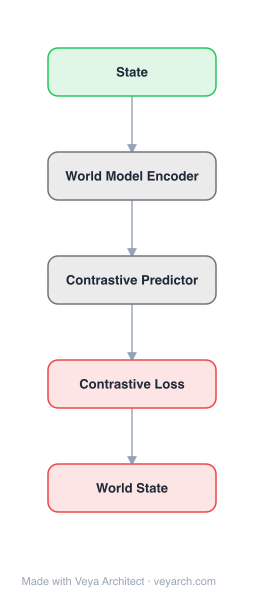

# Architecture: Continuous Thought Machines

## Motivation

Biological brains exhibit complex time-dependent neural dynamics, where neural timing and synchronization are critical to how brains process information. However, artificial neural networks intentionally abstract away the precise timing and interplay of neuron interactions to facilitate large-scale deep learning. While this simplification has enabled significant advancements, it deviates from fundamental biological neural computation principles. Modern AI lacks the flexibility, efficiency, fluidity, generalization capabilities, and common sense of human intelligence, which operates in an open world where learning and adaptation are tied to the arrow of time.

Prior approaches to incorporating temporal dynamics — such as adaptive computation (early-exit networks, PonderNet, ACT), iterative reasoning (RIMs, RAM), and biologically inspired models (Liquid Time-Constant Networks, Spiking Neural Networks) — either use explicit halting mechanisms, focus on external glimpses rather than internal dynamics, or rely on non-differentiable computation. The CTM was designed to incorporate time as part of neural computation by making neural dynamics the core operating principle, not a post-hoc addition.

## Core Idea

Neural architecture where internal computation unfolds in continuous time with learned temporal dynamics.

## Architecture

### Overview

<b>Layer-by-layer (5 nodes)</b>

| # | Layer | Type | Params |
|---|---|---|---|
| 1 | State | `input` |  |
| 2 | World Model Encoder | `custom` |  |
| 3 | Contrastive Predictor | `custom` |  |
| 4 | Contrastive Loss | `loss` |  |
| 5 | World State | `output` |  |

The Continuous Thought Machine (CTM) is a neural network architecture that explicitly incorporates neural dynamics as a core component. It uses an internal dimension `t ∈ {1, ..., T}` — decoupled from data dimensions — that enables iterative refinement of representations, even for static data. Unlike conventional sequential models that process data-inherent sequences, the CTM unfolds along a self-generated timeline of "thought steps" that unfolds neural dynamics for downstream use. The CTM has two defining innovations: (1) neuron-level temporal processing, where each neuron uses unique weight parameters to process incoming histories; and (2) neural synchronization as a latent representation, computed from temporal correlations between neuron-level activity.

### Components

1. **Synapse Model (f_θ_syn)** — A shared synapse model interconnects neurons in a `D`-dimensional latent space `z_t ∈ R^D`. A U-Net-esque MLP was found to perform best, suggesting benefit from deeper and more flexible synaptic computation. It produces pre-activations: `a_t = f_θ_syn(concat(z_t, o_t)) ∈ R^D`, where `o_t` is the attention output. The `M` most recent pre-activations form a history: `A_t = [a_{t-M+1} ... a_t] ∈ R^{D×M}`. Initial pre-activation history and `z_{t=1}` are learnable parameters. `M ≈ 10–100` was effective.

2. **Neuron-Level Models (NLMs)** — Each neuron `d ∈ {1, ..., D}` has a privately parameterized NLM `g_{θ_d}` (depth-1 MLP of width `d_hidden`) processing its `M`-dimensional pre-activation history `A_t^d` to produce post-activations: `z_{t+1}^d = g_{θ_d}(A_t^d)`. This is the key innovation: each neuron has its own private weights and processes its own history of pre-activations, generating complex neuron-level dynamics rather than a simple scalar activation.

3. **Neural Synchronization Matrix (S_t)** — Post-activations are collected into a (non-fixed length) history `Z_t = [z_1 ... z_t] ∈ R^{D×t}`. Neural synchronization is defined as the inner product of neuron histories: `S_t = Z_t · (Z_t)^⊺ ∈ R^{D×D}`. This matrix captures temporal correlations between neuron-level activity and serves as the CTM's primary latent representation — distinct from the static "snapshot" representations used in most neural networks.

4. **Neuron Pairing (Sub-sampling)** — Since `S_t` scales with `O(D²)`, neuron pairs `(i, j)` are randomly sampled at the start of training: `D_out` pairs for output synchronization `S_t^{out} ∈ R^{D_out}` and `D_action` pairs for attention synchronization `S_t^{action} ∈ R^{D_action}`. These are projected by `W_out` and `W_in` for outputs and attention queries respectively.

5. **Attention Mechanism** — Uses standard cross-attention: `o_t = Attention(Q = q_t, KV = FeatureExtractor(data))`, where a FeatureExtractor (e.g., ResNet) provides keys/values. The attention output `o_t ∈ R^{d_input}` is concatenated with `z_{t+1}` and fed into the synapse model for the next internal tick.

6. **Learnable Temporal Decay** — Learnable exponential decay factors `r_{ij} ≥ 0` for each neuron pair modulate the influence of past activity on `S_t`. The rescaled synchronization uses: `S_t^{ij} = ((Z_t^i)^⊺ · diag(R_t^{ij}) · Z_t^j) / Σ R_t^{ij}_τ`. Higher `r_{ij}` biases towards recent ticks (`r_{ij} = 0` means no decay). This allows the CTM to modulate synchronization across multiple time scales.

### Data Flow

1. **Initialization**: Learnable initial pre-activation history and `z_{t=1}` initialize the internal state.
2. **Synapse computation (tick t)**: The synapse model `f_θ_syn` takes `concat(z_t, o_t)` and produces pre-activations `a_t`. The most recent `M` pre-activations form history `A_t`.
3. **Neuron-level processing**: Each NLM `g_{θ_d}` processes its private history `A_t^d` to produce post-activation `z_{t+1}^d`. The full set of post-activations forms `z_{t+1}`.
4. **Synchronization computation**: Post-activations are collected into history `Z_t`. The synchronization matrix `S_t = Z_t · (Z_t)^⊺` is computed, with learnable temporal decay applied.
5. **Output and attention**: Sub-sampled synchronization pairs form `S_t^{out}` and `S_t^{action}`, projected to outputs `y_t` and attention queries `q_t`. Cross-attention `o_t = Attention(q_t, KV=FeatureExtractor(data))` is computed.
6. **Feedback**: `o_t` is concatenated with `z_{t+1}` and fed into the synapse model for the next tick `t+1`.
7. **Repeat**: Steps 2–6 repeat for `T` internal ticks. Loss is computed at the point of minimum loss (`t_1 = argmin(L)`) and maximum certainty (`t_2 = argmax(C)`).

### State / Memory

- **Internal timeline (thought steps)**: The CTM's primary state mechanism is the internal dimension `t ∈ {1, ..., T}`, decoupled from data dimensions. This timeline of internal ticks enables iterative refinement of representations, even for static data.
- **Pre-activation history (A_t)**: Each neuron maintains a history of its `M` most recent pre-activations, processed by its private NLM. This is a local, neuron-level memory.
- **Post-activation history (Z_t)**: The growing history of post-activations across all ticks, used to compute the synchronization matrix. This is the model's working memory.
- **Synchronization matrix (S_t)**: The primary latent representation, computed from temporal correlations in `Z_t`. Unlike static snapshot representations, it directly encodes the temporal interplay of neural dynamics.
- **Attention KV cache**: The FeatureExtractor (e.g., ResNet) provides keys/values for cross-attention, serving as external memory the CTM attends to at each tick.

## Design Decisions

1. **Neural synchronization as primary representation (not snapshot)** — The CTM uses synchronization (temporal correlations between neuron-level activity) directly as the latent representation for observation and prediction, rather than using the static post-activation `z_t`. This was a deliberate choice: "snapshot" representations were found to be too constraining, strongly tying `z_t` to the downstream task and limiting the types of dynamics it can produce. Synchronization decouples the representation from the task.

2. **Privately parameterized NLMs (not shared weights)** — Each neuron has its own private MLP weights processing its pre-activation history. This creates neuron-level diversity in temporal processing, enabling complex dynamics that shared-weight neurons cannot produce. This is more biologically plausible and is the mechanism that generates the complex neural activity.

3. **Internal dimension decoupled from data** — The internal timeline `t ∈ {1, ..., T}` is self-generated, not tied to the input sequence length or structure. This enables iterative refinement even for static data (e.g., images) and allows the model to "think" for variable numbers of steps.

4. **Adaptive compute as emergent property (not explicit mechanism)** — Unlike PonderNet/ACT which use learnable halting modules, the CTM's adaptive processing emerges naturally from its core architecture. The loss function selects the point of minimum loss (`t_1 = argmin(L)`) and maximum certainty (`t_2 = argmax(C)`), which are dynamically defined per data point. This implements native adaptive computation without dedicated halting components.

5. **U-Net-esque synapse model** — A U-Net-like MLP was found to perform best for the synapse model, suggesting benefit from deeper and more flexible synaptic computation. This choice enables richer interactions between neurons.

6. **Learnable temporal decay rates** — Per-pair decay rates `r_{ij}` allow the CTM to modulate synchronization across multiple time scales. Some pairs can focus on recent activity while others integrate over longer histories. (Note: the paper found the CTM barely leveraged this for ImageNet but more so for 2D mazes, suggesting task-dependent temporal sensitivities.)

## Evolution

**Predecessors:**
- **Adaptive Computation Time (ACT) / PonderNet** — Introduced learnable halting for adaptive computation, but require explicit halting modules. CTM's adaptive compute emerges naturally.
- **Recurrent Models of Visual Attention (RAM)** — Used recurrence for sequential processing of visual glimpses, but focused on perceptual decision-making from external glimpses rather than internal neural dynamics.
- **Liquid Time-Constant Networks (LTCNs)** — Neurons governed by time-varying differential equations; CTM draws inspiration but uses differentiable NLMs instead of ODEs.
- **Spiking Neural Networks (SNNs)** — Use discrete timed events and synchronization; CTM abstracts these into a tractable, differentiable framework suitable for gradient-based deep learning.
- **Recurrent Independent Mechanisms (RIMs)** — Modular, asynchronous sub-networks for multi-step reasoning; CTM generates internal dynamics from neuron-level histories instead.

**Successors:**
- The CTM is presented as a step toward bridging the gap between modern AI and biological plausibility. Its design principles (neuron-level processing, synchronization as representation) may inspire future architectures that further incorporate temporal dynamics.

## Characteristics

| Property | Value |
|----------|-------|
| Year | 2025 |
| Authors | Obryk & Yerokhin |
| Category | DL/Transformer |
| Source Paper | `Continuous_Thought_Machines_Obryk_Yerokhin_2025.md` |
| PaperVault Path | `DL-Architectures/01-transformers/Continuous_Thought_Machines_Obryk_Yerokhin_2025.md` |

## Limitations

1. **Computational overhead** — The CTM processes `T` internal ticks per forward pass, each involving NLM computation for all `D` neurons, synchronization matrix computation, and attention. This is more expensive than a single forward pass through a standard network.

2. **Synchronization matrix scaling** — `S_t ∈ R^{D×D}` scales quadratically with the number of neurons, requiring sub-sampling of neuron pairs. This limits the effective dimensionality of the synchronization representation.

3. **Task-dependent temporal sensitivity** — The learnable temporal decay was barely leveraged for ImageNet classification but more so for 2D mazes, suggesting the model's temporal dynamics are task-dependent and may not be universally beneficial.

4. **Not pushing for state-of-the-art** — The paper explicitly states the goal is to share the CTM and its innovations rather than pushing for new SOTA results. Performance on ImageNet-1K, while strong, does not match the best specialized architectures.

5. **Hyperparameter sensitivity** — The number of internal ticks `T`, history length `M`, latent dimension `D`, and NLM width `d_hidden` are all hyperparameters that may require careful tuning per task.

6. **Biological plausibility vs. tractability trade-off** — The CTM strikes a balance between neuron abstractions and biological realism, but remains a significant simplification of biological neural computation. The NLMs (depth-1 MLPs) are much simpler than real neuron dynamics.

## Implementation Notes

See `implementation/` for a minimal runnable implementation.

Key implementation details from the paper:
- Synapse model: U-Net-esque MLP
- NLMs: depth-1 MLP of width `d_hidden`, one per neuron (private weights)
- Pre-activation history length: `M ≈ 10–100`
- Synchronization: inner product of post-activation histories, with learnable temporal decay
- Neuron pairing: random sub-sampling of `D_out` and `D_action` pairs at training start
- Attention: standard cross-attention with FeatureExtractor (e.g., ResNet) providing KV
- Loss: `L = (L_{t1} + L_{t2}) / 2` where `t1 = argmin(L)` and `t2 = argmax(C)` (certainty)
- Tasks: 2D mazes (39×39, up to 100 steps), ImageNet-1K classification, parity computation
- 75 internal ticks for mazes; adaptive for ImageNet

## Information Layers

- **Evidence:** Source paper available in `references/papers/` — all architectural details (synapse model, NLMs, synchronization matrix, neuron pairing, attention, loss function) are directly stated in the paper.
- **Analysis:** The CTM's key insight is that neural synchronization — temporal correlations between neuron-level activity — can serve as a primary latent representation, distinct from the static snapshot representations used in most neural networks. This enables emergent capabilities like adaptive compute, "looking around" images before predicting, and complex sequential reasoning, all from the same core architecture.
- **Hypothesis:** The emergent behaviors (maze navigation without positional encodings, looking around images, adaptive computation) suggest that temporal dynamics are a missing fundamental component in modern AI. Whether scaling up the CTM (more neurons, more ticks, deeper NLMs) would close the gap with specialized architectures on standard benchmarks remains an open question.
