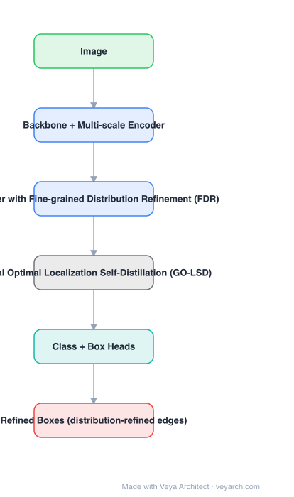

# Architecture: D-FINE

## Motivation

DETR decoders predict a box delta per layer and refine greedily. Two problems follow: the regression target is a point estimate with no notion of uncertainty, and each intermediate layer is supervised only by its own greedy step — so early layers commit to boxes they cannot later correct. D-FINE's claim: the regression task itself is defined too coarsely.

## Core Idea

Redefine box regression as **fine-grained distribution refinement (FDR)**. Each box edge is a probability distribution over discretized offsets; every decoder layer refines the *previous layer's distribution* rather than predicting a fresh delta. Then add **GO-LSD** (global optimal localization self-distillation): the last layer's refined distribution teaches the earlier ones, so intermediate layers become genuinely good.

## Architecture

### Overview

<b>Layer-by-layer (6 nodes)</b>

| # | Layer | Type | Params |
|---|---|---|---|
| 1 | Image | `input` |  |
| 2 | Backbone + Multi-scale Encoder | `conv2d` |  |
| 3 | Decoder with Fine-grained Distribution Refinement (FDR) | `attention` |  |
| 4 | Global Optimal Localization Self-Distillation (GO-LSD) | `custom` |  |
| 5 | Class + Box Heads | `linear` |  |
| 6 | Refined Boxes (distribution-refined edges) | `output` |  |

### Components

1. **Backbone + multi-scale encoder** — a standard DETR-family encoder (multi-scale deformable attention), as in DINO/RT-DETR; D-FINE does not change the encoder.
2. **Decoder with FDR** — each decoder layer outputs, for each box edge, a distribution over discretized offsets; the layer's output refines the distribution produced by the layer before it. Fine adjustments cost little (non-monotonic weighting), so the distribution can be reshaped precisely.
3. **GO-LSD (global optimal localization self-distillation)** — the final layer's distribution, which has seen the most refinement, is used as a distillation target for earlier layers; weighting is based on localization quality so a bad final box does not poison the student layers.
4. **Class and box heads** — unchanged in form from the base detector; the box head now emits a distribution instead of four scalars.
5. **Training-only cost** — both FDR and GO-LSD add parameters and losses at training time but not at inference, which is the reason the method is free at deployment.

### Data Flow

Image → backbone/encoder → decoder layers, each refining the edge distributions of the previous layer → final distribution → box; GO-LSD transfers the final distribution back to intermediate layers during training.

### State / Memory

The refined edge distribution passed between decoder layers is the model's internal state — the "progressive refinement" is a chain over decoder depth, not over time.

## Design Decisions

- **Distributions over point estimates** — a distribution expresses uncertainty about each edge, and the final box is its expectation, so refinement becomes incremental instead of a fresh guess.
- **Refine the previous layer's distribution** — makes each decoder layer's job small and well-conditioned.
- **Self-distill from the last layer** — gives intermediate layers a target better than their own greedy step.
- **Zero inference cost** — the constraint that keeps this usable in real-time detectors.

## Evolution

- **DETR → Deformable DETR → DAB-DETR / DN-DETR → DINO**: from point-estimate box deltas to denoising-based training; regression itself stayed a point estimate.
- **D-FINE**: redefines regression as fine-grained distribution refinement + GO-LSD self-distillation.
- **Siblings**: RT-DETR / RT-DETRv3 (real-time DETR, dense positive supervision), LW-DETR (lightweight, ViT-based real-time), DEYO (one-to-many training trick), D-FINE-seg (instance segmentation extension).
- **Contrast**: YOLOv11 — CNN anchor-free; D-FINE keeps the DETR query formulation and fixes localization.

## Characteristics

| Property | Value |
|---|---|
| Task | object detection (real-time DETR family) |
| Encoder | standard multi-scale DETR encoder (unchanged) |
| Regression | per-edge probability distribution refined per decoder layer |
| Training aid | GO-LSD self-distillation from the final layer |
| Inference cost | none added (training-only modules) |
| Reported | strong COCO speed/accuracy trade-off vs. real-time DETRs |

## Limitations

- The improvement is in localization quality; classification and query-matching weaknesses of the base detector remain.
- Discretization granularity is a hyperparameter: too coarse limits accuracy, too fine adds parameters and noise.
- GO-LSD depends on the quality of the final layer; on hard cases the distillation target is weak.
- Built on a DETR base, so it inherits DETR's sensitivity to Hungarian matching and long schedules.

## Implementation Notes

Essentials: (1) replace the box head with a distribution head over discretized offsets per edge (expectation = box coordinate), (2) make each decoder layer take the previous layer's distribution as its starting point rather than predicting deltas, (3) add the GO-LSD loss weighting by final-layer localization quality, (4) strip all distillation branches at inference and confirm latency is unchanged, (5) tune the number of bins — this is the main new hyperparameter. The main branch still uses one-to-one Hungarian matching; FDR is stacked on top of that assignment.
