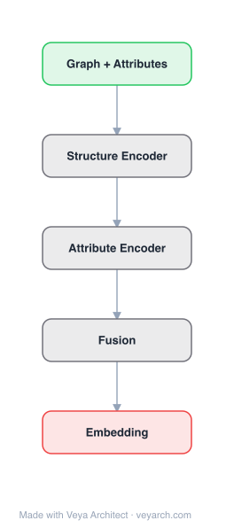

# Architecture: DANE

## Motivation

Network embedding learns a low-dimensional vector representation for each node by preserving node proximity, advancing tasks such as node classification, network clustering, and link prediction. Most existing works are overwhelmingly designed for plain, static networks. They ignore node attributes that could complement a sparse graph, and they assume the network is given a priori and unchanging.

In reality, real-world networks are intrinsically dynamic: edges and nodes are added or deleted over time (co-author relations form, friendships are made in social networks), and node attributes also change naturally — new content patterns emerge and old ones fade (e.g., disaster-relief topics surge on social media after an earthquake, while other topics recede). These changing characteristics demand an embedding that captures both network and attribute evolving patterns, which is of fundamental importance for learning in a dynamic environment.

DANE tackles two challenges: (1) network topology and node attributes are inherently correlated but can be noisy and incomplete individually, necessitating a robust consensus representation capturing their individual properties and correlations; (2) embedding learning must be performed in an online fashion to adapt to changes promptly. DANE is the first to formally address dynamic attributed network embedding, combining an offline consensus model with an online matrix-perturbation-based update.

## Core Idea

Dynamic attributed network embedding preserving both structure and attributes in evolving networks.

## Architecture

### Overview

<b>Layer-by-layer (5 nodes)</b>

| # | Layer | Type | Params |
|---|---|---|---|
| 1 | Graph + Attributes | `input` |  |
| 2 | Structure Encoder | `custom` |  |
| 3 | Attribute Encoder | `custom` |  |
| 4 | Fusion | `custom` |  |
| 5 | Embedding | `output` |  |

DANE (Dynamic Attributed Network Embedding) is a two-stage framework. First, an offline model computes a consensus embedding that jointly preserves network structure and node attributes in a robust way, capturing their correlations while being resilient to noise and incompleteness. The consensus representation fuses a structure-based embedding (from the adjacency matrix) and an attribute-based embedding (from the attribute matrix) into a unified low-dimensional space. Second, an online model leverages matrix perturbation theory to update the consensus embedding incrementally when the network structure and/or attributes change between time steps, avoiding the cost of recomputing from scratch. This online update maintains freshness efficiently, with theoretical time-complexity advantages over offline methods.

### Components

1. **Offline Consensus Embedding Model**:
   - Computes separate embeddings for network structure and node attributes
   - Structure embedding: preserves node proximity from the adjacency matrix A (e.g., via spectral/factorization methods capturing structural proximity)
   - Attribute embedding: preserves node proximity from the attribute matrix X (e.g., via spectral methods on attribute similarity)
   - Consensus fusion: combines the structure and attribute embeddings into a single consensus representation that captures both individual properties and their correlations, robust to noise and incompleteness in either source

2. **Matrix Perturbation Online Update**:
   - When the network evolves from time t to t+1, the adjacency and attribute matrices change by ΔA and ΔX
   - Matrix perturbation theory relates the change in the eigenvectors/eigenvalues (embeddings) to the perturbation ΔA, ΔX
   - Updates the consensus embedding incrementally without full recomputation
   - Provides theoretical time-complexity guarantees superior to offline recomputation

3. **Structure Proximity Preservation**:
   - The structure embedding component preserves node proximity derived from the adjacency matrix
   - Captures first-order and higher-order structural proximity

4. **Attribute Proximity Preservation**:
   - The attribute embedding component preserves node proximity derived from attribute similarity
   - Captures content/feature-based proximity, complementary to structure (especially valuable in sparse graphs)

5. **Consensus Representation (final output)**:
   - The fused, low-dimensional consensus embedding per node
   - Serves as the node's representation for downstream tasks at each time step
   - Updated online as the network evolves

### Data Flow

1. **Input (time t)**: Attributed network G^(t) = (A^(t), X^(t)) — adjacency matrix A and attribute matrix X
2. **Offline consensus embedding (initial)**:
   a. Compute structure embedding from A^(t) (spectral/factorization)
   b. Compute attribute embedding from X^(t) (spectral/factorization)
   c. Fuse into consensus embedding U^(t) capturing both structure and attributes
3. **Network evolution (t → t+1)**: Structure changes by ΔA; attributes change by ΔX
4. **Online update**: Apply matrix perturbation theory to update the consensus embedding U^(t) → U^(t+1) based on ΔA and ΔX, without full recomputation
5. **Output (time t+1)**: Fresh consensus embedding U^(t+1) reflecting the evolved network and attributes
6. **Downstream tasks**: Use U^(t) or U^(t+1) for node classification, clustering, link prediction at each time step

### State / Memory

- **Persistent offline model**: The initial consensus embedding U^(t) and the spectral decomposition (eigenvalues/eigenvectors) of A and X serve as the persistent state from which online updates are derived.
- **Incremental state across time steps**: The online model maintains the current consensus embedding and updates it incrementally — the embedding at t+1 is derived from the embedding at t plus perturbation corrections. This is explicit temporal state: the method is stateful across time steps.
- **Change matrices ΔA, ΔX**: The observed changes in structure and attributes between time steps are the input signals for the online update; they are transient (per-time-step) but drive the state transition.
- **No recurrent neural memory**: Unlike LSTM-based methods, DANE's "memory" is algebraic (matrix/eigenspace state), not neural recurrent state. The update is a closed-form perturbation correction.

## Design Decisions

1. **Offline + online split** — Efficiency for dynamic networks:
   - Computing embeddings from scratch at every time step is prohibitively expensive
   - An initial offline model establishes a strong consensus embedding; the online model only applies corrections
   - Matrix perturbation theory provides the principled, efficient update mechanism

2. **Consensus embedding (structure + attributes)** — Robustness:
   - Network structure and node attributes are correlated but individually noisy/incomplete
   - A consensus representation captures both their individual properties and correlations
   - Robust to noise and missing data in either source — especially valuable when the graph is sparse

3. **Matrix perturbation theory** — Principled online update:
   - Relates eigenvector/eigenvalue changes to matrix perturbations (ΔA, ΔX) in closed form
   - Provides theoretical time-complexity guarantees superior to offline recomputation
   - Avoids re-running the full spectral/factorization pipeline each step

4. **Separate structure and attribute embeddings before fusion** — Modularity:
   - Each source (structure, attributes) is embedded in its own space first
   - Fusion then aligns them into a consensus space
   - Allows each source to contribute according to its reliability

5. **First to formally define dynamic attributed network embedding** — Problem formulation:
   - DANE formally defines the problem of dynamic attributed network embedding
   - Establishes the offline-base + online-update paradigm adopted by subsequent dynamic embedding work

## Evolution

**Predecessors:**
- **DeepWalk** (Perozzi et al., 2014), **LINE** (Tang et al., 2015), **node2vec** (Grover & Leskovec, 2016) — Static, plain-network embedding; context-free; no attributes; no dynamics.
- **TADW** (Yang et al., 2015) — Text-associated DeepWalk; incorporates attributes but static.
- **AANE / attributed network embedding** — Methods incorporating node attributes but static.
- **Spectral graph embedding** (eigen-decomposition based) — The algebraic foundation DANE's offline model and perturbation updates build on.
- **Matrix perturbation theory** — The mathematical tool enabling the efficient online update.
- **Dynamic network analysis** — Prior work on evolving networks (without attribute dynamics).

**Successors:**
- **Dynamic network embedding methods** — Subsequent dynamic embedding frameworks adopt DANE's offline-base + online-update paradigm (e.g., methods using incremental SVD, online matrix factorization).
- **Temporal network embeddings** (e.g., CTNE / continuous-time dynamic embeddings) — Extend dynamic embedding to continuous-time temporal walks.
- **Dynamic GNNs** — Graph neural networks that handle evolving graphs build on the dynamic-attributed framing DANE introduced.

## Characteristics

| Property | Value |
|----------|-------|
| Year | 2017 |
| Authors | Jundong Li, Harsh Dani, Xia Hu, Jiliang Tang, Yi Chang, Huan Liu (ASU / Texas A&M / MSU / Huawei Research) |
| Category | GNN/Embedding |
| Source Paper | `Attributed_network_embedding_for_learning_in_a_dynamic_envir_Li_Dani_Hu_etal_2017.md` |
| PaperVault Path | `GNN/02-network-embedding/Attributed_network_embedding_for_learning_in_a_dynamic_envir_Li_Dani_Hu_etal_2017.md` |

## Limitations

1. **Linear perturbation assumption** — Matrix perturbation theory provides first-order approximations; large structural/attribute changes between time steps may exceed the linear regime, degrading update accuracy.
2. **Spectral/factorization-based** — The offline model relies on spectral decomposition or matrix factorization, which can be expensive for very large graphs and may not capture highly non-linear structure as well as neural methods.
3. **Fixed embedding dimension** — The consensus embedding dimension is fixed at offline time; it does not adapt if the network's intrinsic dimensionality changes over time.
4. **No node addition/deletion handling detail** — While the framework accommodates network changes, node insertions/deletions require careful handling in the matrix perturbation formulation (the matrices' dimensions change).
5. **No neural/non-linear modeling** — DANE is algebraic rather than neural; it may underfit highly non-linear network-attribute relationships that neural methods (SDNE, GraphSAGE) capture.
6. **Attribute-structure correlation assumed** — The consensus fusion assumes structure and attributes are correlated and complementary; when they conflict sharply, the consensus may be suboptimal.
7. **Offline recomputation still needed periodically** — Accumulated perturbation errors over many time steps may require periodic offline recomputation to reset.

## Implementation Notes

See `implementation/` for a minimal runnable implementation. Key details:
- Two-stage: offline consensus embedding + online matrix-perturbation update
- Offline: compute structure embedding (from A) and attribute embedding (from X), fuse into consensus
- Online: when ΔA and ΔX occur, update consensus embedding via matrix perturbation theory
- Theoretical time complexity advantage over offline recomputation
- Handles both network structure and node attribute dynamics
- Robust to noise/incompleteness via consensus fusion
- Outperforms best competitors on clustering and classification; much faster than offline embedding methods
- Evaluated on both synthetic and real-world attributed networks
- First formal framework for dynamic attributed network embedding

## Information Layers

- **Evidence:** Source paper available in `references/papers/` (Li, Dani, Hu, Tang, Chang, Liu, 2017, "Attributed Network Embedding for Learning in a Dynamic Environment", CIKM '17)
- **Analysis:** DANE's central insight is that dynamic attributed networks require both a robust joint representation of structure and attributes and an efficient online update mechanism. The offline consensus embedding addresses the former by fusing two noisy-but-correlated information sources into a resilient representation — valuable especially when the graph is sparse and attributes are complementary. The online matrix-perturbation update addresses the latter by exploiting the algebraic relationship between matrix changes and eigenvector changes, enabling incremental updates without full recomputation. Empirically, DANE outperforms competitors on clustering and classification while being much faster than offline methods, confirming that the offline-base + online-update paradigm is effective for dynamic networks.
- **Hypothesis:** The success of DANE suggests that for dynamic networks, the right architecture is a strong static base model plus a lightweight, principled update rule — not a full re-learn each step. The consensus fusion implies that structure and attributes are best treated as correlated views whose disagreement signals noise. A limitation is the linear perturbation assumption: for highly non-linear or large-step evolution, neural dynamic models (e.g., temporal GNNs) may be needed, suggesting a hybrid of algebraic updates and neural refinement as a future direction.
