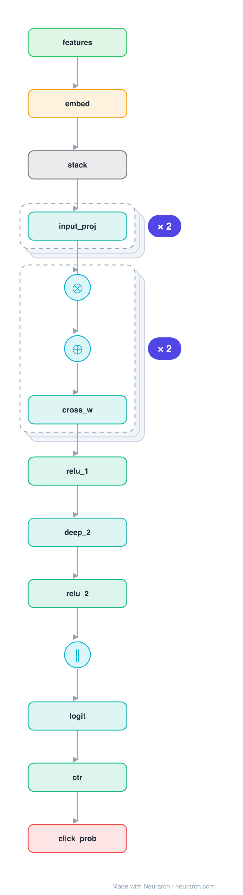

# Architecture: DCN-v2

## Motivation

The production successor to DCN. Each cross layer applies a full weight matrix to the feature vector before the element-wise cross with the input (x0 . (W x_l) + x_l), so the crosses are far more expressive than DCN's rank-1 version, while a low-rank factorization keeps the cost down. Deployed across Google ad and feed ranking.

## Core Idea

The production successor to DCN.

## Architecture

### Overview

*Identical repeated blocks are folded into one representative block with a `× N` badge, so the whole architecture fits on screen. `model.json` keeps all 18 nodes (open it in Neurarch to see and edit every layer). Vector: [diagram.svg](assets/diagram.svg).*

| Hyperparameter | Value |
|---|---|
| Type | CTR / click prediction |
| Cross network | Matrix-weighted cross per layer, plus residual |
| Deep network | Parallel MLP |
| Fusion | Concatenate cross + deep then logit |
| Key idea | Full (low-rank) cross matrix replaces DCN's rank-1 cross |

`model.json` is the full graph, hand-built against the official config.json.

### Design Notes

- The defining change from [dcn](../dcn/): the cross uses a learned matrix W (here a full linear), where the original used a rank-1 weight vector.
- Reference topology: features projected to a base vector x0, two matrix-cross layers, a parallel deep MLP, then concatenation.
- In practice the cross matrix is low-rank (a bottleneck) to control parameters at production feature counts.

### Parameter Check

This entry is a **structural reference**: its parameter mix is not recomputed by the per-layer estimator, so it carries no deviation gate. See the hyperparameter table above for the authoritative total / active parameter counts.

## Design Decisions

> **Analysis** — Observations derived from studying the architecture.

- The defining change from [dcn](../dcn/): the cross uses a learned matrix W (here a full linear), where the original used a rank-1 weight vector.
- Reference topology: features projected to a base vector x0, two matrix-cross layers, a parallel deep MLP, then concatenation.
- In practice the cross matrix is low-rank (a bottleneck) to control parameters at production feature counts.

## Implementation Notes

- `model.json` contains the full structural graph with real dimensions and parameters.
- Open in [Neurarch](https://www.neurarch.com/) to visualize, edit, or export training code.
- Diagrams fold repeated identical blocks with a `× N` badge; `model.json` holds all nodes at real dimensions.

## Limitations

- This package focuses on the architectural structure. Training pipelines, 
dataset preparation, and production optimizations are out of scope.

## Evolution

> See `references/related/` for predecessor and successor architectures.

