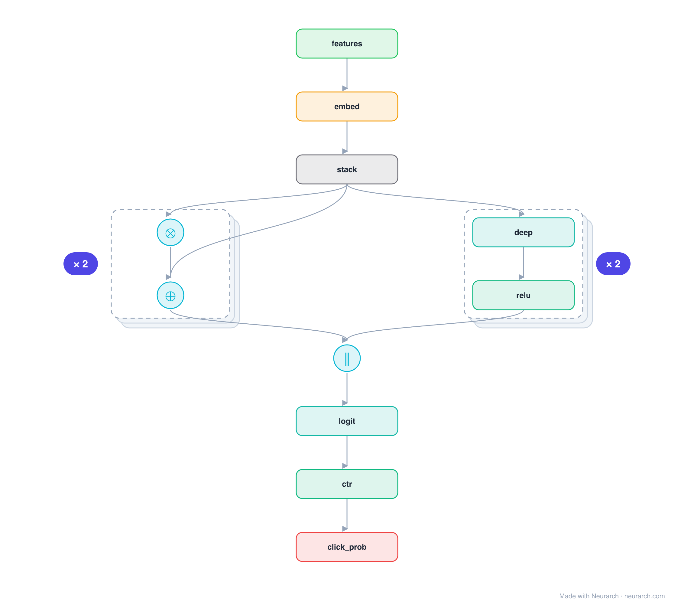

# Architecture: DCN (Deep & Cross)

## Motivation

Google's Deep & Cross Network: a cross network that applies an explicit feature-crossing formula at every layer (so L layers give degree-L crosses), run alongside a deep MLP and concatenated. Generalizes DeepFM's fixed second-order FM to arbitrary order.

## Core Idea

Google's Deep & Cross Network: a cross network that applies an explicit feature-crossing formula at every layer (so L layers give degree-L crosses), run alongside a deep MLP and concatenated.

## Architecture

### Overview

*Identical repeated blocks are folded into one representative block with a `× N` badge, so the whole architecture fits on screen. `model.json` keeps all 15 nodes (open it in Neurarch to see and edit every layer). Vector: [diagram.svg](assets/diagram.svg).*

| Hyperparameter | Value |
|---|---|
| Type | CTR / click prediction |
| Cross network | Stacked layers, each an explicit feature cross + residual |
| Deep network | Parallel MLP |
| Fusion | Concatenate cross + deep → logit → sigmoid |
| Key idea | Bounded-degree feature crosses learned explicitly |

`model.json` is the full graph, hand-built against the official config.json.

### Design Notes

- Each cross layer computes x0 · xl^T · w + xl (a residual feature cross), so stacking k layers yields explicit crosses up to degree k+1 with very few parameters.
- The cross and deep networks run in parallel and are concatenated before the final logit.
- DCN-v2 later swapped the rank-1 cross for a low-rank matrix; this is the original formulation.

### Parameter Check

Neurarch's per-layer parameter estimate over this graph: **10.1M**.

## Design Decisions

> **Analysis** — Observations derived from studying the architecture.

- Each cross layer computes x0 · xl^T · w + xl (a residual feature cross), so stacking k layers yields explicit crosses up to degree k+1 with very few parameters.
- The cross and deep networks run in parallel and are concatenated before the final logit.
- DCN-v2 later swapped the rank-1 cross for a low-rank matrix; this is the original formulation.

## Implementation Notes

- `model.json` contains the full structural graph with real dimensions and parameters.
- Open in [Neurarch](https://www.neurarch.com/) to visualize, edit, or export training code.
- Diagrams fold repeated identical blocks with a `× N` badge; `model.json` holds all nodes at real dimensions.

## Limitations

- This package focuses on the architectural structure. Training pipelines, 
dataset preparation, and production optimizations are out of scope.

## Evolution

> See `references/related/` for predecessor and successor architectures.

