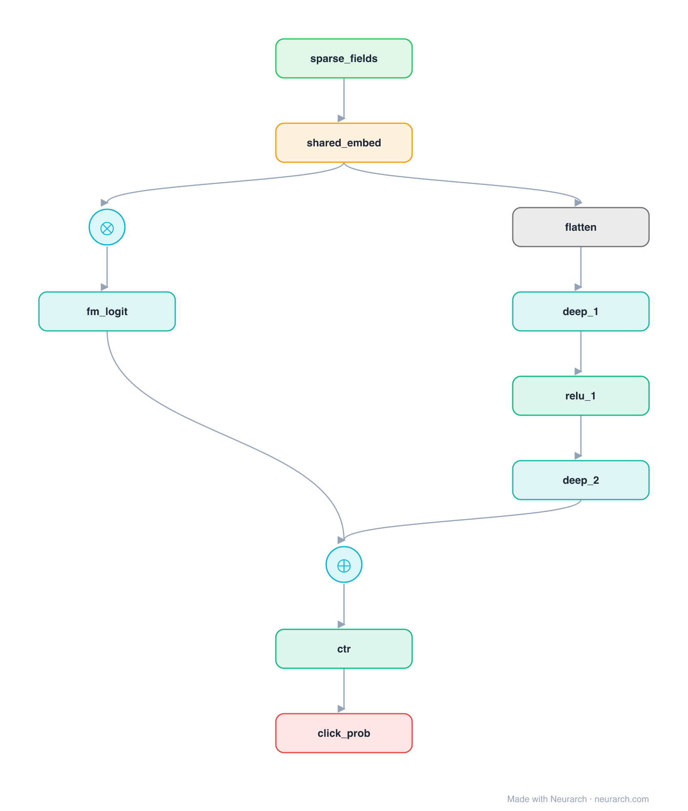

# Architecture: DeepFM

## Motivation

The CTR model that fused a factorization machine with a deep network under one shared embedding table. FM captures low-order feature interactions, the MLP captures high-order, and unlike Wide & Deep neither path needs hand-engineered crosses.

## Core Idea

The CTR model that fused a factorization machine with a deep network under one shared embedding table.

## Architecture

### Overview

*The full graph, all 11 nodes. Vector: [diagram.svg](assets/diagram.svg).*

| Hyperparameter | Value |
|---|---|
| Type | CTR / click prediction |
| FM branch | Shared embeddings → pairwise (2nd-order) interactions |
| Deep branch | Same embeddings flattened → MLP (high-order) |
| Fusion | Sum of the two logits → sigmoid |
| Key idea | No manual feature crosses (vs Wide & Deep) |

`model.json` is the full graph, hand-built against the official config.json.

### Design Notes

- Both branches read the SAME embedding table, so the FM and deep components are trained jointly without separate feature engineering.
- The FM branch models explicit second-order (pairwise) interactions; the deep MLP models higher-order ones implicitly.
- The ancestor of a whole family (xDeepFM, AutoInt, DCN); pairs with [wide-and-deep](../wide-and-deep/) as the "learned vs hand-crafted crosses" comparison.

### Parameter Check

Neurarch's per-layer parameter estimate over this graph: **10.0M**.

## Design Decisions

> **Analysis** — Observations derived from studying the architecture.

- Both branches read the SAME embedding table, so the FM and deep components are trained jointly without separate feature engineering.
- The FM branch models explicit second-order (pairwise) interactions; the deep MLP models higher-order ones implicitly.
- The ancestor of a whole family (xDeepFM, AutoInt, DCN); pairs with [wide-and-deep](../wide-and-deep/) as the "learned vs hand-crafted crosses" comparison.

## Implementation Notes

- `model.json` contains the full structural graph with real dimensions and parameters.
- Open in [Neurarch](https://www.neurarch.com/) to visualize, edit, or export training code.
- Diagrams fold repeated identical blocks with a `× N` badge; `model.json` holds all nodes at real dimensions.

## Limitations

- This package focuses on the architectural structure. Training pipelines, 
dataset preparation, and production optimizations are out of scope.

## Evolution

> See `references/related/` for predecessor and successor architectures.

