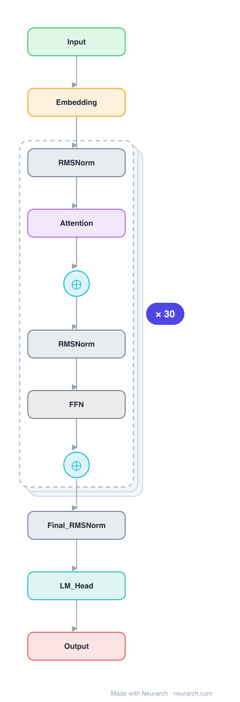

# Architecture: DeepSeek-LLM-7B

## Motivation

The original dense 7B model from DeepSeek, trained on 2T bilingual tokens. A clean Llama-style decoder (RoPE, RMSNorm, SwiGLU) with a large bilingual vocabulary, and the architectural starting point of the DeepSeek lineage.

## Core Idea

The original dense 7B model from DeepSeek, trained on 2T bilingual tokens.

## Architecture

### Overview

*Identical repeated blocks are folded into one representative block with a `× N` badge, so the whole architecture fits on screen. `model.json` uses a NAXS block template + `repeat` directive: the identical repeated layers are defined once and expand to all 185 nodes (open it in Neurarch to see and edit every layer). Vector: [diagram.svg](assets/diagram.svg).*

| Hyperparameter | Value |
|---|---|
| Type | Decoder-only transformer (causal LM) |
| Parameters | 6.9B |
| Layers | 30 |
| Hidden size | 4096 |
| Attention | Multi-head: 32 heads |
| Head dim | 128 |
| FFN | SwiGLU, intermediate size 11,008 |
| Normalization | RMSNorm, pre-norm |
| Positions | RoPE (rotary dim 128) |
| Vocabulary | 102,400 |
| Max context | 4,096 |

`model.json` is the full 30-layer graph (the repeated layers expressed via a NAXS block template + `repeat`), produced with the same import path the Neurarch app uses for "load from Hugging Face", with all hyperparameters from the official `config.json`.

### Design Notes

- The dense ancestor of the DeepSeek series, before the MoE turn (V2/V3). Architecture is deliberately Llama-compatible: model_type in config.json is literally "llama".
- Plain multi-head attention at 7B (32 Q = 32 KV heads); only the 67B sibling adopted grouped-query attention.
- 30 layers instead of the usual 32, slightly shallower and wider than Llama-2-7B.
- Large 102400-token byte-level BPE vocabulary tuned for bilingual Chinese and English text.

### Parameter Check

Neurarch's per-layer parameter estimate over this graph: **6.91B**.
Deviation from the authoritative count (6.91B): **+0.0%**.

## Design Decisions

> **Analysis** — Observations derived from studying the architecture.

- The dense ancestor of the DeepSeek series, before the MoE turn (V2/V3). Architecture is deliberately Llama-compatible: model_type in config.json is literally "llama".
- Plain multi-head attention at 7B (32 Q = 32 KV heads); only the 67B sibling adopted grouped-query attention.
- 30 layers instead of the usual 32, slightly shallower and wider than Llama-2-7B.
- Large 102400-token byte-level BPE vocabulary tuned for bilingual Chinese and English text.

## Implementation Notes

- `model.json` contains the full structural graph with real dimensions and parameters, using a NAXS block template + `repeat` for the identical repeated layers.
- Open in [Neurarch](https://www.neurarch.com/) to visualize, edit, or export training code.
- Diagrams fold repeated identical blocks with a `× N` badge; `model.json` defines each repeated layer once at real dimensions and expands to all nodes.

## Limitations

- This package focuses on the architectural structure. Training pipelines, 
dataset preparation, and production optimizations are out of scope.

## Evolution

> See `references/related/` for predecessor and successor architectures.

