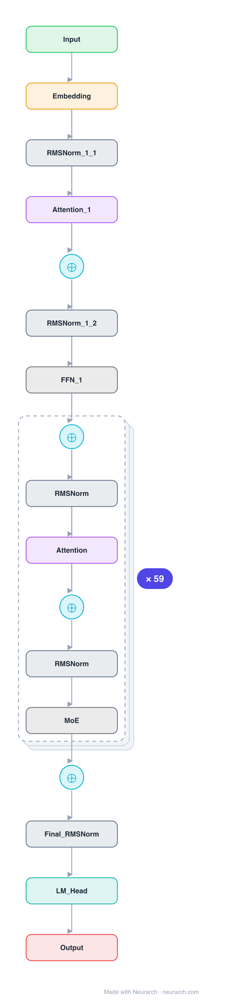

# Architecture: DeepSeek-V2

## Motivation

The 236B MoE where multi-head latent attention and fine-grained mixture-of-experts debuted, the architecture the whole DeepSeek line is built on. Cheap KV cache from MLA, cheap compute from 160 slim experts.

## Core Idea

The 236B MoE where multi-head latent attention and fine-grained mixture-of-experts debuted, the architecture the whole DeepSeek line is built on.

## Architecture

### Overview

*Identical repeated blocks are folded into one representative block with a `× N` badge, so the whole architecture fits on screen. `model.json` uses a NAXS block template + `repeat` for the isomorphic MoE-layer tail (dense prefix kept expanded); it expands back to all 365 nodes (open it in Neurarch to see and edit every layer). Vector: [diagram.svg](assets/diagram.svg).*

| Hyperparameter | Value |
|---|---|
| Type | Decoder-only transformer, sparse MoE (causal LM) |
| Parameters | 236B total, 21B active |
| Layers | 60 |
| Hidden size | 5120 |
| Attention | Multi-head latent: 128 heads; KV latent 512, Q latent 1536; per head 128 NoPE + 64 RoPE, V 128 |
| FFN | MoE: 160 routed experts, top-6 + 1 shared, expert dim 1,536; first 1 layer dense (12,288) |
| Normalization | RMSNorm, pre-norm |
| Positions | RoPE (rotary dim 64) |
| Vocabulary | 102,400 |
| Max context | 163,840 |

`model.json` is the full 60-layer graph (MoE-layer tail expressed via a NAXS block template + `repeat`; dense prefix kept expanded), produced with the same import path the Neurarch app uses for "load from Hugging Face", with all hyperparameters from the official `config.json`.

### Design Notes

- The model that introduced multi-head latent attention and fine-grained MoE, the recipe DeepSeek-V3 later scaled. 236B total, only 21B active per token.
- MLA: KV compressed to a 512-dim latent, Q to a 1536-dim latent; each of 128 heads splits into 128-dim NoPE content + 64-dim decoupled RoPE.
- 160 routed experts (top-6) + 2 shared, slim 1536-dim each; first layer dense.
- See [deepseek-v2-lite](../deepseek-v2-lite/) for the runnable 16B version and [deepseek-v3](../deepseek-v3/) for the scaled-up 671B.

### Parameter Check

Neurarch's per-layer parameter estimate over this graph: **233.08B**.
Hugging Face safetensors metadata reports **235.74B** for the real weights.
Deviation from the authoritative count (235.74B): **-1.1%**.

## Design Decisions

> **Analysis** — Observations derived from studying the architecture.

- The model that introduced multi-head latent attention and fine-grained MoE, the recipe DeepSeek-V3 later scaled. 236B total, only 21B active per token.
- MLA: KV compressed to a 512-dim latent, Q to a 1536-dim latent; each of 128 heads splits into 128-dim NoPE content + 64-dim decoupled RoPE.
- 160 routed experts (top-6) + 2 shared, slim 1536-dim each; first layer dense.
- See [deepseek-v2-lite](../deepseek-v2-lite/) for the runnable 16B version and [deepseek-v3](../deepseek-v3/) for the scaled-up 671B.

## Implementation Notes

- `model.json` contains the full structural graph with real dimensions and parameters, using a NAXS block template + `repeat` for the isomorphic MoE-layer tail.
- Open in [Neurarch](https://www.neurarch.com/) to visualize, edit, or export training code.
- Diagrams fold repeated identical blocks with a `× N` badge; `model.json` defines the repeated MoE layers once at real dimensions and expands to all nodes.

## Limitations

- This package focuses on the architectural structure. Training pipelines, 
dataset preparation, and production optimizations are out of scope.

## Evolution

> See `references/related/` for predecessor and successor architectures.

