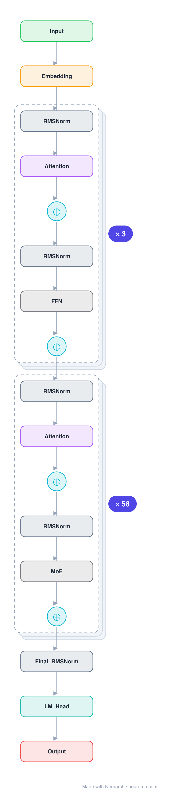

# Architecture: DeepSeek-V3

## Motivation

To build a strong open-source language model that achieves performance comparable to leading closed-source models while maintaining efficient inference and cost-effective training. DeepSeek-V3 addresses the trade-off between model quality and training/inference cost through architectural innovations (MLA, DeepSeekMoE) and training efficiency (FP8, auxiliary-loss-free balancing, multi-token prediction).

## Core Idea

A Mixture-of-Experts (MoE) language model with 671B total parameters and 37B activated per token, using Multi-head Latent Attention (MLA) for efficient inference and DeepSeekMoE for economical training, with an auxiliary-loss-free load balancing strategy and multi-token prediction training objective.

## Architecture

### Overview

*`model.json` uses a NAXS block template + `repeat` for the isomorphic MoE-layer tail (58 layers); the 3-layer dense prefix is kept expanded. The document expands back to the full 371-node graph.*

<b>Layer-by-layer (371 nodes)</b>

| # | Layer | Type | Params |
|---|---|---|---|
| 1 | Input | `input` | shape: [1, 163840, 7168] |
| 2 | Embedding | `embedding` | vocabSize: 129280, embeddingDim: 7168, maxSeqLen: 163840 |
| 3 | RMSNorm_1_1 | `rmsNorm` | normalizedShape: 7168 |
| 4 | Attention_1 | `groupedQueryAttention` | embedDim: 7168, numHeads: 128, numKVHeads: 128, headDim: 56 |
| 5 | Add_1_attn | `add` |  |
| 6 | RMSNorm_1_2 | `rmsNorm` | normalizedShape: 7168 |
| 7 | FFN_1 | `swiglu` | embedDim: 7168, dim: 7168, intermediateSize: 18432 |
| 8 | Add_1_ffn | `add` |  |
| 9 | RMSNorm_2_1 | `rmsNorm` | normalizedShape: 7168 |
| 10 | Attention_2 | `groupedQueryAttention` | embedDim: 7168, numHeads: 128, numKVHeads: 128, headDim: 56 |
| 11 | Add_2_attn | `add` |  |
| 12 | RMSNorm_2_2 | `rmsNorm` | normalizedShape: 7168 |
| 13 | FFN_2 | `swiglu` | embedDim: 7168, dim: 7168, intermediateSize: 18432 |
| 14 | Add_2_ffn | `add` |  |
| 15 | RMSNorm_3_1 | `rmsNorm` | normalizedShape: 7168 |
| 16 | Attention_3 | `groupedQueryAttention` | embedDim: 7168, numHeads: 128, numKVHeads: 128, headDim: 56 |
| 17 | Add_3_attn | `add` |  |
| 18 | RMSNorm_3_2 | `rmsNorm` | normalizedShape: 7168 |
| 19 | FFN_3 | `swiglu` | embedDim: 7168, dim: 7168, intermediateSize: 18432 |
| 20 | Add_3_ffn | `add` |  |
| 21 | RMSNorm_4_1 | `rmsNorm` | normalizedShape: 7168 |
| 22 | Attention_4 | `groupedQueryAttention` | embedDim: 7168, numHeads: 128, numKVHeads: 128, headDim: 56 |
| 23 | Add_4_attn | `add` |  |
| 24 | RMSNorm_4_2 | `rmsNorm` | normalizedShape: 7168 |
| 25 | MoE_4 | `sharedExpertMoE` | embedDim: 7168, numExperts: 256, numSharedExperts: 1, expertDim: 2048, topK: 8 |
| 26 | Add_4_ffn | `add` |  |
| 27 | RMSNorm_5_1 | `rmsNorm` | normalizedShape: 7168 |
| 28 | Attention_5 | `groupedQueryAttention` | embedDim: 7168, numHeads: 128, numKVHeads: 128, headDim: 56 |
| 29 | Add_5_attn | `add` |  |
| 30 | RMSNorm_5_2 | `rmsNorm` | normalizedShape: 7168 |
| 31 | MoE_5 | `sharedExpertMoE` | embedDim: 7168, numExperts: 256, numSharedExperts: 1, expertDim: 2048, topK: 8 |
| 32 | Add_5_ffn | `add` |  |
| 33 | RMSNorm_6_1 | `rmsNorm` | normalizedShape: 7168 |
| 34 | Attention_6 | `groupedQueryAttention` | embedDim: 7168, numHeads: 128, numKVHeads: 128, headDim: 56 |
| 35 | Add_6_attn | `add` |  |
| 36 | RMSNorm_6_2 | `rmsNorm` | normalizedShape: 7168 |
| 37 | MoE_6 | `sharedExpertMoE` | embedDim: 7168, numExperts: 256, numSharedExperts: 1, expertDim: 2048, topK: 8 |
| 38 | Add_6_ffn | `add` |  |
| 39 | RMSNorm_7_1 | `rmsNorm` | normalizedShape: 7168 |
| 40 | Attention_7 | `groupedQueryAttention` | embedDim: 7168, numHeads: 128, numKVHeads: 128, headDim: 56 |
| 41 | Add_7_attn | `add` |  |
| 42 | RMSNorm_7_2 | `rmsNorm` | normalizedShape: 7168 |
| 43 | MoE_7 | `sharedExpertMoE` | embedDim: 7168, numExperts: 256, numSharedExperts: 1, expertDim: 2048, topK: 8 |
| 44 | Add_7_ffn | `add` |  |
| 45 | RMSNorm_8_1 | `rmsNorm` | normalizedShape: 7168 |
| 46 | Attention_8 | `groupedQueryAttention` | embedDim: 7168, numHeads: 128, numKVHeads: 128, headDim: 56 |
| 47 | Add_8_attn | `add` |  |
| 48 | RMSNorm_8_2 | `rmsNorm` | normalizedShape: 7168 |
| 49 | MoE_8 | `sharedExpertMoE` | embedDim: 7168, numExperts: 256, numSharedExperts: 1, expertDim: 2048, topK: 8 |
| 50 | Add_8_ffn | `add` |  |
| 51 | RMSNorm_9_1 | `rmsNorm` | normalizedShape: 7168 |
| 52 | Attention_9 | `groupedQueryAttention` | embedDim: 7168, numHeads: 128, numKVHeads: 128, headDim: 56 |
| 53 | Add_9_attn | `add` |  |
| 54 | RMSNorm_9_2 | `rmsNorm` | normalizedShape: 7168 |
| 55 | MoE_9 | `sharedExpertMoE` | embedDim: 7168, numExperts: 256, numSharedExperts: 1, expertDim: 2048, topK: 8 |
| 56 | Add_9_ffn | `add` |  |
| 57 | RMSNorm_10_1 | `rmsNorm` | normalizedShape: 7168 |
| 58 | Attention_10 | `groupedQueryAttention` | embedDim: 7168, numHeads: 128, numKVHeads: 128, headDim: 56 |
| 59 | Add_10_attn | `add` |  |
| 60 | RMSNorm_10_2 | `rmsNorm` | normalizedShape: 7168 |
| 61 | MoE_10 | `sharedExpertMoE` | embedDim: 7168, numExperts: 256, numSharedExperts: 1, expertDim: 2048, topK: 8 |
| 62 | Add_10_ffn | `add` |  |
| 63 | RMSNorm_11_1 | `rmsNorm` | normalizedShape: 7168 |
| 64 | Attention_11 | `groupedQueryAttention` | embedDim: 7168, numHeads: 128, numKVHeads: 128, headDim: 56 |
| 65 | Add_11_attn | `add` |  |
| 66 | RMSNorm_11_2 | `rmsNorm` | normalizedShape: 7168 |
| 67 | MoE_11 | `sharedExpertMoE` | embedDim: 7168, numExperts: 256, numSharedExperts: 1, expertDim: 2048, topK: 8 |
| 68 | Add_11_ffn | `add` |  |
| 69 | RMSNorm_12_1 | `rmsNorm` | normalizedShape: 7168 |
| 70 | Attention_12 | `groupedQueryAttention` | embedDim: 7168, numHeads: 128, numKVHeads: 128, headDim: 56 |
| 71 | Add_12_attn | `add` |  |
| 72 | RMSNorm_12_2 | `rmsNorm` | normalizedShape: 7168 |
| 73 | MoE_12 | `sharedExpertMoE` | embedDim: 7168, numExperts: 256, numSharedExperts: 1, expertDim: 2048, topK: 8 |
| 74 | Add_12_ffn | `add` |  |
| 75 | RMSNorm_13_1 | `rmsNorm` | normalizedShape: 7168 |
| 76 | Attention_13 | `groupedQueryAttention` | embedDim: 7168, numHeads: 128, numKVHeads: 128, headDim: 56 |
| 77 | Add_13_attn | `add` |  |
| 78 | RMSNorm_13_2 | `rmsNorm` | normalizedShape: 7168 |
| 79 | MoE_13 | `sharedExpertMoE` | embedDim: 7168, numExperts: 256, numSharedExperts: 1, expertDim: 2048, topK: 8 |
| 80 | Add_13_ffn | `add` |  |
| 81 | RMSNorm_14_1 | `rmsNorm` | normalizedShape: 7168 |
| 82 | Attention_14 | `groupedQueryAttention` | embedDim: 7168, numHeads: 128, numKVHeads: 128, headDim: 56 |
| 83 | Add_14_attn | `add` |  |
| 84 | RMSNorm_14_2 | `rmsNorm` | normalizedShape: 7168 |
| 85 | MoE_14 | `sharedExpertMoE` | embedDim: 7168, numExperts: 256, numSharedExperts: 1, expertDim: 2048, topK: 8 |
| 86 | Add_14_ffn | `add` |  |
| 87 | RMSNorm_15_1 | `rmsNorm` | normalizedShape: 7168 |
| 88 | Attention_15 | `groupedQueryAttention` | embedDim: 7168, numHeads: 128, numKVHeads: 128, headDim: 56 |
| 89 | Add_15_attn | `add` |  |
| 90 | RMSNorm_15_2 | `rmsNorm` | normalizedShape: 7168 |
| 91 | MoE_15 | `sharedExpertMoE` | embedDim: 7168, numExperts: 256, numSharedExperts: 1, expertDim: 2048, topK: 8 |
| 92 | Add_15_ffn | `add` |  |
| 93 | RMSNorm_16_1 | `rmsNorm` | normalizedShape: 7168 |
| 94 | Attention_16 | `groupedQueryAttention` | embedDim: 7168, numHeads: 128, numKVHeads: 128, headDim: 56 |
| 95 | Add_16_attn | `add` |  |
| 96 | RMSNorm_16_2 | `rmsNorm` | normalizedShape: 7168 |
| 97 | MoE_16 | `sharedExpertMoE` | embedDim: 7168, numExperts: 256, numSharedExperts: 1, expertDim: 2048, topK: 8 |
| 98 | Add_16_ffn | `add` |  |
| 99 | RMSNorm_17_1 | `rmsNorm` | normalizedShape: 7168 |
| 100 | Attention_17 | `groupedQueryAttention` | embedDim: 7168, numHeads: 128, numKVHeads: 128, headDim: 56 |
| 101 | Add_17_attn | `add` |  |
| 102 | RMSNorm_17_2 | `rmsNorm` | normalizedShape: 7168 |
| 103 | MoE_17 | `sharedExpertMoE` | embedDim: 7168, numExperts: 256, numSharedExperts: 1, expertDim: 2048, topK: 8 |
| 104 | Add_17_ffn | `add` |  |
| 105 | RMSNorm_18_1 | `rmsNorm` | normalizedShape: 7168 |
| 106 | Attention_18 | `groupedQueryAttention` | embedDim: 7168, numHeads: 128, numKVHeads: 128, headDim: 56 |
| 107 | Add_18_attn | `add` |  |
| 108 | RMSNorm_18_2 | `rmsNorm` | normalizedShape: 7168 |
| 109 | MoE_18 | `sharedExpertMoE` | embedDim: 7168, numExperts: 256, numSharedExperts: 1, expertDim: 2048, topK: 8 |
| 110 | Add_18_ffn | `add` |  |
| 111 | RMSNorm_19_1 | `rmsNorm` | normalizedShape: 7168 |
| 112 | Attention_19 | `groupedQueryAttention` | embedDim: 7168, numHeads: 128, numKVHeads: 128, headDim: 56 |
| 113 | Add_19_attn | `add` |  |
| 114 | RMSNorm_19_2 | `rmsNorm` | normalizedShape: 7168 |
| 115 | MoE_19 | `sharedExpertMoE` | embedDim: 7168, numExperts: 256, numSharedExperts: 1, expertDim: 2048, topK: 8 |
| 116 | Add_19_ffn | `add` |  |
| 117 | RMSNorm_20_1 | `rmsNorm` | normalizedShape: 7168 |
| 118 | Attention_20 | `groupedQueryAttention` | embedDim: 7168, numHeads: 128, numKVHeads: 128, headDim: 56 |
| 119 | Add_20_attn | `add` |  |
| 120 | RMSNorm_20_2 | `rmsNorm` | normalizedShape: 7168 |
| 121 | MoE_20 | `sharedExpertMoE` | embedDim: 7168, numExperts: 256, numSharedExperts: 1, expertDim: 2048, topK: 8 |
| 122 | Add_20_ffn | `add` |  |
| 123 | RMSNorm_21_1 | `rmsNorm` | normalizedShape: 7168 |
| 124 | Attention_21 | `groupedQueryAttention` | embedDim: 7168, numHeads: 128, numKVHeads: 128, headDim: 56 |
| 125 | Add_21_attn | `add` |  |
| 126 | RMSNorm_21_2 | `rmsNorm` | normalizedShape: 7168 |
| 127 | MoE_21 | `sharedExpertMoE` | embedDim: 7168, numExperts: 256, numSharedExperts: 1, expertDim: 2048, topK: 8 |
| 128 | Add_21_ffn | `add` |  |
| 129 | RMSNorm_22_1 | `rmsNorm` | normalizedShape: 7168 |
| 130 | Attention_22 | `groupedQueryAttention` | embedDim: 7168, numHeads: 128, numKVHeads: 128, headDim: 56 |
| 131 | Add_22_attn | `add` |  |
| 132 | RMSNorm_22_2 | `rmsNorm` | normalizedShape: 7168 |
| 133 | MoE_22 | `sharedExpertMoE` | embedDim: 7168, numExperts: 256, numSharedExperts: 1, expertDim: 2048, topK: 8 |
| 134 | Add_22_ffn | `add` |  |
| 135 | RMSNorm_23_1 | `rmsNorm` | normalizedShape: 7168 |
| 136 | Attention_23 | `groupedQueryAttention` | embedDim: 7168, numHeads: 128, numKVHeads: 128, headDim: 56 |
| 137 | Add_23_attn | `add` |  |
| 138 | RMSNorm_23_2 | `rmsNorm` | normalizedShape: 7168 |
| 139 | MoE_23 | `sharedExpertMoE` | embedDim: 7168, numExperts: 256, numSharedExperts: 1, expertDim: 2048, topK: 8 |
| 140 | Add_23_ffn | `add` |  |
| 141 | RMSNorm_24_1 | `rmsNorm` | normalizedShape: 7168 |
| 142 | Attention_24 | `groupedQueryAttention` | embedDim: 7168, numHeads: 128, numKVHeads: 128, headDim: 56 |
| 143 | Add_24_attn | `add` |  |
| 144 | RMSNorm_24_2 | `rmsNorm` | normalizedShape: 7168 |
| 145 | MoE_24 | `sharedExpertMoE` | embedDim: 7168, numExperts: 256, numSharedExperts: 1, expertDim: 2048, topK: 8 |
| 146 | Add_24_ffn | `add` |  |
| 147 | RMSNorm_25_1 | `rmsNorm` | normalizedShape: 7168 |
| 148 | Attention_25 | `groupedQueryAttention` | embedDim: 7168, numHeads: 128, numKVHeads: 128, headDim: 56 |
| 149 | Add_25_attn | `add` |  |
| 150 | RMSNorm_25_2 | `rmsNorm` | normalizedShape: 7168 |
| 151 | MoE_25 | `sharedExpertMoE` | embedDim: 7168, numExperts: 256, numSharedExperts: 1, expertDim: 2048, topK: 8 |
| 152 | Add_25_ffn | `add` |  |
| 153 | RMSNorm_26_1 | `rmsNorm` | normalizedShape: 7168 |
| 154 | Attention_26 | `groupedQueryAttention` | embedDim: 7168, numHeads: 128, numKVHeads: 128, headDim: 56 |
| 155 | Add_26_attn | `add` |  |
| 156 | RMSNorm_26_2 | `rmsNorm` | normalizedShape: 7168 |
| 157 | MoE_26 | `sharedExpertMoE` | embedDim: 7168, numExperts: 256, numSharedExperts: 1, expertDim: 2048, topK: 8 |
| 158 | Add_26_ffn | `add` |  |
| 159 | RMSNorm_27_1 | `rmsNorm` | normalizedShape: 7168 |
| 160 | Attention_27 | `groupedQueryAttention` | embedDim: 7168, numHeads: 128, numKVHeads: 128, headDim: 56 |
| 161 | Add_27_attn | `add` |  |
| 162 | RMSNorm_27_2 | `rmsNorm` | normalizedShape: 7168 |
| 163 | MoE_27 | `sharedExpertMoE` | embedDim: 7168, numExperts: 256, numSharedExperts: 1, expertDim: 2048, topK: 8 |
| 164 | Add_27_ffn | `add` |  |
| 165 | RMSNorm_28_1 | `rmsNorm` | normalizedShape: 7168 |
| 166 | Attention_28 | `groupedQueryAttention` | embedDim: 7168, numHeads: 128, numKVHeads: 128, headDim: 56 |
| 167 | Add_28_attn | `add` |  |
| 168 | RMSNorm_28_2 | `rmsNorm` | normalizedShape: 7168 |
| 169 | MoE_28 | `sharedExpertMoE` | embedDim: 7168, numExperts: 256, numSharedExperts: 1, expertDim: 2048, topK: 8 |
| 170 | Add_28_ffn | `add` |  |
| 171 | RMSNorm_29_1 | `rmsNorm` | normalizedShape: 7168 |
| 172 | Attention_29 | `groupedQueryAttention` | embedDim: 7168, numHeads: 128, numKVHeads: 128, headDim: 56 |
| 173 | Add_29_attn | `add` |  |
| 174 | RMSNorm_29_2 | `rmsNorm` | normalizedShape: 7168 |
| 175 | MoE_29 | `sharedExpertMoE` | embedDim: 7168, numExperts: 256, numSharedExperts: 1, expertDim: 2048, topK: 8 |
| 176 | Add_29_ffn | `add` |  |
| 177 | RMSNorm_30_1 | `rmsNorm` | normalizedShape: 7168 |
| 178 | Attention_30 | `groupedQueryAttention` | embedDim: 7168, numHeads: 128, numKVHeads: 128, headDim: 56 |
| 179 | Add_30_attn | `add` |  |
| 180 | RMSNorm_30_2 | `rmsNorm` | normalizedShape: 7168 |
| 181 | MoE_30 | `sharedExpertMoE` | embedDim: 7168, numExperts: 256, numSharedExperts: 1, expertDim: 2048, topK: 8 |
| 182 | Add_30_ffn | `add` |  |
| 183 | RMSNorm_31_1 | `rmsNorm` | normalizedShape: 7168 |
| 184 | Attention_31 | `groupedQueryAttention` | embedDim: 7168, numHeads: 128, numKVHeads: 128, headDim: 56 |
| 185 | Add_31_attn | `add` |  |
| 186 | RMSNorm_31_2 | `rmsNorm` | normalizedShape: 7168 |
| 187 | MoE_31 | `sharedExpertMoE` | embedDim: 7168, numExperts: 256, numSharedExperts: 1, expertDim: 2048, topK: 8 |
| 188 | Add_31_ffn | `add` |  |
| 189 | RMSNorm_32_1 | `rmsNorm` | normalizedShape: 7168 |
| 190 | Attention_32 | `groupedQueryAttention` | embedDim: 7168, numHeads: 128, numKVHeads: 128, headDim: 56 |
| 191 | Add_32_attn | `add` |  |
| 192 | RMSNorm_32_2 | `rmsNorm` | normalizedShape: 7168 |
| 193 | MoE_32 | `sharedExpertMoE` | embedDim: 7168, numExperts: 256, numSharedExperts: 1, expertDim: 2048, topK: 8 |
| 194 | Add_32_ffn | `add` |  |
| 195 | RMSNorm_33_1 | `rmsNorm` | normalizedShape: 7168 |
| 196 | Attention_33 | `groupedQueryAttention` | embedDim: 7168, numHeads: 128, numKVHeads: 128, headDim: 56 |
| 197 | Add_33_attn | `add` |  |
| 198 | RMSNorm_33_2 | `rmsNorm` | normalizedShape: 7168 |
| 199 | MoE_33 | `sharedExpertMoE` | embedDim: 7168, numExperts: 256, numSharedExperts: 1, expertDim: 2048, topK: 8 |
| 200 | Add_33_ffn | `add` |  |
| 201 | RMSNorm_34_1 | `rmsNorm` | normalizedShape: 7168 |
| 202 | Attention_34 | `groupedQueryAttention` | embedDim: 7168, numHeads: 128, numKVHeads: 128, headDim: 56 |
| 203 | Add_34_attn | `add` |  |
| 204 | RMSNorm_34_2 | `rmsNorm` | normalizedShape: 7168 |
| 205 | MoE_34 | `sharedExpertMoE` | embedDim: 7168, numExperts: 256, numSharedExperts: 1, expertDim: 2048, topK: 8 |
| 206 | Add_34_ffn | `add` |  |
| 207 | RMSNorm_35_1 | `rmsNorm` | normalizedShape: 7168 |
| 208 | Attention_35 | `groupedQueryAttention` | embedDim: 7168, numHeads: 128, numKVHeads: 128, headDim: 56 |
| 209 | Add_35_attn | `add` |  |
| 210 | RMSNorm_35_2 | `rmsNorm` | normalizedShape: 7168 |
| 211 | MoE_35 | `sharedExpertMoE` | embedDim: 7168, numExperts: 256, numSharedExperts: 1, expertDim: 2048, topK: 8 |
| 212 | Add_35_ffn | `add` |  |
| 213 | RMSNorm_36_1 | `rmsNorm` | normalizedShape: 7168 |
| 214 | Attention_36 | `groupedQueryAttention` | embedDim: 7168, numHeads: 128, numKVHeads: 128, headDim: 56 |
| 215 | Add_36_attn | `add` |  |
| 216 | RMSNorm_36_2 | `rmsNorm` | normalizedShape: 7168 |
| 217 | MoE_36 | `sharedExpertMoE` | embedDim: 7168, numExperts: 256, numSharedExperts: 1, expertDim: 2048, topK: 8 |
| 218 | Add_36_ffn | `add` |  |
| 219 | RMSNorm_37_1 | `rmsNorm` | normalizedShape: 7168 |
| 220 | Attention_37 | `groupedQueryAttention` | embedDim: 7168, numHeads: 128, numKVHeads: 128, headDim: 56 |
| 221 | Add_37_attn | `add` |  |
| 222 | RMSNorm_37_2 | `rmsNorm` | normalizedShape: 7168 |
| 223 | MoE_37 | `sharedExpertMoE` | embedDim: 7168, numExperts: 256, numSharedExperts: 1, expertDim: 2048, topK: 8 |
| 224 | Add_37_ffn | `add` |  |
| 225 | RMSNorm_38_1 | `rmsNorm` | normalizedShape: 7168 |
| 226 | Attention_38 | `groupedQueryAttention` | embedDim: 7168, numHeads: 128, numKVHeads: 128, headDim: 56 |
| 227 | Add_38_attn | `add` |  |
| 228 | RMSNorm_38_2 | `rmsNorm` | normalizedShape: 7168 |
| 229 | MoE_38 | `sharedExpertMoE` | embedDim: 7168, numExperts: 256, numSharedExperts: 1, expertDim: 2048, topK: 8 |
| 230 | Add_38_ffn | `add` |  |
| 231 | RMSNorm_39_1 | `rmsNorm` | normalizedShape: 7168 |
| 232 | Attention_39 | `groupedQueryAttention` | embedDim: 7168, numHeads: 128, numKVHeads: 128, headDim: 56 |
| 233 | Add_39_attn | `add` |  |
| 234 | RMSNorm_39_2 | `rmsNorm` | normalizedShape: 7168 |
| 235 | MoE_39 | `sharedExpertMoE` | embedDim: 7168, numExperts: 256, numSharedExperts: 1, expertDim: 2048, topK: 8 |
| 236 | Add_39_ffn | `add` |  |
| 237 | RMSNorm_40_1 | `rmsNorm` | normalizedShape: 7168 |
| 238 | Attention_40 | `groupedQueryAttention` | embedDim: 7168, numHeads: 128, numKVHeads: 128, headDim: 56 |
| 239 | Add_40_attn | `add` |  |
| 240 | RMSNorm_40_2 | `rmsNorm` | normalizedShape: 7168 |
| 241 | MoE_40 | `sharedExpertMoE` | embedDim: 7168, numExperts: 256, numSharedExperts: 1, expertDim: 2048, topK: 8 |
| 242 | Add_40_ffn | `add` |  |
| 243 | RMSNorm_41_1 | `rmsNorm` | normalizedShape: 7168 |
| 244 | Attention_41 | `groupedQueryAttention` | embedDim: 7168, numHeads: 128, numKVHeads: 128, headDim: 56 |
| 245 | Add_41_attn | `add` |  |
| 246 | RMSNorm_41_2 | `rmsNorm` | normalizedShape: 7168 |
| 247 | MoE_41 | `sharedExpertMoE` | embedDim: 7168, numExperts: 256, numSharedExperts: 1, expertDim: 2048, topK: 8 |
| 248 | Add_41_ffn | `add` |  |
| 249 | RMSNorm_42_1 | `rmsNorm` | normalizedShape: 7168 |
| 250 | Attention_42 | `groupedQueryAttention` | embedDim: 7168, numHeads: 128, numKVHeads: 128, headDim: 56 |
| 251 | Add_42_attn | `add` |  |
| 252 | RMSNorm_42_2 | `rmsNorm` | normalizedShape: 7168 |
| 253 | MoE_42 | `sharedExpertMoE` | embedDim: 7168, numExperts: 256, numSharedExperts: 1, expertDim: 2048, topK: 8 |
| 254 | Add_42_ffn | `add` |  |
| 255 | RMSNorm_43_1 | `rmsNorm` | normalizedShape: 7168 |
| 256 | Attention_43 | `groupedQueryAttention` | embedDim: 7168, numHeads: 128, numKVHeads: 128, headDim: 56 |
| 257 | Add_43_attn | `add` |  |
| 258 | RMSNorm_43_2 | `rmsNorm` | normalizedShape: 7168 |
| 259 | MoE_43 | `sharedExpertMoE` | embedDim: 7168, numExperts: 256, numSharedExperts: 1, expertDim: 2048, topK: 8 |
| 260 | Add_43_ffn | `add` |  |
| 261 | RMSNorm_44_1 | `rmsNorm` | normalizedShape: 7168 |
| 262 | Attention_44 | `groupedQueryAttention` | embedDim: 7168, numHeads: 128, numKVHeads: 128, headDim: 56 |
| 263 | Add_44_attn | `add` |  |
| 264 | RMSNorm_44_2 | `rmsNorm` | normalizedShape: 7168 |
| 265 | MoE_44 | `sharedExpertMoE` | embedDim: 7168, numExperts: 256, numSharedExperts: 1, expertDim: 2048, topK: 8 |
| 266 | Add_44_ffn | `add` |  |
| 267 | RMSNorm_45_1 | `rmsNorm` | normalizedShape: 7168 |
| 268 | Attention_45 | `groupedQueryAttention` | embedDim: 7168, numHeads: 128, numKVHeads: 128, headDim: 56 |
| 269 | Add_45_attn | `add` |  |
| 270 | RMSNorm_45_2 | `rmsNorm` | normalizedShape: 7168 |
| 271 | MoE_45 | `sharedExpertMoE` | embedDim: 7168, numExperts: 256, numSharedExperts: 1, expertDim: 2048, topK: 8 |
| 272 | Add_45_ffn | `add` |  |
| 273 | RMSNorm_46_1 | `rmsNorm` | normalizedShape: 7168 |
| 274 | Attention_46 | `groupedQueryAttention` | embedDim: 7168, numHeads: 128, numKVHeads: 128, headDim: 56 |
| 275 | Add_46_attn | `add` |  |
| 276 | RMSNorm_46_2 | `rmsNorm` | normalizedShape: 7168 |
| 277 | MoE_46 | `sharedExpertMoE` | embedDim: 7168, numExperts: 256, numSharedExperts: 1, expertDim: 2048, topK: 8 |
| 278 | Add_46_ffn | `add` |  |
| 279 | RMSNorm_47_1 | `rmsNorm` | normalizedShape: 7168 |
| 280 | Attention_47 | `groupedQueryAttention` | embedDim: 7168, numHeads: 128, numKVHeads: 128, headDim: 56 |
| 281 | Add_47_attn | `add` |  |
| 282 | RMSNorm_47_2 | `rmsNorm` | normalizedShape: 7168 |
| 283 | MoE_47 | `sharedExpertMoE` | embedDim: 7168, numExperts: 256, numSharedExperts: 1, expertDim: 2048, topK: 8 |
| 284 | Add_47_ffn | `add` |  |
| 285 | RMSNorm_48_1 | `rmsNorm` | normalizedShape: 7168 |
| 286 | Attention_48 | `groupedQueryAttention` | embedDim: 7168, numHeads: 128, numKVHeads: 128, headDim: 56 |
| 287 | Add_48_attn | `add` |  |
| 288 | RMSNorm_48_2 | `rmsNorm` | normalizedShape: 7168 |
| 289 | MoE_48 | `sharedExpertMoE` | embedDim: 7168, numExperts: 256, numSharedExperts: 1, expertDim: 2048, topK: 8 |
| 290 | Add_48_ffn | `add` |  |
| 291 | RMSNorm_49_1 | `rmsNorm` | normalizedShape: 7168 |
| 292 | Attention_49 | `groupedQueryAttention` | embedDim: 7168, numHeads: 128, numKVHeads: 128, headDim: 56 |
| 293 | Add_49_attn | `add` |  |
| 294 | RMSNorm_49_2 | `rmsNorm` | normalizedShape: 7168 |
| 295 | MoE_49 | `sharedExpertMoE` | embedDim: 7168, numExperts: 256, numSharedExperts: 1, expertDim: 2048, topK: 8 |
| 296 | Add_49_ffn | `add` |  |
| 297 | RMSNorm_50_1 | `rmsNorm` | normalizedShape: 7168 |
| 298 | Attention_50 | `groupedQueryAttention` | embedDim: 7168, numHeads: 128, numKVHeads: 128, headDim: 56 |
| 299 | Add_50_attn | `add` |  |
| 300 | RMSNorm_50_2 | `rmsNorm` | normalizedShape: 7168 |
| 301 | MoE_50 | `sharedExpertMoE` | embedDim: 7168, numExperts: 256, numSharedExperts: 1, expertDim: 2048, topK: 8 |
| 302 | Add_50_ffn | `add` |  |
| 303 | RMSNorm_51_1 | `rmsNorm` | normalizedShape: 7168 |
| 304 | Attention_51 | `groupedQueryAttention` | embedDim: 7168, numHeads: 128, numKVHeads: 128, headDim: 56 |
| 305 | Add_51_attn | `add` |  |
| 306 | RMSNorm_51_2 | `rmsNorm` | normalizedShape: 7168 |
| 307 | MoE_51 | `sharedExpertMoE` | embedDim: 7168, numExperts: 256, numSharedExperts: 1, expertDim: 2048, topK: 8 |
| 308 | Add_51_ffn | `add` |  |
| 309 | RMSNorm_52_1 | `rmsNorm` | normalizedShape: 7168 |
| 310 | Attention_52 | `groupedQueryAttention` | embedDim: 7168, numHeads: 128, numKVHeads: 128, headDim: 56 |
| 311 | Add_52_attn | `add` |  |
| 312 | RMSNorm_52_2 | `rmsNorm` | normalizedShape: 7168 |
| 313 | MoE_52 | `sharedExpertMoE` | embedDim: 7168, numExperts: 256, numSharedExperts: 1, expertDim: 2048, topK: 8 |
| 314 | Add_52_ffn | `add` |  |
| 315 | RMSNorm_53_1 | `rmsNorm` | normalizedShape: 7168 |
| 316 | Attention_53 | `groupedQueryAttention` | embedDim: 7168, numHeads: 128, numKVHeads: 128, headDim: 56 |
| 317 | Add_53_attn | `add` |  |
| 318 | RMSNorm_53_2 | `rmsNorm` | normalizedShape: 7168 |
| 319 | MoE_53 | `sharedExpertMoE` | embedDim: 7168, numExperts: 256, numSharedExperts: 1, expertDim: 2048, topK: 8 |
| 320 | Add_53_ffn | `add` |  |
| 321 | RMSNorm_54_1 | `rmsNorm` | normalizedShape: 7168 |
| 322 | Attention_54 | `groupedQueryAttention` | embedDim: 7168, numHeads: 128, numKVHeads: 128, headDim: 56 |
| 323 | Add_54_attn | `add` |  |
| 324 | RMSNorm_54_2 | `rmsNorm` | normalizedShape: 7168 |
| 325 | MoE_54 | `sharedExpertMoE` | embedDim: 7168, numExperts: 256, numSharedExperts: 1, expertDim: 2048, topK: 8 |
| 326 | Add_54_ffn | `add` |  |
| 327 | RMSNorm_55_1 | `rmsNorm` | normalizedShape: 7168 |
| 328 | Attention_55 | `groupedQueryAttention` | embedDim: 7168, numHeads: 128, numKVHeads: 128, headDim: 56 |
| 329 | Add_55_attn | `add` |  |
| 330 | RMSNorm_55_2 | `rmsNorm` | normalizedShape: 7168 |
| 331 | MoE_55 | `sharedExpertMoE` | embedDim: 7168, numExperts: 256, numSharedExperts: 1, expertDim: 2048, topK: 8 |
| 332 | Add_55_ffn | `add` |  |
| 333 | RMSNorm_56_1 | `rmsNorm` | normalizedShape: 7168 |
| 334 | Attention_56 | `groupedQueryAttention` | embedDim: 7168, numHeads: 128, numKVHeads: 128, headDim: 56 |
| 335 | Add_56_attn | `add` |  |
| 336 | RMSNorm_56_2 | `rmsNorm` | normalizedShape: 7168 |
| 337 | MoE_56 | `sharedExpertMoE` | embedDim: 7168, numExperts: 256, numSharedExperts: 1, expertDim: 2048, topK: 8 |
| 338 | Add_56_ffn | `add` |  |
| 339 | RMSNorm_57_1 | `rmsNorm` | normalizedShape: 7168 |
| 340 | Attention_57 | `groupedQueryAttention` | embedDim: 7168, numHeads: 128, numKVHeads: 128, headDim: 56 |
| 341 | Add_57_attn | `add` |  |
| 342 | RMSNorm_57_2 | `rmsNorm` | normalizedShape: 7168 |
| 343 | MoE_57 | `sharedExpertMoE` | embedDim: 7168, numExperts: 256, numSharedExperts: 1, expertDim: 2048, topK: 8 |
| 344 | Add_57_ffn | `add` |  |
| 345 | RMSNorm_58_1 | `rmsNorm` | normalizedShape: 7168 |
| 346 | Attention_58 | `groupedQueryAttention` | embedDim: 7168, numHeads: 128, numKVHeads: 128, headDim: 56 |
| 347 | Add_58_attn | `add` |  |
| 348 | RMSNorm_58_2 | `rmsNorm` | normalizedShape: 7168 |
| 349 | MoE_58 | `sharedExpertMoE` | embedDim: 7168, numExperts: 256, numSharedExperts: 1, expertDim: 2048, topK: 8 |
| 350 | Add_58_ffn | `add` |  |
| 351 | RMSNorm_59_1 | `rmsNorm` | normalizedShape: 7168 |
| 352 | Attention_59 | `groupedQueryAttention` | embedDim: 7168, numHeads: 128, numKVHeads: 128, headDim: 56 |
| 353 | Add_59_attn | `add` |  |
| 354 | RMSNorm_59_2 | `rmsNorm` | normalizedShape: 7168 |
| 355 | MoE_59 | `sharedExpertMoE` | embedDim: 7168, numExperts: 256, numSharedExperts: 1, expertDim: 2048, topK: 8 |
| 356 | Add_59_ffn | `add` |  |
| 357 | RMSNorm_60_1 | `rmsNorm` | normalizedShape: 7168 |
| 358 | Attention_60 | `groupedQueryAttention` | embedDim: 7168, numHeads: 128, numKVHeads: 128, headDim: 56 |
| 359 | Add_60_attn | `add` |  |
| 360 | RMSNorm_60_2 | `rmsNorm` | normalizedShape: 7168 |
| 361 | MoE_60 | `sharedExpertMoE` | embedDim: 7168, numExperts: 256, numSharedExperts: 1, expertDim: 2048, topK: 8 |
| 362 | Add_60_ffn | `add` |  |
| 363 | RMSNorm_61_1 | `rmsNorm` | normalizedShape: 7168 |
| 364 | Attention_61 | `groupedQueryAttention` | embedDim: 7168, numHeads: 128, numKVHeads: 128, headDim: 56 |
| 365 | Add_61_attn | `add` |  |
| 366 | RMSNorm_61_2 | `rmsNorm` | normalizedShape: 7168 |
| 367 | MoE_61 | `sharedExpertMoE` | embedDim: 7168, numExperts: 256, numSharedExperts: 1, expertDim: 2048, topK: 8 |
| 368 | Add_61_ffn | `add` |  |
| 369 | Final_RMSNorm | `rmsNorm` | normalizedShape: 7168 |
| 370 | LM_Head | `linear` | inFeatures: 7168, outFeatures: 129280, bias: False |
| 371 | Output | `output` |  |

DeepSeek-V3 is built on the Transformer framework with two key architectural innovations from DeepSeek-V2: Multi-head Latent Attention (MLA) for KV cache reduction and DeepSeekMoE for sparse expert routing. The model has 671B total parameters with 37B activated per token, pre-trained on 14.8T tokens. It pioneers an auxiliary-loss-free strategy for load balancing and multi-token prediction (MTP) for stronger performance.

### Components

1. **Multi-head Latent Attention (MLA)** — Compresses keys and values into a low-rank latent vector to reduce KV cache during inference:
   - Keys and values are jointly compressed: `c_KV = W_DKV · h_t` where `c_KV ∈ R^{d_c}` (d_c ≪ d_h·n_h)
   - Only the compressed latent vector and decoupled RoPE key need to be cached during generation
   - Queries are also low-rank compressed to reduce activation memory during training
   - Maintains performance comparable to standard Multi-Head Attention while significantly reducing KV cache

2. **DeepSeekMoE** — Fine-grained expert architecture with shared experts:
   - Uses finer-grained experts than GShard
   - Isolates some experts as shared (always active)
   - Top-K_r routing to routed experts
   - Auxiliary-loss-free load balancing strategy (avoids performance degradation from load balancing efforts)

3. **Auxiliary-Loss-Free Load Balancing** — A novel strategy that mitigates performance degradation from encouraging load balance without using auxiliary losses. Uses bias adjustment to influence expert routing.

4. **Multi-Token Prediction (MTP)** — Predicts multiple future tokens simultaneously during training, beneficial for:
   - Stronger model performance
   - Speculative decoding for inference acceleration

5. **FP8 Mixed Precision Training** — First validation of FP8 training on an extremely large-scale model, with mixed precision framework and improved quantization/multiplication.

### Data Flow

1. **Input**: Token → embedding
2. **Transformer Block (×L)**:
   - RMSNorm → MLA (attention with low-rank KV compression + RoPE)
   - RMSNorm → DeepSeekMoE (router → Top-K_r experts + shared experts)
3. **Output**: Next token prediction (+ multi-token prediction during training)

**Training pipeline:**
1. Pre-training on 14.8T tokens (FP8 mixed precision)
2. Supervised Fine-Tuning (SFT)
3. Reinforcement Learning (GRPO)
4. Knowledge distillation from DeepSeek-R1 (long-CoT reasoning)

### State / Memory

- **KV cache (compressed)**: MLA caches only the compressed latent vector `c_KV` and decoupled RoPE key `k_R`, dramatically reducing memory vs standard MHA.
- **Expert routing state**: DeepSeekMoE maintains routing decisions per token (which experts are activated).
- **MoE parameters**: 671B total parameters, but only 37B activated per token (sparse activation).
- **FP8 training state**: Uses FP8 mixed precision for reduced memory and communication.

## Design Decisions

1. **MLA over standard MHA** — Low-rank joint compression of keys and values reduces KV cache significantly while maintaining performance. This is crucial for efficient inference of large models.

2. **DeepSeekMoE with fine-grained experts** — Finer-grained experts + shared experts provide better specialization than coarse-grained MoE (e.g., GShard).

3. **Auxiliary-loss-free load balancing** — Traditional auxiliary losses for load balancing cause performance degradation. DeepSeek-V3's bias-based approach avoids this without sacrificing balance.

4. **Multi-token prediction** — Training the model to predict multiple future tokens improves performance and enables speculative decoding at inference time.

5. **FP8 training** — First large-scale validation of FP8 training, reducing memory and communication overhead while maintaining training stability.

6. **DualPipe** — Computation-communication overlap for cross-node MoE training, achieving near-full overlap.

7. **Knowledge distillation from R1** — Distills long-CoT reasoning capabilities from DeepSeek-R1 into DeepSeek-V3.

## Evolution

**Predecessors:**
- **DeepSeek-V2** — Introduced MLA and DeepSeekMoE architectures.
- **DeepSeekMath** — Introduced GRPO for reinforcement learning.
- **DeepSeek-Coder** — Code pre-training foundation.
- **GShard** (Lepikhin et al., 2021) — Coarse-grained MoE baseline.
- **Standard Transformer** (Vaswani et al., 2017) — Base architecture.

**Successors:**
- **DeepSeek-R1** — Reasoning model with long chain-of-thought.
- Future DeepSeek models scaling up MLA + MoE further.

## Characteristics

| Property | Value |
|----------|-------|
| Year | 2024 |
| Authors | DeepSeek-AI |
| Category | DL/Transformer |
| Source Paper | `DeepSeek_V3_Technical_Report_DeepSeek_2025.md` |
| PaperVault Path | `DL-Architectures/01-transformers/DeepSeek_V3_Technical_Report_DeepSeek_2025.md` |

## Limitations

1. **Large total parameter count** — 671B total parameters, requiring significant infrastructure for deployment (though only 37B activated per token).
2. **MoE complexity** — Expert routing adds complexity to training and inference pipelines.
3. **FP8 precision concerns** — While validated at scale, FP8 training may introduce subtle numerical issues.
4. **Training infrastructure dependence** — Efficient training requires specific hardware (H800 GPUs) and co-designed software (DualPipe).
5. **Knowledge cutoff** — Pre-training data has a cutoff; does not learn from experience post-training.
6. **English-Chinese imbalance** — While strong in Chinese, English factual knowledge trails behind some closed-source models.

## Implementation Notes

See `implementation/` for a minimal runnable implementation. Key details:
- MLA: low-rank KV compression (`c_KV = W_DKV · h_t`), only cache `c_KV` and `k_R`
- DeepSeekMoE: fine-grained experts + shared experts, Top-K_r routing
- Auxiliary-loss-free balancing: bias-based, no auxiliary loss
- MTP: multi-token prediction training objective
- FP8 mixed precision training
- DualPipe: computation-communication overlap
- Pre-trained on 14.8T tokens, 2.788M H800 GPU hours
- Available at github.com/deepseek-ai/DeepSeek-V3

## Information Layers

- **Evidence:** Source paper available in `references/papers/` (DeepSeek-AI, 2024, "DeepSeek-V3 Technical Report")
- **Analysis:** DeepSeek-V3's key architectural innovations — MLA and DeepSeekMoE — demonstrate that efficient inference and economical training can be achieved without sacrificing performance. The auxiliary-loss-free load balancing is particularly notable: it avoids the performance degradation that plagues traditional MoE training while maintaining expert utilization. The FP8 training validation at this scale is a significant engineering achievement. The knowledge distillation from R1 shows that reasoning capabilities can be transferred from specialized reasoning models to general models.
- **Hypothesis:** The combination of MLA (KV cache compression) and fine-grained MoE (sparse activation) may represent the optimal architecture for large-scale language models, balancing quality and efficiency. The auxiliary-loss-free approach suggests that load balancing can be achieved through architectural design rather than training objectives.
