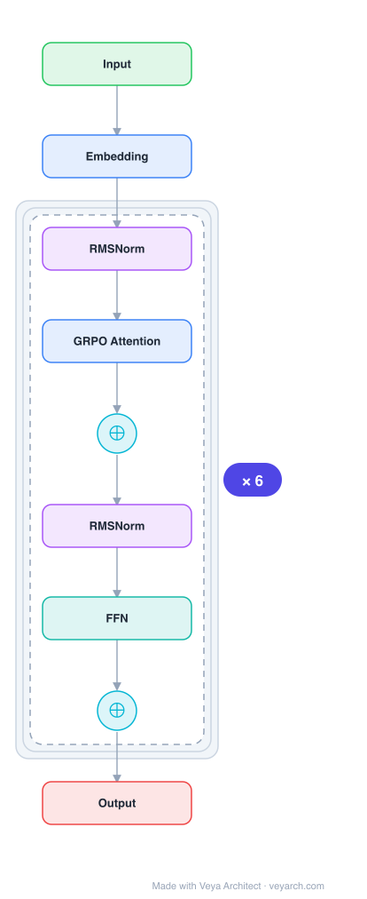

# Architecture: DeepSeekMath

## Motivation

Mathematical reasoning poses a significant challenge for language models due to its complex and structured nature. Cutting-edge models like GPT-4 and Gemini-Ultra are not publicly available, and open-source models considerably trail behind in performance. DeepSeekMath aims to push the limits of mathematical reasoning in open language models by combining large-scale math pre-training with a novel reinforcement learning algorithm (GRPO).

## Core Idea

A domain-specific language model for mathematics that continues pre-training DeepSeek-Coder-Base-v1.5 7B with 120B math-related tokens from Common Crawl, combined with Group Relative Policy Optimization (GRPO) — a variant of PPO that foregoes the critic model and estimates baselines from group scores, significantly reducing training resources.

## Architecture

### Overview

<b>Layer-by-layer (9 nodes)</b>

| # | Layer | Type | Params |
|---|---|---|---|
| 1 | Input | `input` |  |
| 2 | Embedding | `embed` |  |
| 3 | RMSNorm | `norm` |  |
| 4 | GRPO Attention | `attention` |  |
| 5 | ⊕ | `residual` |  |
| 6 | RMSNorm | `norm` |  |
| 7 | FFN | `ffn` |  |
| 8 | ⊕ | `residual` |  |
| 9 | Output | `output` |  |

DeepSeekMath is built on a 7B parameter decoder-only Transformer (DeepSeek-Coder-Base-v1.5), continued pre-trained on the DeepSeekMath Corpus (120B math tokens). The architecture itself is a standard decoder-only Transformer; the key contributions are in data engineering (math corpus construction) and training methodology (GRPO reinforcement learning).

### Components

1. **Base Model** — DeepSeek-Coder-Base-v1.5 7B, a decoder-only Transformer pre-trained on code and natural language data.

2. **DeepSeekMath Corpus** — 120B math-related tokens extracted from Common Crawl using a fastText-based classifier. The classifier is iteratively trained: initial positive examples from OpenWebMath, negative examples from diverse non-math web pages. The corpus is ~7× the size of Minerva's math web pages and ~9× OpenWebMath.

3. **Group Relative Policy Optimization (GRPO)** — A variant of PPO that:
   - Foregoes the critic model (no value function network)
   - Estimates the baseline from group scores (mean reward of sampled outputs)
   - Significantly reduces training resources compared to PPO
   - Enhances mathematical reasoning while optimizing memory usage

4. **Data Selection Pipeline** — Iterative fastText classifier approach:
   - Train classifier on OpenWebMath (positive) + diverse web pages (negative)
   - Classify Common Crawl to extract math pages
   - Re-train classifier with newly found math pages as additional positive examples
   - Repeat iteratively to improve recall and precision

### Data Flow

**Pre-training phase:**
1. Start with DeepSeek-Coder-Base-v1.5 7B
2. Continue pre-training on DeepSeekMath Corpus (120B math tokens) + natural language + code data
3. Result: DeepSeekMath-Base 7B

**Supervised Fine-Tuning:**
4. Fine-tune on math instruction data → DeepSeekMath-Instruct

**Reinforcement Learning (GRPO):**
5. Sample G outputs for each prompt
6. Compute rewards for each output
7. Estimate baseline as group mean reward
8. Optimize policy using group-relative advantages (no critic model needed)

### State / Memory

- **Standard Transformer KV cache**: The base architecture is a standard decoder-only Transformer.
- **GRPO state**: During RL training, maintains policy network state; no separate critic model needed (unlike PPO).
- **Group sampling**: GRPO samples G outputs per prompt and uses group statistics, requiring more forward passes but less memory than PPO's actor-critic setup.

## Design Decisions

1. **Code pre-training before math** — Code training prior to math training improves models' ability to solve mathematical problems both with and without tool use. This provides evidence that code training improves reasoning abilities.

2. **Iterative data selection** — The fastText classifier is iteratively retrained, improving both recall and precision of math content extraction from Common Crawl.

3. **GRPO over PPO** — Eliminating the critic model reduces training resources significantly while maintaining or improving performance. Group-relative baselines are effective for mathematical reasoning where multiple solution paths exist.

4. **arXiv training provides no benefit** — Despite common practice, training on arXiv papers brings no notable improvements on mathematical benchmarks, suggesting web math content is more valuable.

5. **Unified paradigm** — GRPO, RFT, DPO, and PPO can be understood within a unified framework, enabling systematic comparison and optimization.

## Evolution

**Predecessors:**
- **DeepSeek-Coder-Base-v1.5** — The base code model for continued pre-training.
- **Minerva** (Lewkowycz et al., 2022) — Google's math-focused language model.
- **OpenWebMath** (Paster et al., 2023) — Open math web dataset.
- **PPO** (Schulman et al., 2017) — Proximal Policy Optimization, the predecessor to GRPO.

**Successors:**
- **DeepSeek-V3** — Scales up the architecture with MoE and MLA.
- **DeepSeek-R1** — Reasoning model with long chain-of-thought.

## Characteristics

| Property | Value |
|----------|-------|
| Year | 2024 |
| Authors | Shao, Wang, Zhu, Xu et al. (DeepSeek-AI) |
| Category | DL/Transformer |
| Source Paper | `DeepSeekMath_Unknown_Shao_Wang_Zhu_etal_2025.md` |
| PaperVault Path | `DL-Architectures/01-transformers/DeepSeekMath_Unknown_Shao_Wang_Zhu_etal_2025.md` |

## Limitations

1. **7B parameter scale** — While impressive for its size, still trails behind GPT-4 and Gemini-Ultra on competition-level math.
2. **Domain specificity** — Focused on mathematics; general language capabilities may not be as strong.
3. **Data dependence** — Performance depends heavily on the quality of the DeepSeekMath Corpus and the iterative classifier.
4. **GRPO limitations** — Group-relative baselines may be less effective for tasks with high variance in solution quality.
5. **English-centric** — Math content primarily from English-language web sources.

## Implementation Notes

See `implementation/` for a minimal runnable implementation. Key details:
- Base: DeepSeek-Coder-Base-v1.5 7B (decoder-only Transformer)
- Pre-training: 120B math tokens from DeepSeekMath Corpus
- GRPO: sample G outputs, compute group-relative advantages, no critic model
- Data pipeline: iterative fastText classifier on Common Crawl
- Available at github.com/deepseek-ai/DeepSeek-Math
- Achieves 51.7% on MATH benchmark (competition-level)

## Information Layers

- **Evidence:** Source paper available in `references/papers/` (Shao et al., 2024, "DeepSeekMath: Pushing the Limits of Mathematical Reasoning in Open Language Models")
- **Analysis:** DeepSeekMath's key contributions are in data engineering and training methodology rather than architecture. The iterative fastText classifier approach to building a 120B math corpus from Common Crawl demonstrates that publicly available web data contains valuable mathematical content. GRPO's elimination of the critic model is a practical innovation that reduces training cost while maintaining effectiveness. The finding that code training improves math reasoning provides evidence for the hypothesis that code and math share underlying reasoning skills.
- **Hypothesis:** The unified paradigm for understanding GRPO, RFT, DPO, and PPO suggests that these methods differ mainly in how they estimate baselines and compute advantages, and that GRPO's group-relative approach may be particularly suited for tasks with diverse valid solution paths (like math).
