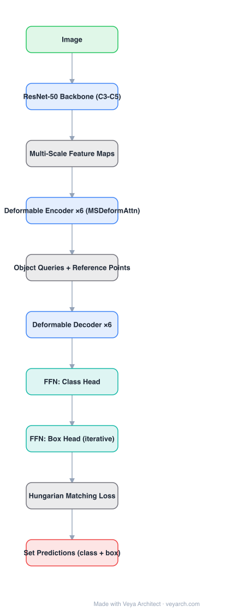

# Architecture: Deformable DETR

## Motivation

DETR converges slowly (≈500 epochs) and is weak on small objects. The root cause is architectural: global self-attention over all image tokens is quadratic in the number of pixels, so DETR can only afford a single-scale, low-resolution feature map, and attention needs many epochs to learn to focus on the sparse regions that matter. Deformable DETR attacks the same problem with the sparse sampling idea from deformable convolution.

## Core Idea

Replace dense all-pairs attention with **deformable attention**: for each query and each reference point, predict a small set of **sampling offsets** and **attention weights** from the query feature itself, and attend only to those K sampled locations. Because K is small and independent of feature-map size, complexity becomes linear in pixels — which frees the budget for **multi-scale** features, and multi-scale features are what fix small objects.

## Architecture

### Overview

<b>Layer-by-layer (10 nodes)</b>

| # | Layer | Type | Params |
|---|---|---|---|
| 1 | Image | `input` |  |
| 2 | ResNet-50 Backbone (C3-C5) | `conv2d` |  |
| 3 | Multi-Scale Feature Maps | `custom` |  |
| 4 | Deformable Encoder ×6 (MSDeformAttn) | `attention` |  |
| 5 | Object Queries + Reference Points | `custom` |  |
| 6 | Deformable Decoder ×6 | `attention` |  |
| 7 | FFN: Class Head | `linear` |  |
| 8 | FFN: Box Head (iterative) | `linear` |  |
| 9 | Hungarian Matching Loss | `custom` |  |
| 10 | Set Predictions (class + box) | `output` |  |

### Components

1. **CNN backbone (ResNet-50)** — produces multi-scale feature maps C3–C5 (and C6 via a stride-2 conv), each with 256 channels after projection.
2. **Multi-scale deformable attention module** — the core primitive. Given a query feature, a linear layer outputs 2D offsets and attention weights for K sampling points per attention head, across L feature levels; the output is a weighted sum of bilinearly sampled features.
3. **Deformable encoder** (6 layers) — self-attention replaced by multi-scale deformable self-attention, FFN unchanged. Since tokens attend only locally-ish, high-resolution multi-scale maps are affordable.
4. **Deformable decoder** (6 layers) — self-attention among object queries plus **cross-attention using multi-scale deformable attention**, so each query samples the sparse locations it believes the object occupies.
5. **Prediction heads** — class and box FFNs as in DETR; optionally **iterative bounding-box refinement** (each layer refines the previous box) and a **two-stage** variant where the encoder selects region proposals as decoder queries.
6. **Hungarian matching loss** — unchanged from DETR (classification + L1 + GIoU), so the set-prediction/NMS-free property is preserved.

### Data Flow

Image → ResNet-50 → multi-scale features (C3–C6) → deformable encoder → object queries with reference points → deformable decoder (query self-attention + sparse cross-attention) → heads → set of (class, box).

### State / Memory

No recurrent state. The learned object queries and their reference points form the fixed query set; offsets are predicted per token per layer.

## Design Decisions

- **Sparse sampling instead of global attention** — linear complexity, and the network starts with a much better inductive bias, hence ≈10× faster convergence.
- **Multi-scale by construction** — attention itself fuses scales, so no separate FPN module is needed.
- **Reference points** — each query is anchored to a 2D point, making learning much easier than DETR's free-floating queries. This idea is the seed of the whole DAB-DETR / DINO line.
- **Optional iterative refinement** — reuses the decoder layers as refinement stages instead of adding parameters.

## Evolution

- **DETR** (predecessor): global attention, single scale, slow convergence.
- **Deformable DETR**: sparse multi-scale attention; the practical DETR that everyone actually used.
- **DAB-DETR / DN-DETR**: queries become explicit 4D anchor boxes; query denoising accelerates training.
- **DINO**: contrastive denoising + look-forward-twice box prediction; closes the gap with the best classical detectors.
- **RT-DETR**: real-time hybrid encoder and uncertainty-minimal query selection.

## Characteristics

| Property | Value |
|---|---|
| Backbone | ResNet-50 / ResNet-101 (multi-scale C3–C6) |
| Attention | Multi-scale deformable attention (K = 4, up to 3×3 per level) |
| Encoder / decoder layers | 6 / 6 |
| Object queries | 300 (with reference points) |
| Matching | Hungarian, one-to-one |
| Training schedule | ≈50 epochs vs DETR's ≈500 |

## Limitations

- Deformable attention's bilinear sampling is harder to accelerate on some inference runtimes than plain matmul attention.
- Still a two-stage-style cost at high resolution: the encoder processes all scales.
- Reference-point/offset prediction can be unstable with extreme aspect ratios; two-stage and refinement variants mitigate but add complexity.

## Implementation Notes

The critical pieces are: (1) a `ms_deform_attn` CUDA-equivalent that samples offsets across feature levels, (2) per-level normalized coordinates so offsets transfer across resolutions, (3) reference points updated per decoder layer when iterative refinement is enabled. Everything else (matching, loss, heads) is identical to DETR.
