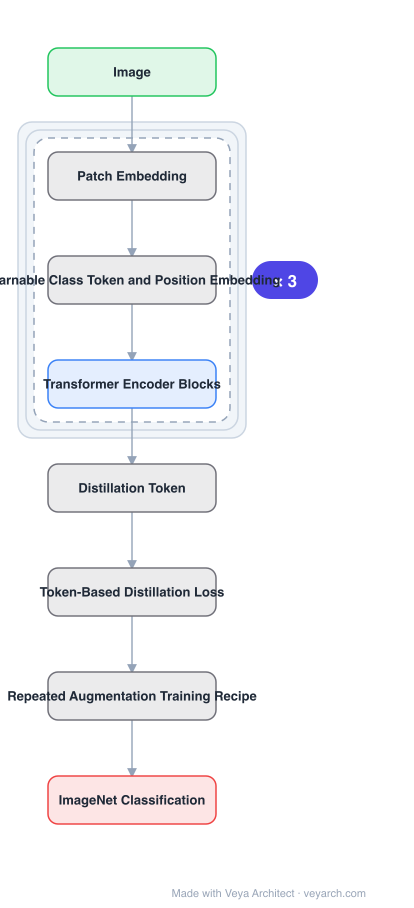

# Architecture: DeiT

## Motivation

ViT worked, but only under conditions most researchers could not reproduce: a **300M-image private dataset** (JFT-300M) and large compute. The paper's own conclusion was that transformers "do not generalize well when trained on insufficient amounts of data". That made ViT unusable in ordinary settings and left the *training method* as the real unknown — the architecture was nearly unchanged from Dosovitskiy et al., so whatever stood between ImageNet-only and a working model was in the recipe, not the model.

## Core Idea

Train the same visual transformer architecture **on ImageNet alone**, on a single node in two to three days, using a strong training recipe and augmentation — and add a **token-based distillation strategy** specific to transformers, which replaces the usual (convolutional) distillation. Nearly all of the contribution is *how to train*, not *what to build*.

## Architecture

### Overview

<b>Layer-by-layer (8 nodes)</b>

| # | Layer | Type | Params |
|---|---|---|---|
| 1 | Image | `input` |  |
| 2 | Patch Embedding | `custom` |  |
| 3 | Learnable Class Token and Position Embedding | `custom` |  |
| 4 | Transformer Encoder Blocks | `attention` |  |
| 5 | Distillation Token | `custom` |  |
| 6 | Token-Based Distillation Loss | `custom` |  |
| 7 | Repeated Augmentation Training Recipe | `custom` |  |
| 8 | ImageNet Classification | `output` |  |

### Components

1. **Patch embedding** — image split into patches, linearly embedded; no convolutional layer anywhere in the network.
2. **Learnable class token and position embedding** — inherited from the visual transformer architecture, with improvements from the timm library.
3. **Transformer encoder blocks** — standard self-attention and FFN, essentially unchanged.
4. **Distillation token** — a second learnable token alongside the class token, the mechanism for transformer-specific distillation.
5. **Token-based distillation loss** — the distillation strategy denoted by DeiT, shown to advantageously replace the usual distillation.
6. **Training recipe** — the ablation covers hyper-parameters and key ingredients, notably **repeated augmentation**.

### Data Flow

Image → patch embedding → add position embedding, prepend class token and distillation token → transformer encoder → class token output for classification; the distillation token output is compared against the teacher during training.

### State / Memory

No recurrent state. Two learned tokens pass through the encoder; the distillation token exists only for training and is discarded at inference.

## Design Decisions

- **Change the training, not the architecture** — the architecture is inherited; the contribution is the recipe plus distillation. This is why the ablation is a headline contribution.
- **No external data** — ImageNet only, which is the precondition being removed.
- **Distil via a token, not via a convnet teacher signal applied to logits alone** — the distillation token is specific to transformers and shown to beat the usual distillation.
- **Bound the compute** — 53 hours pre-training on one node, optionally 20 hours fine-tuning; 4 GPUs in three days for smaller models.
- **Offer convnet-equivalent sizes** — DeiT-S and DeiT-Ti as the counterparts of ResNet-50 and ResNet-18, for fair comparison.

## Evolution

- **ViT (Dosovitskiy et al.)** (predecessor): same architecture, JFT-300M pretraining.
- **timm library improvements** (absorbed).
- **DeiT (2020)**: ImageNet-only training recipe + token-based distillation.
- **Siblings**: Swin, MAE, I-JEPA (which uses ViT encoders).
- **Successors**: DeiT II/III and the broader family of ViT training-recipe work; MAE extends masking-based pretraining.

## Characteristics

| Property | Value |
|---|---|
| Task | image classification / ViT backbone |
| Architecture | essentially unchanged from ViT, no convolutions |
| Data | ImageNet only, no external data |
| Compute | single 8-GPU node, 53 h pre-training + optional 20 h fine-tuning |
| Distillation | token-based (distillation token), replaces the usual distillation |
| Models | DeiT-Ti, DeiT-S, DeiT-B (ResNet-18/50 counterparts) |

## Limitations

- The contribution is a recipe, so reproducing it requires matching augmentation and hyper-parameters closely; small deviations matter.
- Still ImageNet-scale: the paper does not claim to reach JFT-pretrained ViT performance.
- Distillation requires a teacher (typically a convnet), adding a training-time dependency.
- Classification-focused; dense prediction needs later adaptations (e.g. hierarchical variants).

## Implementation Notes

Essentials: (1) keep the architecture essentially stock — if you change the model you cannot attribute the gain to the recipe, (2) add the distillation token as a *separate* learnable token and supervise it against the teacher; the token-based strategy is the named contribution, (3) include repeated augmentation and follow the reported hyper-parameters, since the ablation is the main content, (4) verify with no external data — adding JFT or similar invalidates the claim, (5) report single-node wall-clock (53 h / 20 h), because the accessibility of the compute budget is part of the result.
