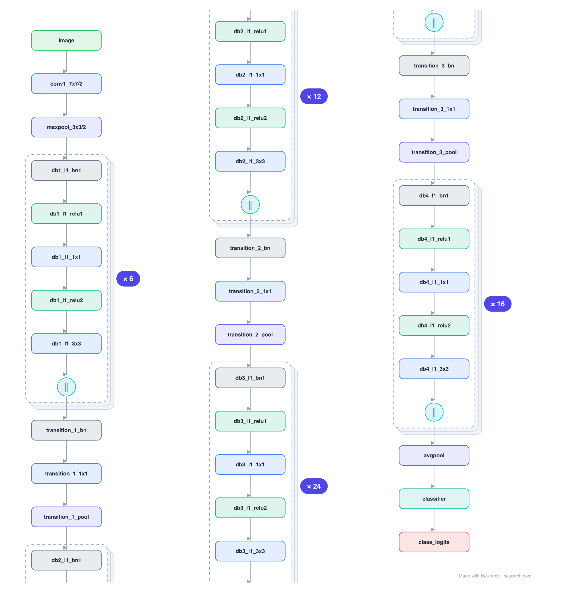

# Architecture: DenseNet-121

## Motivation

The network where every layer is connected to every other layer in its block: each layer reads the concatenation of all preceding feature maps. Feature reuse instead of re-learning gives strong accuracy at very few parameters.

## Core Idea

The network where every layer is connected to every other layer in its block: each layer reads the concatenation of all preceding feature maps.

## Architecture

### Overview

*The full graph, all 363 nodes. Vector: [diagram.svg](assets/diagram.svg).*

| Hyperparameter | Value |
|---|---|
| Type | Densely-connected convolutional network |
| Parameters | 8M |
| Stem | 7x7/2 conv + 3x3/2 max-pool |
| Dense blocks | 4 blocks, 6/12/24/16 layers |
| Dense layer | BN → ReLU → 1x1 → BN → ReLU → 3x3, output concatenated to input |
| Transitions | BN → 1x1 conv → avg-pool (halve channels) between blocks |

`model.json` is the full graph, hand-built against the official config.json.

### Design Notes

- The defining op is the concatenate: a layer adds only a small "growth" (32 channels here) but sees everything before it, so gradients and features flow directly to every layer.
- Transition layers between blocks compress channels with a 1x1 conv + pooling so the concatenation does not explode.
- The opposite design philosophy from [resnet-50](../resnet-50/) (additive skips): DenseNet concatenates instead of adds.

### Parameter Check

Neurarch's per-layer parameter estimate over this graph: **8.0M**.

## Design Decisions

> **Analysis** — Observations derived from studying the architecture.

- The defining op is the concatenate: a layer adds only a small "growth" (32 channels here) but sees everything before it, so gradients and features flow directly to every layer.
- Transition layers between blocks compress channels with a 1x1 conv + pooling so the concatenation does not explode.
- The opposite design philosophy from [resnet-50](../resnet-50/) (additive skips): DenseNet concatenates instead of adds.

## Implementation Notes

- `model.json` contains the full structural graph with real dimensions and parameters, using NAXS block templates + `repeat` for repeated units.
- Open in [Neurarch](https://www.neurarch.com/) to visualize, edit, or export training code.
- Diagrams fold repeated identical blocks with a `× N` badge; `model.json` defines each repeated unit once at real dimensions and expands to all nodes.

## Limitations

- This package focuses on the architectural structure. Training pipelines, 
dataset preparation, and production optimizations are out of scope.

## Evolution

> See `references/related/` for predecessor and successor architectures.

