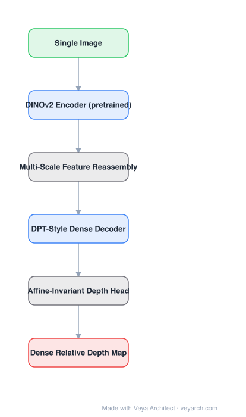

# Architecture: Depth Anything V2

## Motivation

Depth Anything V1 already showed that large-scale pseudo-labelled real images beat small labelled sets. V2 asks what actually limits quality, and the answer is **not architecture**: it is noisy pseudo-labels, the weak encoder used to produce them, and the lack of a benchmark that measures fine-grained, robust relative depth. V2 is therefore a set of findings instantiated as a model.

## Core Idea

Three findings drive the design: (1) **replace labelled real images with high-precision synthetic images** — pseudo-labels from a weaker model add noise that synthetic ground truth does not; (2) **scale the model capacity** rather than increasing noisy data; (3) use large-scale pseudo-labelled real images only as a **bridge** that improves robustness, not as the primary supervision. The encoder is a strong pretrained representation — **DINOv2** — because semantic features turn out to be the main source of fine-grained detail.

## Architecture

### Overview

<b>Layer-by-layer (6 nodes)</b>

| # | Layer | Type | Params |
|---|---|---|---|
| 1 | Single Image | `input` |  |
| 2 | DINOv2 Encoder (pretrained) | `conv2d` |  |
| 3 | Multi-Scale Feature Reassembly | `custom` |  |
| 4 | DPT-Style Dense Decoder | `conv2d` |  |
| 5 | Affine-Invariant Depth Head | `custom` |  |
| 6 | Dense Relative Depth Map | `output` |  |

### Components

1. **DINOv2 encoder** — a large pretrained ViT kept as the feature extractor; the choice is justified empirically (DINOv2 was used to produce much better pseudo-labels, and its features carry the fine detail).
2. **Multi-scale feature reassembly** — features from several transformer stages are resampled to a common resolution (Reassemble/DPT-style stages) so both coarse layout and fine detail are available to the decoder.
3. **DPT-style dense decoder** — progressive fusion blocks that upsample the reassembled features back to full resolution.
4. **Affine-invariant depth head** — predicts relative (scale/shift-free) depth; supervision uses scale-and-shift-invariant losses and gradient-based terms for sharp boundaries.
5. **Deployment-oriented variants** — Small (~25M params, ~60 ms), Base, and Large (~335M params, ~213 ms) on a V100, giving an explicit latency ladder.

### Data Flow

Single image → DINOv2 encoder → multi-scale reassembly → DPT-style fusion decoder → relative depth map. Optional metric heads are attached downstream (not part of the base model).

### State / Memory

No recurrent state; single-image inference. Temporal consistency for video requires a separate module (or a video-specific variant).

## Design Decisions

- **Synthetic over pseudo-labelled real data** — precise labels matter more than in-domain images.
- **Capacity over noise** — increase model size instead of adding more noisy data.
- **Keep a strong pretrained encoder** — semantic pretraining supplies what depth supervision cannot: crisp boundaries and robustness across domains.
- **DA-2K benchmark** — evaluate on hard, densely annotated cases rather than only on standard benchmarks that saturate.
- **Relative, not metric, depth** — avoids committing to a scale the model cannot know from one image.

## Evolution

- **MiDaS / DPT** (predecessors): multi-dataset mixed training, DPT dense decoder.
- **Depth Anything V1**: scaled pseudo-labelled real data.
- **Depth Anything V2**: synthetic precision + DINOv2 encoder + capacity; the current default relative-depth model.
- **Competitors**: Marigold and DepthFM (diffusion-based, slow but detailed), UniDepth/Metric3D (metric depth), MoGe (point-map geometry).
- **Downstream**: metric fine-tuning, Video Depth Anything (temporally stable video depth), grounding/segmentation stacks.

## Characteristics

| Property | Value |
|---|---|
| Task | monocular relative depth estimation |
| Encoder | DINOv2 (ViT, S/B/L) |
| Decoder | DPT-style dense prediction with multi-scale reassembly |
| Training data | high-precision synthetic + pseudo-labelled real bridge |
| Variants | Small ~25M / ~60 ms, Large ~335M / ~213 ms (V100) |
| Output | affine-invariant relative depth |

## Limitations

- Relative depth only; metric scale needs extra information or fine-tuning.
- Large variant is slow for real-time use; the Small variant trades detail for latency.
- Synthetic-heavy training can make performance domain-dependent in unusual scenes.
- Single-image inference gives no temporal consistency without a video-specific extension.
- Fine detail is bounded by patch resolution of the ViT encoder.

## Implementation Notes

Essentials for a reproduction: (1) a strong pretrained ViT encoder (frozen or lightly fine-tuned), (2) multi-scale feature reassembly, (3) a DPT-style fusion decoder, (4) scale-and-shift-invariant plus gradient losses. When adapting for real-time use, swap the encoder for a smaller DINOv2 variant and reduce the decoder's channel width before reducing input resolution.
