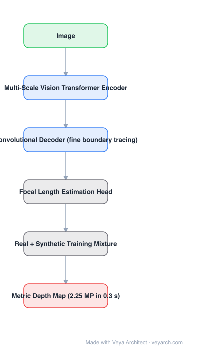

# Architecture: Depth Pro

## Motivation

Zero-shot monocular depth is used for view synthesis, image editing and conditional generation, and those applications care about two things the field was not optimizing: **metric scale without intrinsics** and **sharp, high-frequency boundaries**. Existing models were smooth and low-resolution — fine for coarse layout, unusable for novel view synthesis where boundary error is immediately visible. Also, boundary quality had no proper metric, so it was not being measured.

## Core Idea

A **multi-scale vision transformer** for dense prediction, a convolutional decoder trained on a **real + synthetic mixture** so that metric accuracy and boundary detail are both achieved, **dedicated boundary evaluation metrics**, and **focal length estimation from a single image** — which is what makes the output metric without supplied intrinsics.

## Architecture

### Overview

<b>Layer-by-layer (6 nodes)</b>

| # | Layer | Type | Params |
|---|---|---|---|
| 1 | Image | `input` |  |
| 2 | Multi-Scale Vision Transformer Encoder | `attention` |  |
| 3 | Convolutional Decoder (fine boundary tracing) | `conv2d` |  |
| 4 | Focal Length Estimation Head | `custom` |  |
| 5 | Real + Synthetic Training Mixture | `custom` |  |
| 6 | Metric Depth Map (2.25 MP in 0.3 s) | `output` |  |

### Components

1. **Multi-scale vision transformer encoder** — efficient multi-scale ViT designed for dense prediction rather than classification.
2. **Convolutional decoder** — produces high-resolution depth with fine boundary tracing; the paper emphasizes sharpness and high-frequency details.
3. **Focal length estimation** — state-of-the-art single-image focal length estimation, supplying the missing scale information.
4. **Real + synthetic training protocol** — combining both dataset types to get metric accuracy alongside fine boundaries.
5. **Boundary evaluation metrics** — new metrics for boundary accuracy in estimated depth maps, since existing ones were insensitive to it.

### Data Flow

Image → multi-scale ViT encoder → convolutional decoder → high-resolution metric depth map; focal length estimated in parallel and used to provide absolute scale.

### State / Memory

No recurrent state. Multi-scale encoder features are the structure that enables both sharp boundaries (high-resolution levels) and global consistency (low-resolution levels).

## Design Decisions

- **Measure what matters** — introducing boundary metrics acknowledges that prior evaluation hid the weakness the paper targets.
- **Multi-scale encoder, convolutional decoder** — the split that gives high-frequency detail without paying for attention at full resolution.
- **Mix real and synthetic data** — real data for metric accuracy, synthetic for boundary supervision.
- **Estimate focal length** — the enabler for metric output on arbitrary images without metadata.
- **Speed as a constraint** — 0.3 s for 2.25 MP is a design target, not an afterthought.

## Evolution

- **MiDaS** (predecessor): zero-shot affine-invariant, no metric scale.
- **UniDepth, Metric3D** (siblings): metric zero-shot by predicting or canonicalizing the camera.
- **Depth Anything / Depth Anything V2** (siblings): relative depth at scale.
- **Depth Pro (2024)**: sharp, metric, fast, with focal length estimation.
- **Contrast**: affine-invariant models recover no absolute scale; domain-trained metric models do not generalize.

## Characteristics

| Property | Value |
|---|---|
| Task | zero-shot metric monocular depth |
| Encoder | multi-scale vision transformer |
| Decoder | convolutional (fine boundary tracing) |
| Scale | focal length estimated from a single image |
| Training | real + synthetic mixture |
| Speed | 2.25 MP depth map in 0.3 s |

## Limitations

- Single image only; no multi-view or temporal consistency.
- Metric accuracy depends on correct focal length estimation — errors there propagate directly into scale.
- Sharpness targets boundaries but does not guarantee geometric consistency across views.
- Trained partly on synthetic data, so realism gaps remain in unusual domains.

## Implementation Notes

Essentials: (1) keep the encoder multi-scale so the decoder can trace boundaries at high resolution, (2) use a convolutional decoder rather than an attention decoder at full resolution, (3) train on the real + synthetic mixture — either alone loses one of the two target properties, (4) implement and report the boundary metrics, not only standard depth errors, (5) verify metric output with intrinsics withheld at inference; that is the deployment scenario being claimed.
