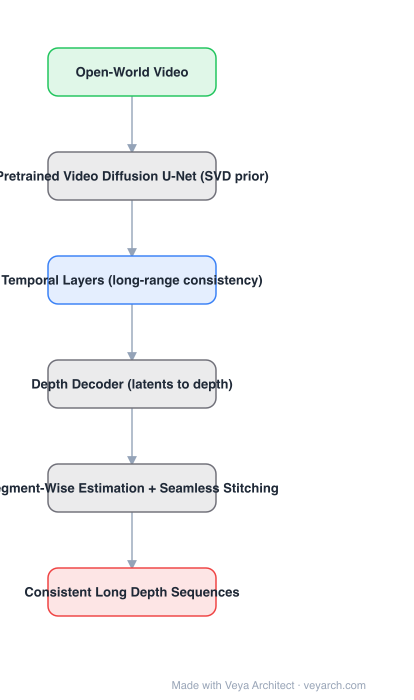

# Architecture: DepthCrafter

## Motivation

Per-frame monocular depth models produce depth that flickers, and video depth models are trained on limited domains so they generalize poorly to internet video. Meanwhile, video *diffusion* models have been trained on enormous open-world video and already encode strong priors about geometry and motion. DepthCrafter's bet: reuse that prior instead of training a depth network from scratch.

## Core Idea

Repurpose a **pretrained video diffusion model** (Stable Video Diffusion) as a depth estimator: keep its U-Net and **temporal layers** for long-range consistency, and change the task to depth. Because the base model has a fixed context length, arbitrarily long videos are handled by **segment-wise estimation with seamless stitching**.

## Architecture

### Overview

<b>Layer-by-layer (6 nodes)</b>

| # | Layer | Type | Params |
|---|---|---|---|
| 1 | Open-World Video | `input` |  |
| 2 | Pretrained Video Diffusion U-Net (SVD prior) | `custom` |  |
| 3 | Temporal Layers (long-range consistency) | `attention` |  |
| 4 | Depth Decoder (latents to depth) | `custom` |  |
| 5 | Segment-Wise Estimation + Seamless Stitching | `custom` |  |
| 6 | Consistent Long Depth Sequences | `output` |  |

### Components

1. **Pretrained video diffusion U-Net (SVD) as prior** — the source of open-world generalization; reused rather than retrained from scratch.
2. **Temporal layers** — long-range temporal attention in the U-Net; these are what make depth consistent across frames instead of flickering per frame.
3. **Depth-oriented adaptation** — the model's output space is changed from RGB latents to depth, and the training objective from denoising images to predicting depth.
4. **Long temporal context** — the context is extended (reported up to ~110 frames per segment), which is what "long depth sequences" refers to.
5. **Segment-wise estimation + seamless stitching** — long videos are processed in overlapping segments and stitched, so the fixed context length is not a limit.
6. **Fine-grained detail** — diffusion-based estimation retains thin structures better than regression baselines.

### Data Flow

Video → segments → video diffusion U-Net with temporal layers → depth latents → depth decoder → per-segment depth → stitched consistent depth sequence.

### State / Memory

The sliding-window overlap between segments is the mechanism that carries consistency across the stitched boundaries; within a segment, temporal attention is the memory.

## Design Decisions

- **Reuse a generative prior** — generalization comes from the pretraining corpus, not from depth annotations.
- **Keep temporal layers** — consistency is a temporal-attention property; removing them collapses the method to per-frame depth.
- **Segment-wise for unbounded length** — accepts a fixed-context backbone and solves length at the pipeline level.
- **Optimize for detail and consistency, not metric scale** — the output is affine-invariant video depth.

## Evolution

- **MiDaS / DepthAnything** (predecessors): single-image relative depth, strong generalization.
- **Marigold / DepthFM / Lotus** (siblings): diffusion priors for single-image depth.
- **DepthCrafter (2024)**: video diffusion prior + temporal layers + segment-wise stitching for long sequences.
- **Parallel**: **Video Depth Anything** — temporally consistent depth from a discriminative (non-diffusion) video model; the main alternative approach.
- **Downstream**: video effects (depth-based relighting, DoF), 3D/4D reconstruction, robotics perception.

## Characteristics

| Property | Value |
|---|---|
| Task | video depth estimation (open-world) |
| Backbone | pretrained video diffusion U-Net (SVD) |
| Consistency mechanism | temporal layers + long context |
| Length handling | segment-wise estimation + seamless stitching |
| Context per segment | ~110 frames (as reported) |
| Output | affine-invariant (relative) depth |

## Limitations

- No metric scale — output is relative/affine-invariant depth, so it cannot be used where absolute distance is required without calibration.
- Diffusion inference is far slower than a feed-forward depth network; not real-time.
- Inherits the base model's biases (synthetic-looking depth in stylized content, occasional hallucinated structure).
- Stitching is a mitigation, not a guarantee: very long videos can still drift or show seams.

## Implementation Notes

Essentials: (1) start from a pretrained SVD-class video diffusion U-Net and keep its temporal attention intact, (2) change the output head/objective to depth and train on video depth data, (3) train with long context (the value is in the temporal layers, not in the spatial prior), (4) implement overlapping segment-wise inference with stitching for arbitrary length, (5) report temporal consistency metrics (not just per-frame depth error) — that is the property the architecture exists for.
