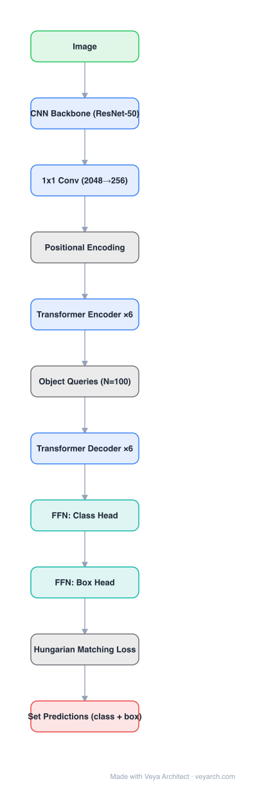

# Architecture: DETR

## Motivation

Modern detectors solve detection *indirectly*: they define surrogate regression and classification problems over a large set of proposals, anchors, or window centers. Their accuracy is therefore strongly influenced by hand-designed components — anchor sizes and ratios, the heuristics that assign targets to anchors, and non-maximum suppression (NMS) to collapse near-duplicate boxes. DETR asks whether the pipeline can be simplified by treating detection as a **direct set prediction** problem, as end-to-end learning already did for machine translation and speech recognition.

## Core Idea

Two ingredients make direct set prediction work:

1. **A set-based global loss** — bipartite matching between predictions and ground truth forces a permutation-invariant, one-to-one assignment. Because every ground-truth object is claimed by exactly one prediction, near-duplicates never appear and NMS becomes unnecessary.
2. **A transformer encoder-decoder** — a fixed small set of *learned object queries* attends to the image features and decodes, in parallel, the final set of boxes and labels.

## Architecture

### Overview

<b>Layer-by-layer (11 nodes)</b>

| # | Layer | Type | Params |
|---|---|---|---|
| 1 | Image | `input` |  |
| 2 | CNN Backbone (ResNet-50) | `conv2d` |  |
| 3 | 1x1 Conv (2048→256) | `conv2d` |  |
| 4 | Positional Encoding | `custom` |  |
| 5 | Transformer Encoder ×6 | `attention` |  |
| 6 | Object Queries (N=100) | `custom` |  |
| 7 | Transformer Decoder ×6 | `attention` |  |
| 8 | FFN: Class Head | `linear` |  |
| 9 | FFN: Box Head | `linear` |  |
| 10 | Hungarian Matching Loss | `custom` |  |
| 11 | Set Predictions (class + box) | `output` |  |

### Components

1. **CNN backbone** — a conventional convnet (ResNet-50/101) turns the input image (3×H₀×W₀) into a lower-resolution activation map f ∈ R^{C×H×W} with C = 2048 and H, W = H₀/32, W₀/32.
2. **Channel projection** — a 1×1 convolution reduces C to the transformer width d (256), producing z₀ ∈ R^{d×H×W}.
3. **Positional encodings** — fixed (sinusoidal-style) encodings are added at the input of every attention layer, because the transformer is otherwise permutation-invariant.
4. **Transformer encoder** — L = 6 layers, each a multi-head self-attention module followed by an FFN. Spatial dimensions are collapsed into a d×HW token sequence; global self-attention lets every token see the whole image, which is what makes redundant predictions avoidable.
5. **Transformer decoder** — L = 6 layers of standard self-attention + cross-attention, decoding N = 100 learned object queries into output embeddings. Queries are learned positional embeddings; they are the architectural substitute for anchors/proposals.
6. **Prediction FFNs** — shared across the N slots: a 3-layer MLP with ReLU and hidden dimension d predicts normalized box center, height and width; a linear layer with softmax predicts the class, including a special ∅ ("no object") class that absorbs unused slots.
7. **Auxiliary decoding losses** — predictions from every decoder layer are passed to the same Hungarian loss, adding supervisory signal.

### Data Flow

Image → backbone → 1×1 projection → + positional encoding → flatten → encoder (self-attention over all tokens) → decoder (queries cross-attend encoder memory) → per-slot FFN heads → set of (class, box) pairs. The Hungarian matcher runs only at training time and is not part of inference.

### State / Memory

No recurrent state. The persistent "state" is the learned object-query set, which is a fixed parameter tensor, not input-dependent.

## Design Decisions

- **Absolute box prediction** instead of anchor-relative deltas: predictions are made with respect to the input image, which removes anchor design entirely.
- **Loss reweighting for scale**: box loss is a linear combination of L1 and generalized IoU (GIoU), because plain L1 has different scales for small and large boxes at equal relative error.
- **Deep supervision at every decoder layer** (auxiliary losses) to speed up convergence.
- **Single-scale features** in the original design — one of the reasons small-object accuracy lags; addressed by later multi-scale variants.

## Evolution

- **Faster R-CNN / Mask R-CNN** (predecessors): proposal + RoI head + NMS pipelines that DETR replaces.
- **Deformable DETR**: multi-scale deformable attention, much faster convergence and better small objects.
- **Conditional / DAB-DETR**: queries become explicit dynamic anchor boxes.
- **DN-DETR, DINO**: query denoising and contrastive tricks, closing the gap with the best classical detectors.
- **RT-DETR**: real-time hybrid encoder + uncertainty-minimal query selection, making the set-prediction design viable under latency budgets.
- **Grounding DINO**: fuses the set-prediction detector with text grounding for open-set detection.

## Characteristics

| Property | Value |
|---|---|
| Backbone | ResNet-50 / ResNet-101 |
| Transformer width | d = 256 |
| Encoder / decoder layers | 6 / 6 |
| Object queries | N = 100 |
| Heads | 3-layer MLP (box) + linear softmax (class) |
| Post-processing | None (no anchors, no NMS) |
| Matching | Hungarian, one-to-one |

## Limitations

- Very long training schedule (≈500 epochs) compared with classical detectors.
- Weak on small objects; single-scale encoder features and quadratic attention cost are the main causes.
- Quadratic cost in the number of image tokens; high-resolution inputs are expensive.
- Requires dense supervision and careful loss balancing; convergence is sensitive to the ∅ class weight.

## Implementation Notes

The architecture needs no specialized detection library: a backbone, a standard transformer, two small FFN heads, and a Hungarian matcher implemented with `scipy.optimize.linear_sum_assignment`. A minimal implementation should reproduce: (1) positional encoding added per attention layer, (2) learned query embeddings, (3) the bipartite matching loss with L1 + GIoU, (4) auxiliary losses on intermediate decoder layers.
