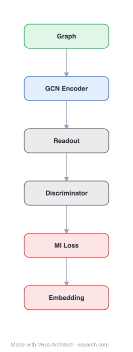

# Architecture: Deep Graph Infomax (DGI)

## Motivation

The field of unsupervised node embeddings has been dominated by random walk-based methods (DeepWalk, node2vec, LINE). These methods, while powerful due to their relation to PageRank-like techniques, have known limitations: they tend to over-emphasize proximity information at the expense of structural information (as discussed in struc2vec; Ribeiro et al., 2017), performance can be highly dependent on hyperparameter choices, and they are much harder to apply in inductive settings, especially on entirely unseen graphs.

A key observation motivating DGI is that when graph convolutional networks (GCNs) are combined with random walk objectives (as in GraphSAGE), the random walk signal may become redundant. A GCN already summarizes local patches centered around each node by design—neighbors experience significant patch-level mixing and will already have similar embeddings as a result. Random walks, which enforce a bias toward proximal nodes having similar embeddings, may fail to provide any useful additional signal in this case. The field should seek a move toward **non-local objectives**.

DGI draws inspiration from two contemporaneous advances in the vision domain—Contrastive Predictive Coding (CPC; Oord et al., 2018) and Deep InfoMax (DIM; Hjelm et al., 2018)—both relying on **mutual information maximization** between different parts of the input in the latent space. DGI adapts these ideas to graphs: instead of local proximity objectives, it maximizes mutual information between local patch representations and a global graph summary. This local-global objective is a scalable proxy for all-pairs local-local mutual information, and it allows every node to "see" arbitrarily far in the graph, reinforcing structural similarities. The resulting unsupervised embeddings are often competitive with supervised learning.

## Core Idea

Unsupervised graph-level representation via mutual information maximization between patch and graph summary.

## Architecture

### Overview

<b>Layer-by-layer (6 nodes)</b>

| # | Layer | Type | Params |
|---|---|---|---|
| 1 | Graph | `input` |  |
| 2 | GCN Encoder | `gcn_conv` |  |
| 3 | Readout | `custom` |  |
| 4 | Discriminator | `custom` |  |
| 5 | MI Loss | `loss` |  |
| 6 | Embedding | `output` |  |

Deep Graph Infomax (DGI) is an unsupervised graph representation learning method that maximizes mutual information between local patch representations and a global graph summary. The architecture generalizes the Deep InfoMax (DIM) principle from images to graphs: instead of concatenating a global feature vector with local feature maps at every spatial location (as in DIM for images), DGI pairs each node's patch representation with a graph-level summary vector and trains a discriminator to distinguish true (positive) patch-summary pairs from corrupted (negative) ones.

The method requires four components, most of which reuse standard ideas from graph neural networks: (1) a graph convolutional encoder to obtain patch representations; (2) a readout function to obtain global graph summaries; (3) a corruption function to obtain negative patch representations; and (4) a discriminator to classify positive vs. negative patch-summary pairs. The encoder used is GCN (Kipf & Welling, 2017) for transductive tasks and GraphSAGE (Hamilton et al., 2017) for inductive tasks.

The objective maximizes mutual information based on the Jensen-Shannon divergence: the discriminator's binary cross-entropy loss, optimized over positive pairs `(h_i, s)` and negative pairs `(h̃_j, s)`, implicitly maximizes MI between patch representations and the graph summary. DGI is evaluated on transductive (Cora, Citeseer, Pubmed), inductive (Reddit, PPI), and large-graph benchmarks, achieving results competitive with or surpassing supervised methods while using only unsupervised training.

### Components

- **Graph convolutional encoder `E`**: Produces patch representations `h_i` for each node. For transductive tasks, uses the GCN encoder: `E(X, A) = σ(D̂^(-1/2) Â D̂^(-1/2) X)`, where `Â = A + I` (adjacency with self-loops) and `D̂` is the degree matrix. For inductive tasks, uses GraphSAGE with neighbor sampling. The encoder is the only learned component whose parameters are optimized during training.

- **Readout function `R`**: Produces a global graph summary `s` from the patch representations `H = {h_1, ..., h_N}`. While several readouts were attempted (e.g., set2vec), **simple averaging was found to work best**: `R(H) = (1/N) Σ_{i=1}^N h_i`. For large graphs (>100K nodes), summarizing only the nodes in the current batch still works well.

- **Corruption function `C`**: Produces a negative graph `(X̃, Ã)` from the positive graph `(X, A)`. DGI uses **node shuffling**: row-wise shuffling of the feature matrix `X` while keeping the adjacency matrix fixed (`Ã = A`). This corruption has desirable properties: all input node features are preserved, the adjacency matrix is isomorphic to the original, and there is a high likelihood of useless neighborhoods (mismatched features and topology). For multi-graph datasets (e.g., PPI), using another graph from the training set as the "fake" input works too (with added dropout for variability).

- **Discriminator `D`**: A bilinear binary classifier that scores patch-summary pairs: `D(h_i, s) = σ(h_i^T W s)`, where `W` is a learnable scoring matrix. Positive pairs `(h_i, s)` (from the same graph) should score high; negative pairs `(h̃_j, s)` (corrupted patch, same summary) should score low. Optimizing its binary cross-entropy loss implicitly maximizes mutual information based on the Jensen-Shannon divergence.

- **Loss function**: `L = (1/(N+M)) [Σ_i E_(X,A) log D(h_i, s) + Σ_j E_(X̃,Ã) log(1 - D(h̃_j, s))]`, where `N` positive and `M` negative samples are used. This is the standard GAN-style discriminator loss.

### Data Flow

1. **Input**: A graph `(X, A)` with node feature matrix `X` and adjacency matrix `A`.
2. **Positive patch representations**: Feed `(X, A)` through the graph convolutional encoder `E` to obtain patch representations `H = {h_1, ..., h_N}` for all nodes.
3. **Graph summary**: Apply the readout function `R` to `H` to obtain the global summary vector `s = R(H) = (1/N) Σ_i h_i`. (For large graphs, summarize only the batch's nodes.)
4. **Corruption**: Apply the corruption function `C` to `(X, A)` to obtain the negative graph `(X̃, Ã)` (node features row-wise shuffled, adjacency fixed).
5. **Negative patch representations**: Feed `(X̃, Ã)` through the same encoder `E` to obtain negative patch representations `H̃ = {h̃_1, ..., h̃_M}`.
6. **Discriminator scoring**: For each positive pair `(h_i, s)`, compute `D(h_i, s) = σ(h_i^T W s)`; for each negative pair `(h̃_j, s)`, compute `D(h̃_j, s)`.
7. **Loss and backprop**: Compute the binary cross-entropy loss `L` over positive and negative pairs; backpropagate to update the encoder `E` parameters and the discriminator `W`.
8. **Output embeddings**: After training, the encoder `E`'s output `h_i` for each node serves as the learned unsupervised embedding. These are evaluated via simple linear classification (logistic regression) on downstream tasks.

### State / Memory

Stateless. DGI is a feed-forward architecture with no recurrent state, memory cells, or iterative propagation. The encoder `E` (GCN or GraphSAGE) computes patch representations in a single forward pass. The readout function is a simple averaging operation with no learned parameters. The discriminator `D` is a bilinear scoring function, not a recurrent model. The corruption function `C` is a fixed (non-learned) transformation applied once per forward pass. All learned parameters (`E`'s weights and `W`) are standard model parameters updated via backpropagation, not sequence/state memory.

## Design Decisions

- **Mutual information maximization over random walk objectives**: The core design decision. Random walk objectives (DeepWalk, node2vec) enforce local proximity similarity, but GCNs already produce similar embeddings for neighbors through patch-level mixing—making random walks redundant. A local-global MI objective is a scalable proxy for all-pairs local-local MI and allows nodes to "see" arbitrarily far in the graph, reinforcing structural similarities.

- **Node shuffling as the corruption function**: Chosen because it preserves all input node features, keeps the adjacency matrix isomorphic to the original (same topology), and creates a high likelihood of useless neighborhoods (mismatched features and structure). It is "trivial to apply, and works really well." Direct corruption of `A` also works but is harder (requires avoiding excessive density) and more expensive to compute at every step.

- **Simple averaging as the readout function**: Despite attempting several popular readouts (e.g., set2vec), simple averaging `R(H) = (1/N) Σ h_i` was found to work best. This is a pragmatic choice favoring simplicity over complexity.

- **Bilinear discriminator**: The discriminator `D(h_i, s) = σ(h_i^T W s)` is a simple bilinear binary classifier. Optimizing its binary cross-entropy loss implicitly maximizes MI based on the Jensen-Shannon divergence—a well-grounded connection to information theory.

- **Reuse existing GNN encoders**: DGI is encoder-agnostic. It uses GCN for transductive tasks and GraphSAGE for inductive tasks, rather than proposing a new encoder. This makes DGI a general framework applicable on top of any suitable GNN encoder.

- **Batch summarization for large graphs**: For graphs >100K nodes, summarizing only the nodes in the current batch (rather than the entire graph) still works well, enabling scalability without sacrificing the local-global objective.

- **Local-global objective captures structural roles**: The paper argues that structural roles may be excellent predictors (as in struc2vec and GraphWave, Donnat et al., KDD 2018). A local-global objective allows every node to see arbitrarily far, looking for structural similarities to reinforce its local representation—something random walk methods cannot easily do.

## Evolution

**Predecessors:**
- **Random walk-based methods** — DeepWalk (Perozzi et al., KDD 2014), LINE (Tang et al., WWW 2015), node2vec (Grover & Leskovec, KDD 2016). These dominated unsupervised node embeddings but over-emphasize proximity at the expense of structural information, are hyperparameter-sensitive, and are hard to apply inductively on unseen graphs.
- **Link prediction objectives** — GAE (Kipf & Welling, NIPS BDL 2016), EP (Duran & Niepert, NIPS 2017). Essentially "random walks of length 1."
- **GCN** (Kipf & Welling, ICLR 2017) — used as the encoder for transductive tasks. Combined with random walk objectives in GraphSAGE, but the random walk signal becomes redundant when GCN already mixes local patches.
- **GraphSAGE** (Hamilton et al., NIPS 2017) — used as the encoder for inductive tasks. Combines GCN-style convolution with random walk-based unsupervised loss.
- **Contrastive Predictive Coding (CPC)** (Oord et al., 2018) — relies on an autoregressive model (LSTM/PixelCNN) to produce context from latents, which is unlikely to be trivially applicable to graphs because it requires a node ordering.
- **Deep InfoMax (DIM)** (Hjelm et al., 2018) — the direct inspiration. DIM maximizes MI between global and local representations of images. DGI generalizes this to graphs, with the key adaptation that for node classification, the focus is on maximizing MI between different local parts of the input (local-global), which simultaneously captures both local and global information.
- **struc2vec** (Ribeiro et al., 2017) and **GraphWave** (Donnat et al., KDD 2018) — argued that structural roles are important predictors, motivating the structural-capture goal of DGI's local-global objective.

**Successors:**
- The paper does not explicitly name successor architectures but establishes DGI as a general framework applicable on top of any GNN encoder, suggesting future extensions to other encoders and corruption functions. The MI-maximization paradigm influenced subsequent contrastive graph representation learning methods.

## Characteristics

| Property | Value |
|----------|-------|
| Year | 2018 |
| Authors | Veličković et al. |
| Category | GNN/Architecture |
| Source Paper | `Deep_Graph_Infomax_Brain_Fedus_Hamilton_2018.md` |
| PaperVault Path | `GNN/03-gnn-architectures/Deep_Graph_Infomax_Brain_Fedus_Hamilton_2018.md` |

## Limitations

- **Corruption function is hand-designed**: The node-shuffling corruption (row-wise feature shuffling, fixed adjacency) is a heuristic choice. While it works well, the paper acknowledges that direct corruption of the adjacency matrix `A` also works but is "harder (requires us not to get too dense), and more expensive to compute at every step." The optimal corruption strategy is not theoretically established.

- **Readout function is simplistic**: Simple averaging `R(H) = (1/N) Σ h_i` was found to work best among attempted readouts, but more expressive readouts (e.g., set2vec) were tried and underperformed. The reason averaging suffices is not deeply analyzed; it may limit performance on graphs where a more nuanced global summary is needed.

- **Relies on a good encoder**: DGI is encoder-agnostic but inherits the limitations of whatever encoder is chosen. Using GCN (transductive) or GraphSAGE (inductive) means DGI cannot overcome those encoders' inherent limitations (e.g., GCN's transductive requirement, GraphSAGE's fixed neighborhood sampling).

- **Batch summarization approximation**: For large graphs, summarizing only the batch's nodes (rather than the full graph) is a practical approximation. The paper notes it "still works well" but does not rigorously quantify the trade-off between batch size and summary quality.

- **Single-graph corruption challenge**: For multi-graph datasets (like PPI), reusing another graph as the "fake" input is straightforward. But most graph datasets are single-graph, requiring the stochastic corruption function—a workaround rather than a principled solution.

- **Mutual information is a proxy**: The local-global MI objective is a scalable proxy for all-pairs local-local MI. It is not equivalent to maximizing MI between all pairs of nodes, and there may be structural information that only pairwise (not global) objectives can capture.

- **No explicit discussion of failure modes**: The paper (being a presentation/seminar deck format) does not include a dedicated limitations or discussion section. The limitations above are inferred from the design choices and empirical observations presented.

## Implementation Notes

See `implementation/` for a minimal runnable implementation.

## Information Layers

- **Evidence:** Source paper available in `references/papers/`
- **Analysis:** DGI's central insight—that random walk objectives become redundant when GCNs already mix local patches—is a compelling argument for moving to non-local, MI-based objectives. The local-global objective is elegant: it is a scalable proxy for all-pairs local-local MI that lets every node "see" arbitrarily far. Empirically, DGI's unsupervised embeddings are competitive with supervised methods (e.g., 82.3% on Cora vs. GCN's 81.5% supervised; 0.969 F1 on PPI vs. 0.958 supervised). The corruption function study shows node-shuffling is robust across corruption rates, and dimension-ablation experiments reveal the discriminator learns specialized dimensions (removing >half the dimensions still stays competitive with supervised GCN). The silhouette score (0.234 vs. 0.158 for EP) suggests cleaner cluster structure.
- **Hypothesis:** The superiority of simple averaging over set2vec for the readout may be because averaging preserves more gradient signal flow than parametric readouts, or because the global summary needs only to be a "centroid" against which local patches are compared. The specialization of discriminator dimensions (some "hot," many "cold") suggests the model learns a form of attention-like routing, but whether this specialization corresponds to interpretable structural roles (as in struc2vec) is not validated. The reliance on a hand-designed corruption function is a potential weakness—learned corruption (adversarial) might yield harder negatives and better representations.
