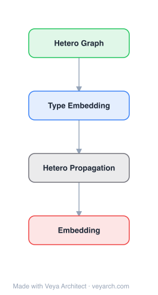

# Architecture: DHNE

## Motivation

The paper addresses **network embedding for hyper-networks** — learning low-dimensional representations for nodes in networks where relationships go beyond pairwise, involving three or more objects per relationship (hyperedges). For example, ⟨John, shirt, cotton⟩ is a high-order relationship that cannot be decomposed into pairwise edges without losing information. Existing network embedding methods (DeepWalk, LINE, node2vec) are designed for pairwise networks and cannot handle hyperedges.

A critical challenge is **indecomposability**: in heterogeneous hyper-networks, a set of nodes in a hyperedge has a strong relationship, but subsets of those nodes do not necessarily have a strong relationship. For example, in ⟨user, movie, tag⟩ relations, the ⟨user, tag⟩ pair is not typically a strong relationship. Traditional approaches (clique expansion, star expansion) decompose hyperedges into pairwise edges, implicitly assuming decomposability — an assumption that fails for heterogeneous hyper-networks. Additionally, due to network sparsity, preserving only local structure is insufficient; **global structure** (neighborhood structure) must also be captured.

DHNE (Deep Hyper-Network Embedding) fills this gap by theoretically proving that any linear similarity metric cannot maintain the indecomposability property, and proposing a deep model with a **non-linear tuplewise similarity function** that preserves both local and global proximities.

## Core Idea

Structural deep embedding for hyper-networks preserving high-order proximities in hypergraph structures.

## Architecture

### Overview

<b>Layer-by-layer (4 nodes)</b>

| # | Layer | Type | Params |
|---|---|---|---|
| 1 | Hetero Graph | `input` |  |
| 2 | Type Embedding | `embed` |  |
| 3 | Hetero Propagation | `custom` |  |
| 4 | Embedding | `output` |  |

DHNE is a deep model that jointly optimizes two components: (1) a **deep autoencoder** that learns node representations by reconstructing neighborhood structures, ensuring nodes with similar neighborhoods have similar embeddings (preserving global proximity); (2) a **non-linear tuplewise similarity function** realized by a deep neural network that predicts whether a given tuple of nodes forms a hyperedge (preserving local proximity and indecomposability). The two components are jointly optimized. The model handles heterogeneous hyper-networks where nodes and hyperedges have multiple types.

### Components

- **Indecomposable tuplewise similarity function:** A deep neural network that takes the embeddings of all nodes in a hyperedge as input and outputs a similarity score indicating whether the tuple forms a valid hyperedge. The non-linearity (via hidden layers and non-linear activations) is theoretically necessary — the paper proves that no linear function can maintain indecomposability. This function is defined over the entire tuple, ensuring subsets are not implicitly incorporated.
- **Deep autoencoder (global structure preservation):** An encoder maps each node's neighborhood structure (represented as a high-dimensional vector) to a low-dimensional embedding; a decoder reconstructs the neighborhood structure. Nodes with similar neighborhoods are mapped to similar embeddings, preserving global proximity. This addresses the sparsity problem where many relationships are unobserved.
- **Joint optimization:** The tuplewise similarity loss (local proximity) and autoencoder reconstruction loss (global proximity) are jointly minimized, ensuring the embeddings capture both local hyperedge relationships and global neighborhood structure.
- **Heterogeneous type handling:** The model accommodates multiple node types and hyperedge types in heterogeneous hyper-networks, with type-specific embeddings and parameters.

### Data Flow

1. **Input:** A heterogeneous hyper-network with hyperedges connecting tuples of nodes (e.g., ⟨user, movie, tag⟩ triples).
2. **Neighborhood construction:** For each node, construct a neighborhood structure vector encoding its connections in the hyper-network.
3. **Autoencoder encoding:** The encoder maps each node's neighborhood vector to a low-dimensional embedding.
4. **Tuplewise similarity:** For each hyperedge tuple, feed the node embeddings into the deep non-linear similarity network to predict whether the tuple forms a valid hyperedge.
5. **Joint loss:** Minimize the tuplewise similarity loss (preserving local hyperedge structure) and the autoencoder reconstruction loss (preserving global neighborhood structure) simultaneously.
6. **Output:** Low-dimensional embeddings for all nodes that preserve both local (hyperedge) and global (neighborhood) proximities.

### State / Memory

Stateless at inference. The learned node embeddings are the persistent model state. The autoencoder and tuplewise similarity network parameters are trained state. There is no recurrent or dynamic memory; the model is a feed-forward deep network optimized end-to-end.

## Design Decisions

- **Non-linear tuplewise similarity (theoretical necessity):** The paper proves that linear similarity metrics cannot maintain indecomposability in hyper-networks. Using a deep neural network with non-linear activations is not just an empirical choice but a theoretical requirement for correctly modeling indecomposable hyperedges.
- **Joint local + global preservation:** Local structure (observed hyperedges) alone is insufficient due to network sparsity; the autoencoder component preserves global neighborhood structure, ensuring unobserved but structurally similar nodes get similar embeddings.
- **Rejection of clique/star expansion:** Unlike clique expansion (which assumes all subsets of a hyperedge form edges) or star expansion (which introduces implicit pairwise similarity), DHNE models the hyperedge as a whole via the tuplewise function, preserving indecomposability.
- **Linear complexity:** The model's complexity is linear in the number of nodes, enabling application to large-scale networks.

## Evolution

**Predecessors:**
- DeepWalk (Perozzi et al., 2014), LINE (Tang et al., 2015), node2vec (Grover & Leskovec, 2016) — pairwise network embedding; cannot handle hyperedges.
- HOPE (Ou et al., 2016) — higher-order proximity in pairwise networks.
- Spectral hypergraph methods (Zhou et al., 2006) — generalize spectral clustering to hypergraphs but assume decomposability.
- SDNE (Wang et al., 2016) — deep autoencoder for pairwise network embedding; DHNE extends the autoencoder idea to hyper-networks.

**Successors:**
- Hypergraph neural networks (HGNN, Feng et al., 2019) — spectral-based hypergraph convolution.
- Hypergraph attention networks and dynamic hypergraph embedding methods.
- Knowledge hypergraph completion methods (HSimplE, HypE) that work directly with n-ary relations.

## Characteristics

| Property | Value |
|----------|-------|
| Year | 2018 |
| Authors | Tu et al. |
| Category | GNN/Hypergraph |
| Source Paper | `Structural_Deep_Embedding_for_Hyper_Networks_Tu_Cui_Wang_etal_2018.md` |
| PaperVault Path | `GNN/05-hypergraphs-topology/Structural_Deep_Embedding_for_Hyper_Networks_Tu_Cui_Wang_etal_2018.md` |

## Limitations

- **Fixed hyperedge arity:** The original model is designed for uniform hyperedges (e.g., all triples); extending to variable-arity hyperedges requires architectural modifications.
- **Transductive setting:** The model learns embeddings for all nodes in the network; inductive prediction on entirely unseen nodes requires retraining or extensions.
- **Autoencoder reconstruction cost:** The neighborhood structure reconstruction can be expensive for very large or dense hyper-networks.
- **No dynamic structure:** The model assumes a static hyper-network; evolving hyper-networks (e.g., social networks with changing group memberships) require incremental or online learning extensions.
- **Limited to structure:** The model uses only network structure; incorporating node features would require additional components.

## Implementation Notes

See `implementation/` for a minimal runnable implementation.

## Information Layers

- **Evidence:** Source paper available in `references/papers/`
- **Analysis:** DHNE's key theoretical contribution is the proof that linear similarity metrics cannot maintain indecomposability — making the deep non-linear tuplewise function a necessity, not just an empirical choice. The joint local-global preservation via the autoencoder + tuplewise similarity design addresses both the sparsity and structure preservation challenges. The rejection of clique/star expansion is principled for heterogeneous hyper-networks where decomposability fails.
- **Hypothesis:** The fixed-arity limitation could be addressed with variable-arity tuplewise functions (e.g., via set-based neural networks). The transductive setting could be extended to inductive via amortized inference over node features. The autoencoder component may struggle with very high-dimensional neighborhood vectors; dimensionality reduction or sampling-based neighborhood approximation could improve scalability.
